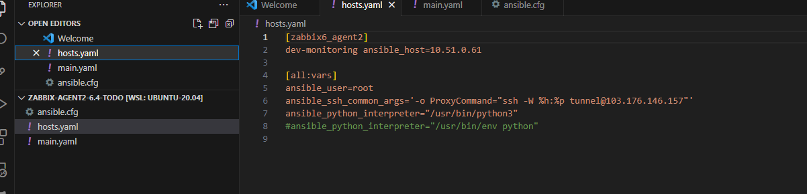
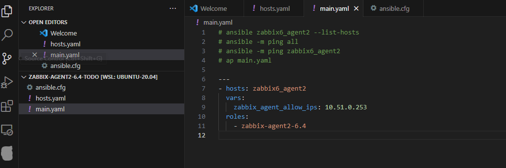
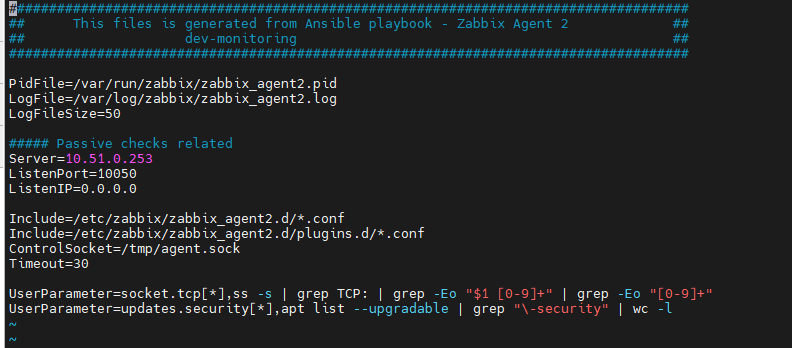
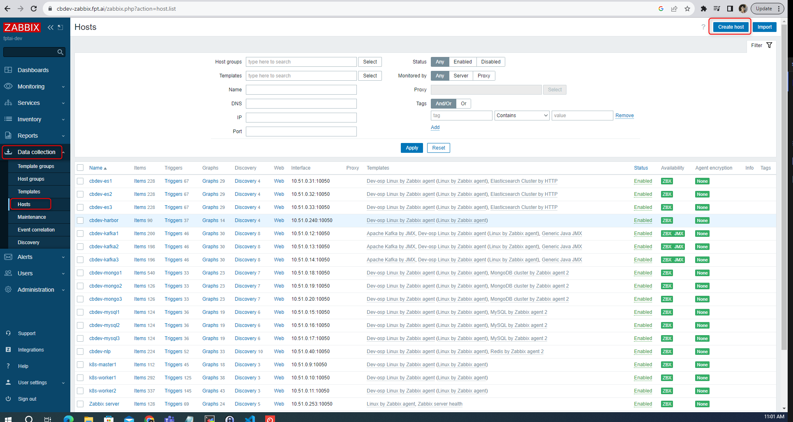

<h1 style="color:orange">Cài đặt Zabbix-agent2 bằng ansible</h1>
Sửa file host 

 
dev-monitoring là host muốn cài agent2
File main.yml

 
Config zabbix-agent2 sau khi chạy xong ansible 
 
Đây là cấu hình agent passive, tức là zabbix sẽ tự động chọc vào lấy metric từ agent
<h2 style="color:orange">1. Add host trên UI</h2>

 
 
Nếu có giám sát JMX thì add interfaces JMX