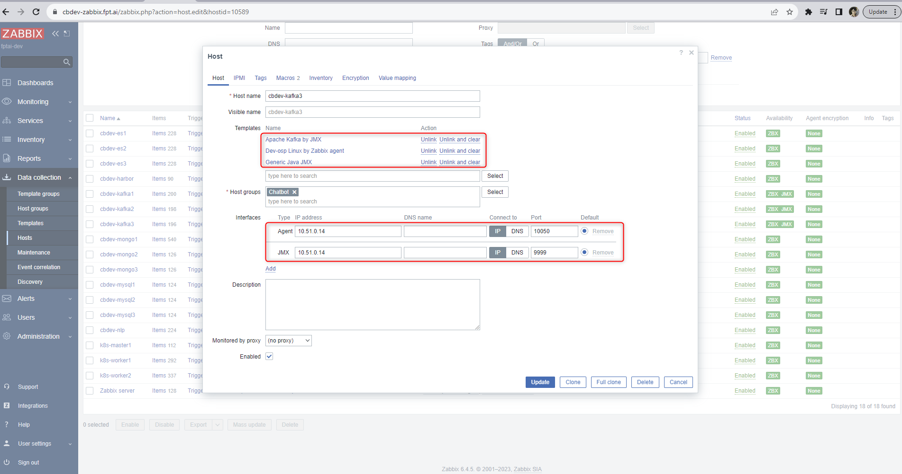
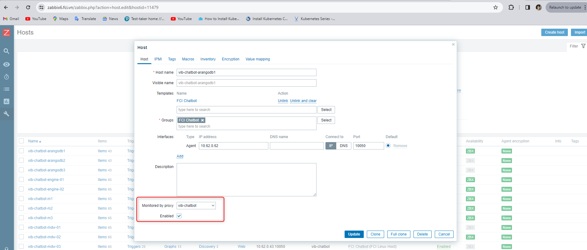
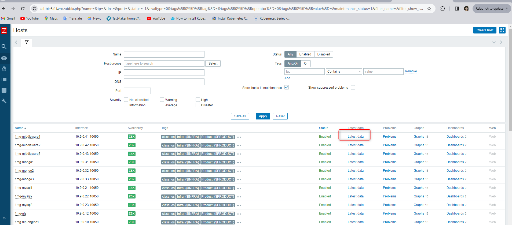
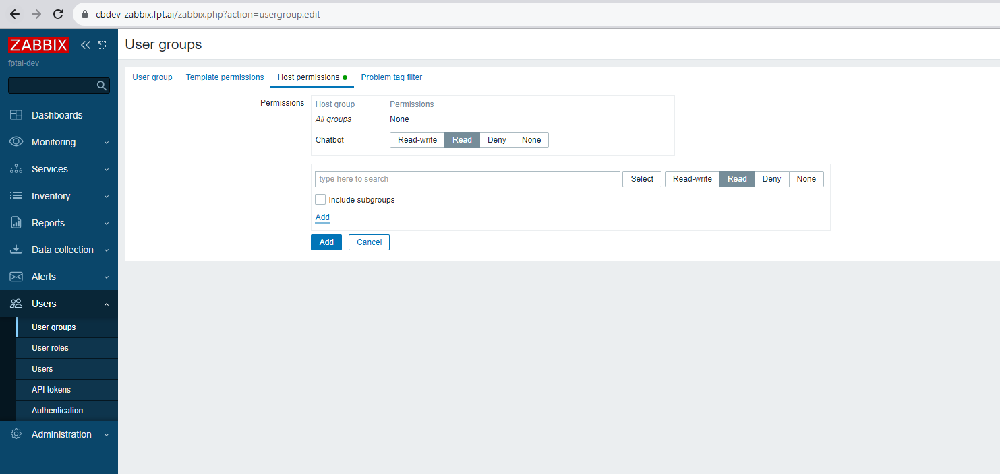
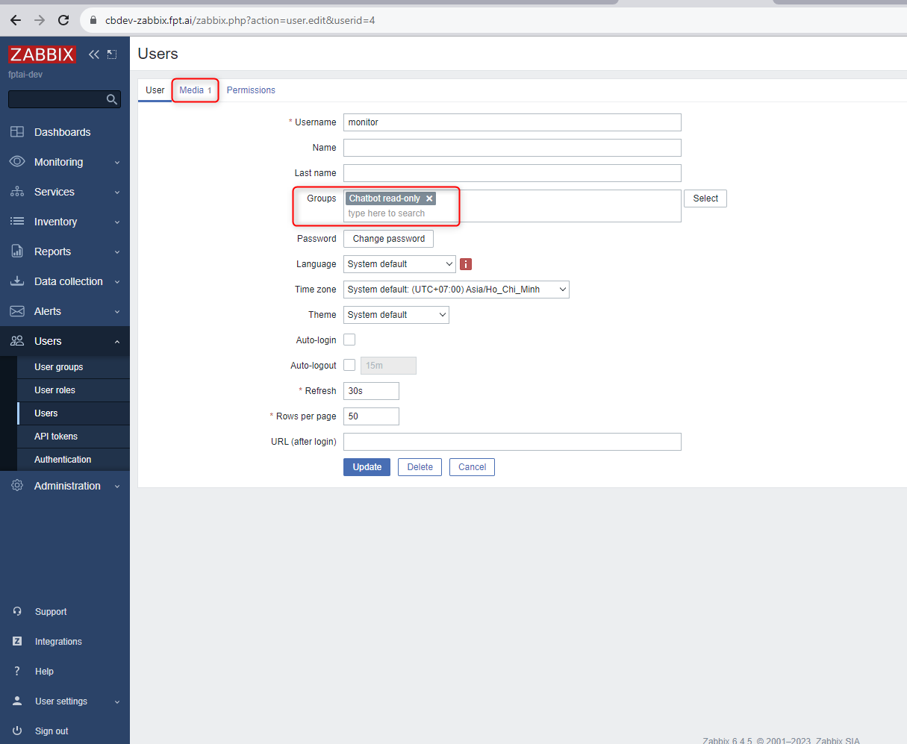
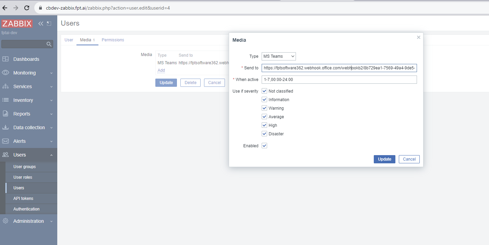
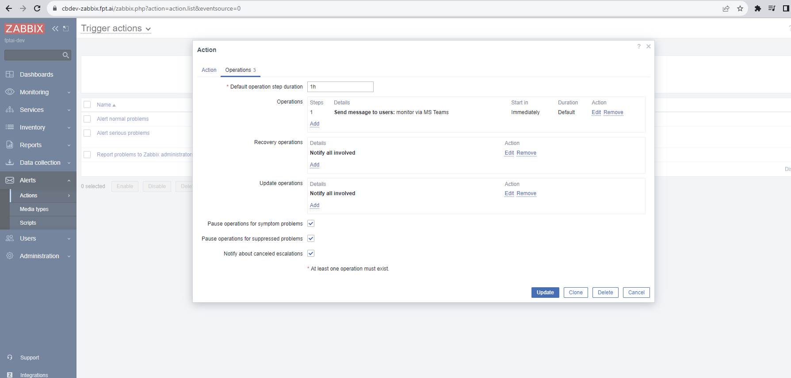
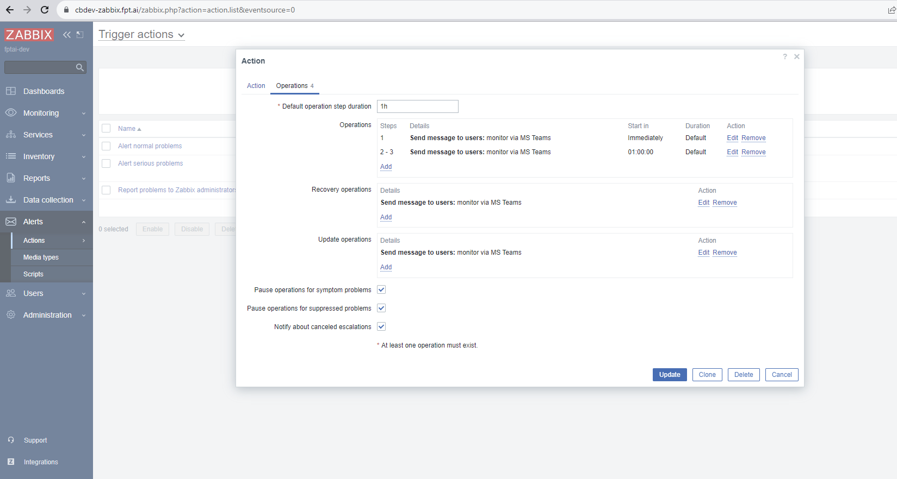

<h1 style="color:orange">Cài đặt Zabbix-agent2 bằng ansible</h1>
Sửa file host 

 
dev-monitoring là host muốn cài agent2
File main.yml

 
Config zabbix-agent2 sau khi chạy xong ansible 
 
Đây là cấu hình agent passive, tức là zabbix sẽ tự động chọc vào lấy metric từ agent
<h2 style="color:orange">1. Add host trên UI</h2>

 
 
Nếu có giám sát JMX thì add interfaces JMX
<h3 style="color:orange">1.1. Add host trên UI qua zabbix-proxy</h3>
Nếu zabbix-agent đẩy data vào zabbix-proxy thì phải thêm trường monitored by proxy

 
Sau đó restart zabbix-proxy

    # systemctl restart zabbix-proxy
Kiểm tra xem đã có data chưa: Monitoring -> Hosts -> Latest Data, có data là đã cài zabbix-agent đẩy data vào zabbix-proxy thành công.
 
<h2 style="color:orange">2. Hướng dẫn tạo alert trên zabbix</h2>
Tạo User groups: Users -> User groups -> Create -> Tạo host Permissions 

 
Tạo user để monitor zabbix -> Media để add webhook teams (Lưu ý với teams sử dụng Incoming Webhook chứ ko chọn Zabbix Webhook)
 
 
<h3 style="color:orange">2.1 Add action</h3>

Alerts -> Actions -> Create action: Trigger severity is less than or equals Average 
-> Operations: 
 

Alerts -> Action -> Create action: 	Trigger severity is greater than or equals High 
-> Operations: 
 