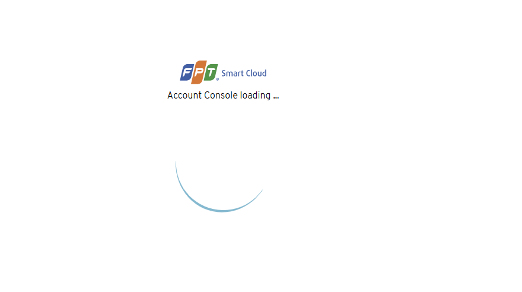
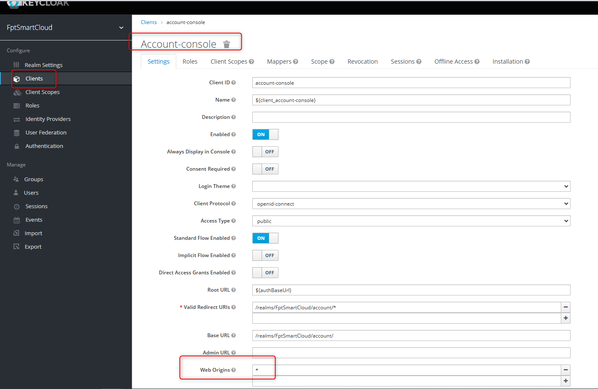
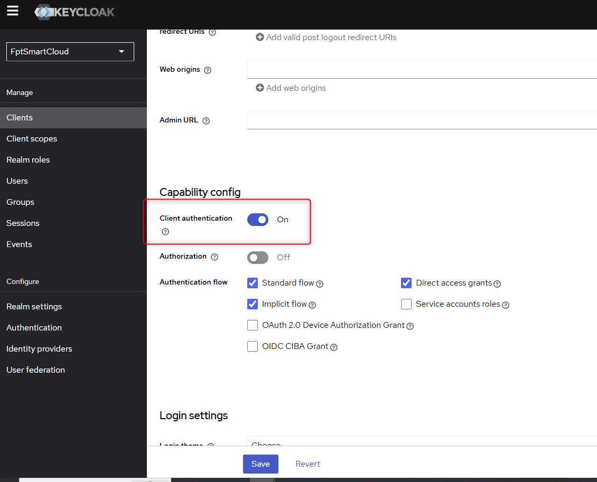
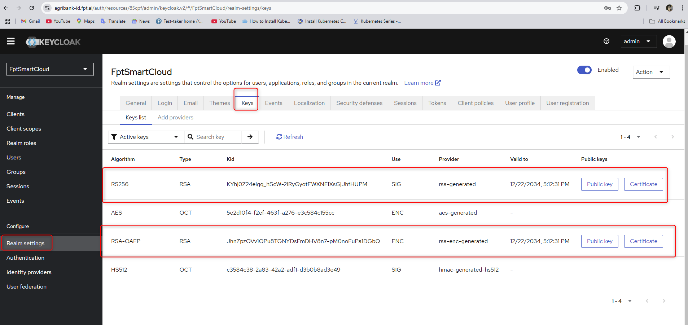
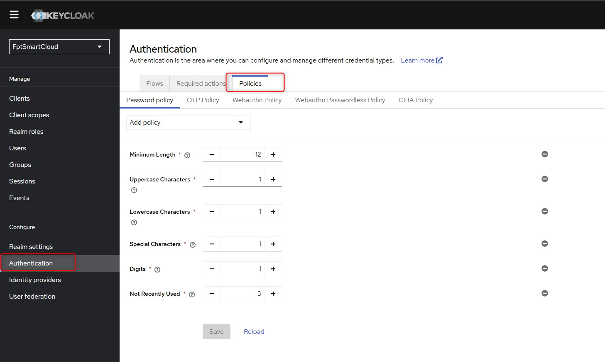

<h1 style="color:orange">Note cài đặt keycloak</h1>
<h2 style="color:orange">1. Chuẩn bị</h2>
Chuẩn bị DB MySQL cho keycloak: 10.51.0.15.<br>
Keycloak được cài đặt trên cụm k8s<br>
Tạo secret cho k8s để pull được image từ gcr.io

    # kubectl create secret generic gcrcred --from-file=.dockerconfigjson=~/.docker/config.json --type=kubernetes.io/dockerconfigjson -n chatbot-dev
<h2 style="color:orange">1.1. Cài đặt mysql</h2>
Tạo user mysql cho keycloak:

    mysql> CREATE USER 'keycloak'@'%' IDENTIFIED BY '<password>';
    mysql> GRANT ALL PRIVILEGES ON `keycloak`.* TO `keycloak`@`%`;
    mysql> CREATE DATABASE keycloak;
Lưu ý: Nếu mysql cài kiểu replication-group chứ không phải master-slave thì khi up keycloak lên sẽ không thể ghi vào db của mysql. Lý do là cài replication group thì mysql sẽ không cho tạo mà không có foreign key. Để fix, ta phải tạo thủ công 1 bảng trong db keycloak:

    mysql> use keycloak;
    mysql> CREATE TABLE `DATABASECHANGELOG` (
      `ID` varchar(255) NOT NULL,
      `AUTHOR` varchar(255) NOT NULL,
      `FILENAME` varchar(255) NOT NULL,
      `DATEEXECUTED` datetime NOT NULL,
      `ORDEREXECUTED` int(11) NOT NULL,
      `EXECTYPE` varchar(10) NOT NULL,
      `MD5SUM` varchar(35) DEFAULT NULL,
      `DESCRIPTION` varchar(255) DEFAULT NULL,
      `COMMENTS` varchar(255) DEFAULT NULL,
      `TAG` varchar(255) DEFAULT NULL,
      `LIQUIBASE` varchar(20) DEFAULT NULL,
      `CONTEXTS` varchar(255) DEFAULT NULL,
      `LABELS` varchar(255) DEFAULT NULL,
      `DEPLOYMENT_ID` varchar(10) DEFAULT NULL,
      PRIMARY KEY (`ID`,`AUTHOR`,`FILENAME`)
    ) ENGINE=InnoDB DEFAULT CHARSET=utf8;
Tham khảo: https://mysql-dba.co.uk/2020/11/29/keycloak-and-innodb-cluster/
<h2 style="color:orange">2. Cài đặt</h2>
Apply các file sau vào cụm k8s:

    # k apply -f cm.yaml

    apiVersion: v1
    data:
      KC_PROXY: edge
      KEYCLOAK_PROXY: edge
      KEYCLOAK_FRONTEND_URL: https://cbdev-id.fpt.ai/auth/
      KEYCLOAK_USER: "admin"
      KEYCLOAK_PASSWORD: "<keycloak_admin_password>"
      PROXY_ADDRESS_FORWARDING: "true"
      DB_VENDOR: mysql
      DB_ADDR: 10.51.0.15
      DB_DATABASE: keycloak
      DB_PORT: "3306"
      DB_USER: keycloak
      DB_PASSWORD: <mysql_password>
    kind: ConfigMap
    metadata:
      name: iam-cm
      namespace: chatbot-dev
Apply file deploy

```
---
apiVersion: v1
kind: Service
metadata:
  name: iam-svc
  namespace: chatbot-dev
spec:
  type: NodePort
  selector:
    app: iam
  ports:
    -  port: 8080 # listen on this port
       targetPort: 8080 # forward traffic to this port of containers
       nodePort: 30007
---
apiVersion: apps/v1
kind: Deployment
metadata:
  name: iam
  labels:
    app: iam
  namespace: chatbot-dev
spec:
  selector:
    matchLabels:
      app: iam
  replicas: 1
  revisionHistoryLimit: 3
  strategy:
    rollingUpdate:
      maxSurge: 1         # how many pods we can add at a time
      maxUnavailable: 1   # maxUnavailable define how many pods can be unavailable
    type: RollingUpdate   # during the rolling update
  template:
    metadata:
      namespace: chatbot
      labels:
        app: iam
        rel: 'keycloak_12.0.4'
        img_tag: 'v3.1'
      annotations:
        kubernetes.io/change-cause: 'Update configmap: ts=1563536713'
    spec:
      imagePullSecrets:
        - name: acrcred
      containers:
        - name: iam
          image: acr.fci.vn/fptai-chatbot/iam:v3.1
          imagePullPolicy: IfNotPresent
          resources:
            requests:
              cpu: 500m
              memory: 1Gi
            limits:
              cpu: 4
              memory: 8Gi
          envFrom:
            - configMapRef:
                name: iam-cm
          ports:
            - containerPort: 3001
          ports:
          - name: http
            containerPort: 8080
          - name: https
            containerPort: 8443
```
Sau khi apply xong deployment thì service sẽ được expose Nodeport
<br>
<h2 style="color:orange">3. Cài nginx trên front-proxy</h2>
Trên server front-proxy

```
# vim /etc/nginx/conf.d/fptai.conf
add các dòng

upstream iam {
    server 10.51.0.10:30007;  # ip các node worker mà k8s tạo pod keycloak
    server 10.51.0.11:30007;
}

server {
    server_name cbdev-id.fpt.ai;
    access_log /var/log/nginx/cbdev-id.fpt.ai.access.log;
    error_log /var/log/nginx/cbdev-id.fpt.ai.error.log;

    charset utf-8;
    client_max_body_size 100M;

    location = /auth/ {     #chặn truy cập vào path /auth/
        return 301 /auth/admin/master/console/;
    }
    location / {
        # include includes/k8s-proxy.conf;

        proxy_pass http://iam;

        proxy_pass_request_headers      on;
        proxy_set_header                Host $host;
        proxy_set_header  X-Real-IP $remote_addr;
        proxy_set_header  X-Forwarded-Proto https;
        proxy_set_header  X-Forwarded-For $remote_addr;
        proxy_set_header  X-Forwarded-Host $host;


        # Redirect root URL to /auth/realms/FptSmartCloud/account/
        location = / {
            return 301 /auth/realms/FptSmartCloud/account/;
        }
    }
    include /etc/nginx/ssl/fpt.ai-ssl.conf;
}
```

    # systemctl restart nginx
<h2 style="color:orange">4. Cài đặt keycloak sử dụng ingress nginx</h2>
Apply các file sau vào cụm k8s:

    # k apply -f cm.yaml

    apiVersion: v1
    data:
      KC_PROXY: edge
      KC_HOSTNAME: cbdev-id.fpt.ai
      KC_HOSTNAME_URL: https://cbdev-id.fpt.ai/auth
      KC_HTTP_ENABLED: "false"
      KC_HOSTNAME_PORT: "443"
      KEYCLOAK_FRONTEND_URL: https://cbdev-id.fpt.ai/auth/
      KEYCLOAK_USER: "admin"
      KEYCLOAK_PASSWORD: "<keycloak_admin_password>"
      PROXY_ADDRESS_FORWARDING: "false"
      DB_VENDOR: mysql
      DB_ADDR: 10.51.0.15
      DB_DATABASE: keycloak
      DB_PORT: "3306"
      DB_USER: keycloak
      DB_PASSWORD: <mysql_password>
    kind: ConfigMap
    metadata:
      name: iam-cm
      namespace: chatbot-dev
Apply file deploy

```
---
apiVersion: v1
kind: Service
metadata:
  name: iam-svc
  namespace: chatbot-dev
spec:
  selector:
    app: iam
  ports:
    -  port: 8080 # listen on this port
       targetPort: 8080 # forward traffic to this port of containers
       name: http
       protocol: TCP
---
apiVersion: apps/v1
kind: Deployment
metadata:
  name: iam
  labels:
    app: iam
  namespace: chatbot-dev
spec:
  selector:
    matchLabels:
      app: iam
  replicas: 1
  revisionHistoryLimit: 3
  strategy:
    rollingUpdate:
      maxSurge: 1         # how many pods we can add at a time
      maxUnavailable: 1   # maxUnavailable define how many pods can be unavailable
    type: RollingUpdate   # during the rolling update
  template:
    metadata:
      namespace: chatbot
      labels:
        app: iam
        rel: 'keycloak_12.0.4'
        img_tag: 'v3.1'
      annotations:
        kubernetes.io/change-cause: 'Update configmap: ts=1563536713'
    spec:
      imagePullSecrets:
        - name: acrcred
      containers:
        - name: iam
          image: acr.fci.vn/fptai-chatbot/iam:v3.1
          imagePullPolicy: IfNotPresent
          resources:
            requests:
              cpu: 500m
              memory: 1Gi
            limits:
              cpu: 4
              memory: 8Gi
          envFrom:
            - configMapRef:
                name: iam-cm
          ports:
          - name: http
            containerPort: 8080
            protocol: TCP
```
Apply file ingress.yaml

```
---
apiVersion: networking.k8s.io/v1
kind: Ingress
metadata:
  namespace: chatbot-dev
  name: iam-ing
  annotations:
    nginx.ingress.kubernetes.io/affinity: cookie
    nginx.ingress.kubernetes.io/proxy-set-header: "X-Forwarded-Proto https"
    nginx.ingress.kubernetes.io/proxy-set-header: "X-Forwarded-Port 443"
    nginx.ingress.kubernetes.io/proxy-redirect-to: https://$host
    nginx.ingress.kubernetes.io/proxy-connect-timeout: "300"
    nginx.ingress.kubernetes.io/proxy-send-timeout: "300"
    nginx.ingress.kubernetes.io/proxy-read-timeout: "300"
    nginx.ingress.kubernetes.io/proxy-body-size: "200m"
    nginx.ingress.kubernetes.io/use-forwarded-headers: "true"
    nginx.ingress.kubernetes.io/affinity: cookie
    nginx.ingress.kubernetes.io/app-root: /auth/realms/FptSmartCloud/account
    nginx.ingress.kubernetes.io/ssl-redirect: "false"
    nginx.ingress.kubernetes.io/proxy-buffer-size: 8k
    nginx.ingress.kubernetes.io/server-snippet: |
      location = "/auth/" {
          return 301 /auth/admin/master/console/;
      }
spec:
  rules:
    - host: cbdev-id.fpt.ai
      http:
        paths:
          - path: /auth
            pathType: Prefix
            backend:
              service:
                name: iam-svc
                port:
                  number: 8080
```
<h2 style="color:orange">5. Fix lỗi</h2>

lỗi Failed to initialize keycloak thì vào account setting tham khảo:<br>
https://keycloak.discourse.group/t/the-account-console-presents-failed-to-initialize-keycloak-init-request-returns-403/8918/2

<br>

Realm: Clients -> Account-console -> Web Origins: *<br>
<br>

<h2 style="color:orange">6. Deploy keycloak 26.0.7</h2>
File config-map keycloak:

```
apiVersion: v1
data:
      KC_HOSTNAME: agribank.com.vn
      KC_HTTP_ENABLED: "true"
      KC_HEALTH_ENABLED: "true"
      KC_BOOTSTRAP_ADMIN_USERNAME: admin
      KC_BOOTSTRAP_ADMIN_PASSWORD: "password"
      KC_DB: mysql
      KC_DB_URL: jdbc:mysql://10.96.5.11/keycloak
      KC_DB_USERNAME: keycloak
      KC_DB_PASSWORD: <password>

      KC_PROXY_HEADERS: "xforwarded"
      KC_HTTP_RELATIVE_PATH: "/auth"
kind: ConfigMap
metadata:
  name: iam-cm
  namespace: agribank-chatbot
```

File deploy
```
---
apiVersion: v1
kind: Service
metadata:
  name: iam-svc
  namespace: agribank-chatbot
spec:
  type: NodePort
  selector:
    app: iam
  ports:
    -  port: 8080 # listen on this port
       targetPort: 8080 # forward traffic to this port of containers
       nodePort: 30007
---
apiVersion: apps/v1
kind: Deployment
metadata:
  name: iam
  labels:
    app: iam
  namespace: agribank-chatbot
spec:
  selector:
    matchLabels:
      app: iam
  replicas: 1
  revisionHistoryLimit: 3
  strategy:
    rollingUpdate:
      maxSurge: 1         # how many pods we can add at a time
      maxUnavailable: 1   # maxUnavailable define how many pods can be unavailable
    type: RollingUpdate   # during the rolling update
  template:
    metadata:
      namespace: agribank-chatbot
      labels:
        app: iam
        rel: 'keycloak'
        img_tag: '26.0.7'
      annotations:
        kubernetes.io/change-cause: 'Update configmap: ts=1734939275'
    spec:
      containers:
        - name: iam
          image: quay.io/keycloak/keycloak:26.0.7
          args:
            - start
            - "--spi-login-protocol-openid-connect-legacy-logout-redirect-uri=true"
          imagePullPolicy: IfNotPresent
          resources:
            requests:
              cpu: 500m
              memory: 1Gi
            limits:
              cpu: 4
              memory: 8Gi
          envFrom:
            - configMapRef:
                name: iam-cm
          ports:
          - name: http
            containerPort: 8080
            protocol: TCP
```

Config nginx expose nodeport:
```
upstream iam {
    server 10.96.4.x:30007;
    server 10.96.4.x:30007;
    server 10.96.4.x:30007;
}

server {
    server_name agribank;
    access_log /var/log/nginx/agribank.access.log;
    error_log /var/log/nginx/agribank.error.log;

    charset utf-8;
    client_max_body_size 100M;

    location / {
        proxy_pass http://iam;

        proxy_pass_request_headers      on;
        proxy_set_header                Host $host;
        proxy_set_header  X-Real-IP $remote_addr;
        proxy_set_header  X-Forwarded-Proto https;
        proxy_set_header  X-Forwarded-For $remote_addr;
        proxy_set_header  X-Forwarded-Host $host;


        # Redirect root URL to /auth/realms/FptSmartCloud/account/
        location = / {
            return 301 /auth/realms/FptSmartCloud/account/;
        }
    }
    include /etc/nginx/ssl/fpt.ai-ssl.conf;
}
```
<h2 style="color:orange">6.1. Lưu ý</h2>

<br>
- Tuyệt đối ko turnoff `client authentication` -> reset client secret

- 1 số code chưa hỗ trợ RSA-OAEP -> vô hiệu hóa RSA-OAEP hoặc đưa RS256 lên đầu<br>
<br>
- Cài policy password<br>
<br>