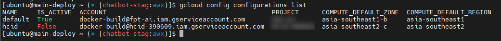

<h1 style="color:orange">Set up control server</h1>
<h2 style="color:orange">1. Cài đặt gcloud</h2>

1. Cài đặt gcloud CLI: https://cloud.google.com/sdk/docs/install
2. Set up gcloud: https://medium.com/google-cloud/how-to-use-multiple-accounts-with-gcloud-848fdb53a39a

 
<h2 style="color:orange">2. Setup kubectl client</h2>