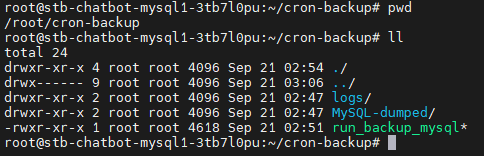
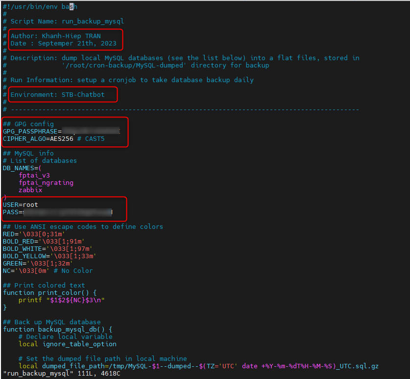
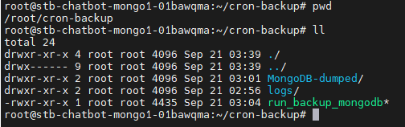

<h1 style="color:orange">Back up database</h1>
<h2 style="color:orange">1. MySQL</h2>
Mục đích của script backup là dùng câu lệnh mysqldump để backup mysql.<br>
Sau đó dùng gpg command để mã hóa file backup mysql vừa tạo.

Trên node master, tạo directory cho script backup:

    # cd /root/ && mkdir -p cron-backup/logs && mkdir -p cron-backup/MySQL-dumped
đẩy script backup vào trong directory cron-backup (Script backup nằm trong 23.backup-db.zip)

    # chmod +x run_backup_mysql
<br>
Sửa lại các thông tin của script:

    # vim run_backup_mysql
<br>
`GPG_PASSPHRASE` là chuỗi mã hóa của file output mysqldump<br>
`PASS` là pass root của mysql<br>

Sau khi chạy script, giải mã bằng câu lệnh:

    # gpg --batch --yes --passphrase dVGpcUk7x5U9VAI -o decrypted_file.sql.gz MySQL-fptid--encrypted-AES256--2023-09-19T13-16-05_UTC.sql.gz

Tạo crontab để chạy script

    # crontab -e
paste vào
```
SHELL=/bin/bash
PATH=/usr/local/sbin:/usr/local/bin:/usr/sbin:/usr/bin:/root/bin


# MySQL DB backup job - 03:16 AM
# -----------------------------------
16 20  * * * /root/cron-backup/run_backup_mysql > /root/cron-backup/logs/backup-mysql_$(TZ=UTC date +\%Y-\%m-\%dT\%H-\%M-\%S)_UTC.log 2>&1

# Clean up backup log files older than 90 days - 06:42 AM
# -----------------------------------
42 23 * * * find /root/cron-backup/logs/ -mtime +90 | xargs rm -rf {} \;

# Clean up backup database files older than 90 days - 05:42 AM
# -----------------------------------
42 22 * * * find /root/cron-backup/MySQL-dumped/ -mtime +90 | xargs rm -rf {} \;

# Clean up backup Zabbix server database files older than 7 days - 05:47 AM
# -----------------------------------
47 22 * * * find /root/cron-backup/MySQL-dumped/ -name "MySQL-zabbix--encrypted*" -mtime +7 | xargs rm -rf {} \;
```
<h2 style="color:orange">2. MongoDB</h2>
Mục đích của script backup là dùng câu lệnh mongodump để backup mongo.<br>
Sau đó dùng gpg command để mã hóa file backup mongo vừa tạo.

Trên node master, tạo directory cho script backup:

    # cd /root/ && mkdir -p cron-backup/logs && mkdir -p cron-backup/MongoDB-dumped
đẩy script backup vào trong directory cron-backup (Script backup nằm trong 23.backup-db.zip)

    # chmod +x run_backup_mongodb
<br>
Sửa lại thông tin tương tự script mysql

Tạo crontab để chạy script

    # crontab -e
paste vào
```
SHELL=/bin/bash
PATH=/usr/local/sbin:/usr/local/bin:/usr/sbin:/usr/bin:/root/bin


# MongoDB backup job - 01:16 AM
# -----------------------------------
16 18  * * * /root/cron-backup/run_backup_mongodb > /root/cron-backup/logs/backup-mongodb_$(TZ=UTC date +\%Y-\%m-\%dT\%H-\%M-\%S)_UTC.log 2>&1

# Clean up backup log files older than 60 days - 05:22 AM
# -----------------------------------
22 22 * * * find /root/cron-backup/logs/ -mtime +60 | xargs rm -rf {} \;

# Clean up database files older than 60 days - 05:42 AM
# -----------------------------------
42 22 * * * find /root/cron-backup/MongoDB-dumped/ -mtime +60 | xargs rm -rf {} \;
```