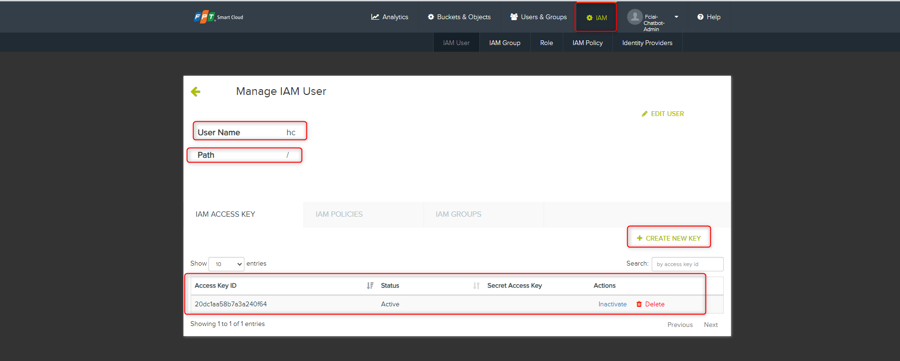
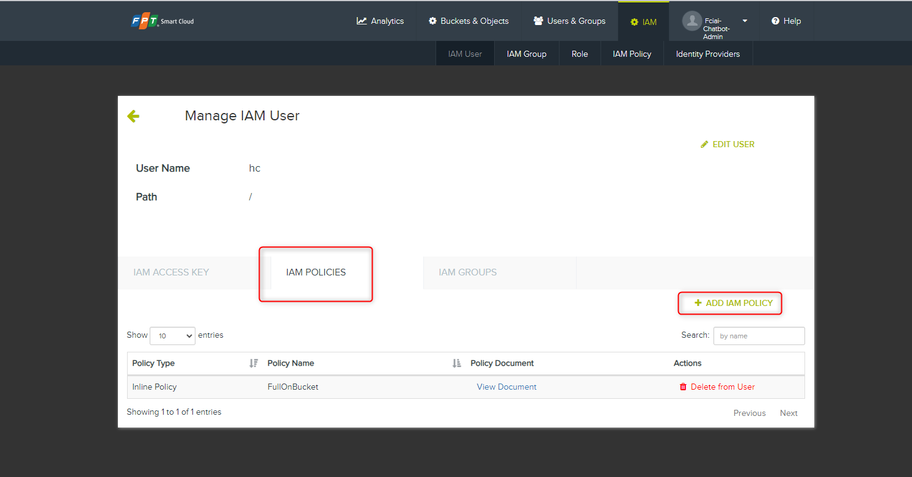
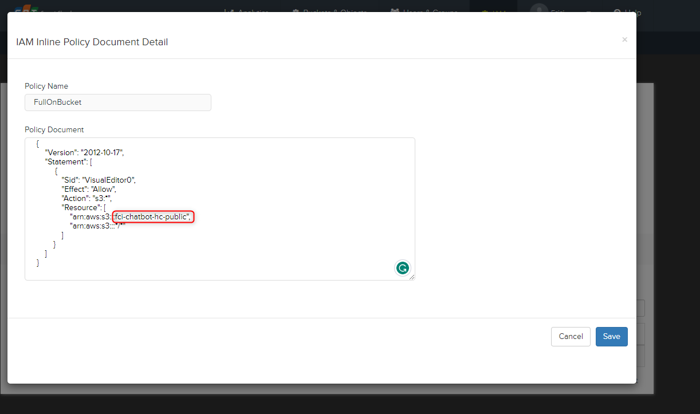

<h1 style="color:orange">Back up database</h1>
<h2 style="color:orange">1. MySQL</h2>
Mục đích của script backup là dùng câu lệnh mysqldump để backup mysql.<br>
Sau đó dùng gpg command để mã hóa file backup mysql vừa tạo.

Trên node master, tạo directory cho script backup:

    # cd /root/ && mkdir -p cron-backup/logs && mkdir -p cron-backup/MySQL-dumped
đẩy script backup vào trong directory cron-backup (Script backup nằm trong 23.backup-db.zip)

    # chmod +x run_backup_mysql
<br>
Sửa lại các thông tin của script:

    # vim run_backup_mysql
<br>
`GPG_PASSPHRASE` là chuỗi mã hóa của file output mysqldump<br>
`PASS` là pass root của mysql<br>

Script sử dụng mysqldump để backup mysql, câu lệnh mẫu ví dụ:

    # mysqldump -u root -p<password> --ignore-table=fptai_v3.bill_subscription_package_feature --set-gtid-purged=OFF fptai_v3 | gzip -c > MySQL-fptai_v3--encrypted-AES256--2023-10-03T20-16-01_UTC.sql.gz

Sau khi chạy script, giải mã bằng câu lệnh:

    # gpg --batch --yes --passphrase dVGpcUk7x5U9VAI -o decrypted_file.sql.gz MySQL-fptid--encrypted-AES256--2023-09-19T13-16-05_UTC.sql.gz

Tạo crontab để chạy script

    # crontab -e
paste vào
```
SHELL=/bin/bash
PATH=/usr/local/sbin:/usr/local/bin:/usr/sbin:/usr/bin:/root/bin


# MySQL DB backup job - 03:16 AM
# -----------------------------------
16 20  * * * /root/cron-backup/run_backup_mysql > /root/cron-backup/logs/backup-mysql_$(TZ=UTC date +\%Y-\%m-\%dT\%H-\%M-\%S)_UTC.log 2>&1

# Clean up backup log files older than 90 days - 06:42 AM
# -----------------------------------
42 23 * * * find /root/cron-backup/logs/ -mtime +90 | xargs rm -rf {} \;

# Clean up backup database files older than 90 days - 05:42 AM
# -----------------------------------
42 22 * * * find /root/cron-backup/MySQL-dumped/ -mtime +90 | xargs rm -rf {} \;

# Clean up backup Zabbix server database files older than 7 days - 05:47 AM
# -----------------------------------
47 22 * * * find /root/cron-backup/MySQL-dumped/ -name "MySQL-zabbix--encrypted*" -mtime +7 | xargs rm -rf {} \;
```
<h2 style="color:orange">2. MongoDB</h2>
Mục đích của script backup là dùng câu lệnh mongodump để backup mongo.<br>
Sau đó dùng gpg command để mã hóa file backup mongo vừa tạo.

Trên node master, tạo directory cho script backup:

    # cd /root/ && mkdir -p cron-backup/logs && mkdir -p cron-backup/MongoDB-dumped
đẩy script backup vào trong directory cron-backup (Script backup nằm trong 23.backup-db.zip)

    # chmod +x run_backup_mongodb
<br>
Sửa lại thông tin tương tự script mysql

Tạo crontab để chạy script

    # crontab -e
paste vào
```
SHELL=/bin/bash
PATH=/usr/local/sbin:/usr/local/bin:/usr/sbin:/usr/bin:/root/bin


# MongoDB backup job - 01:16 AM
# -----------------------------------
16 18  * * * /root/cron-backup/run_backup_mongodb > /root/cron-backup/logs/backup-mongodb_$(TZ=UTC date +\%Y-\%m-\%dT\%H-\%M-\%S)_UTC.log 2>&1

# Clean up backup log files older than 60 days - 05:22 AM
# -----------------------------------
22 22 * * * find /root/cron-backup/logs/ -mtime +60 | xargs rm -rf {} \;

# Clean up database files older than 60 days - 05:42 AM
# -----------------------------------
42 22 * * * find /root/cron-backup/MongoDB-dumped/ -mtime +60 | xargs rm -rf {} \;
```
<h3 style="color:orange">2.1. Đẩy dữ liệu lên s3</h3>
Cài đặt s3cmd. Tạo file config cho s3cmd với config:

    # vim ~/.s3cfg
paste vào config

```
# Setup endpoint
host_base = s3-sgn09.fptcloud.com
host_bucket = s3-sgn09.fptcloud.com
bucket_location = us-east-1
use_https = True

# Setup access keys
access_key = <access key>
secret_key = <secret key>

# Enable S3 v4 signature APIs
signature_v2 = False
```

Câu lệnh để đẩy object lên s3:

    # s3cmd --quiet --limit-rate=5m --recursive put <file> s3://<bucket>/<path>/
Paste vào command để tạo job crontab đẩy dữ liệu lên s3 hàng ngày

    # crontab -e
    paste vào
    16 19 * * * find /root/cron-backup/MongoDB-dumped/ -type f -name "*--$(/bin/date -d 'yesterday' '+\%Y-\%m-\%d')T*" -exec sh -c '/usr/bin/s3cmd -v put "$0" "s3://<bucket>/Mongodb-dumped/${0##*/}"' {} \;
<h3 style="color:orange">2.1.1. Cài đặt phân quyền trên s3</h3>
Để lấy được access_key và secret_key. Trên s3 tạo user: IAM<br>

<br>
User name: Tên user<br>
Path: "/"<br>
Create new key: để lấy access và secret key<br>

Tiếp tục phân quyền cho user: IAM POLICIES > Add IAM POLICY<br>
<br>
Phân quyền:<br>
<br>
Trong đó, `fci-chatbot-hc-public` là tên bucket cần đẩy dữ liệu vào.

```
{
    "Version": "2012-10-17",
    "Statement": [
         {
            "Sid": "VisualEditor0",
            "Effect": "Allow",
            "Action": "s3:*",
            "Resource": [
                "arn:aws:s3:::fci-chatbot-hc-public",
                "arn:aws:s3:::*/*"
            ]
        }
    ]
}
```