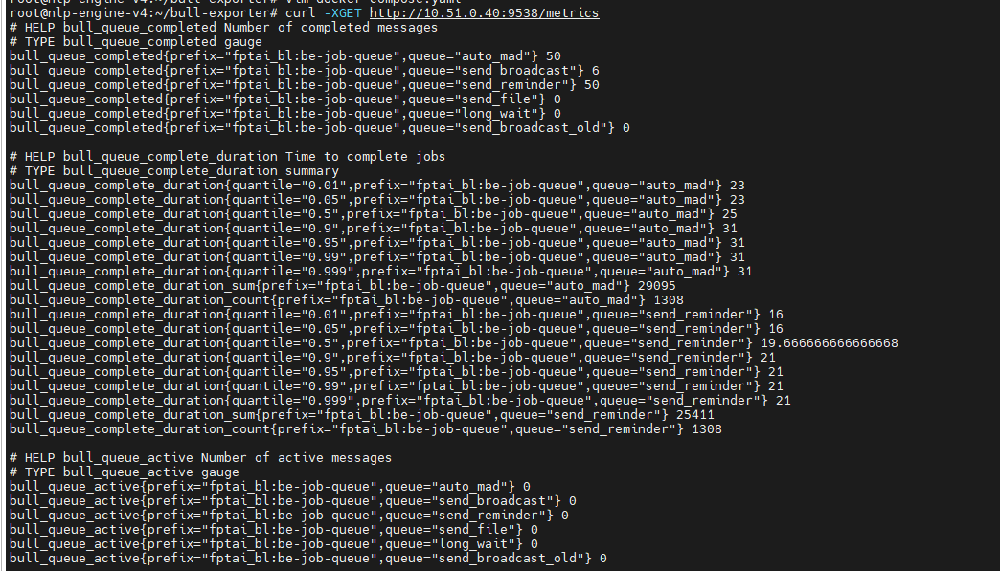
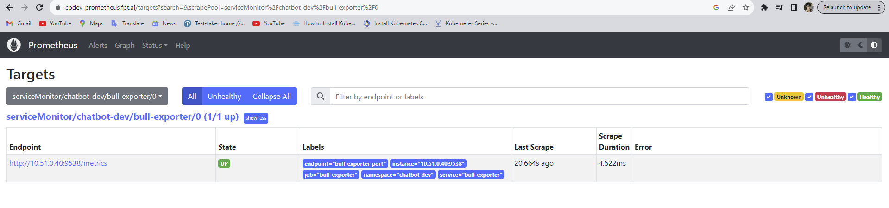
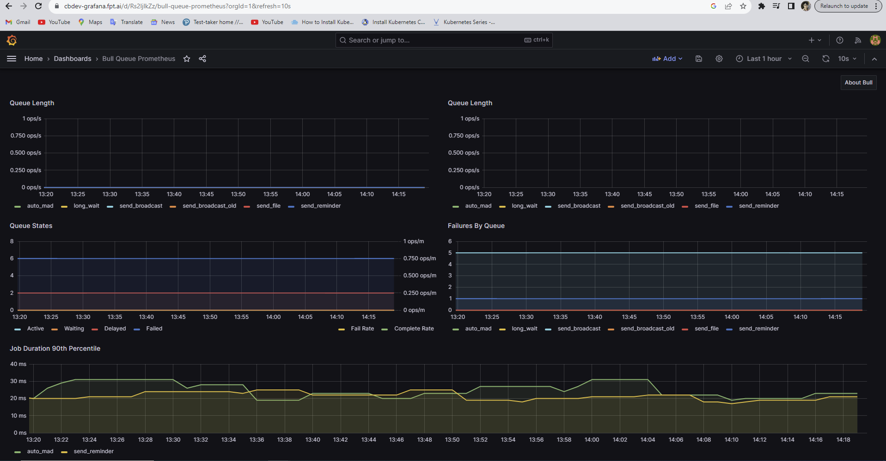

<h1 style="color:orange">Install bull-exporter</h1>
<h2 style="color:orange">1. Chuẩn bị</h2>
Bull-exporter là exporter lấy metric của redis và đẩy cho prometheus.

Cài đặt sẵn kube-prometheus trong k8s cluster.<br>
Cài đặt redis, IP: 10.51.0.40:6379<br>
Server cài đặt bull-exporter đã được cài docker và docker-compose, phải thông kết nối đến redis server<br>
Docker version 24.0.2, build cb74dfc<br>
docker-compose version 1.29.2, build 5becea4c<br>
<h2 style="color:orange">2. Cài đặt</h2>
Tạo folder cho bull_exporter

    # mkdir -p ~/bull-exporter && cd ~/bull-exporter
    # vim docker-compose.yaml
paste vào
```
version: '3.2'
services:
  bull-exporter:
    image: uphabit/bull_exporter:latest
    ports:
      - 9538:9538
    environment:
      EXPORTER_REDIS_URL: redis://:password@10.51.0.40:6379/1
      EXPORTER_PREFIX: 'fptai_bl:be-job-queue'
      EXPORTER_QUEUES: 'auto_mad send_broadcast send_reminder send_file long_wait send_broadcast_old'
      EXPORTER_AUTODISCOVER: 0
```
Tham khảo: https://github.com/UpHabit/bull_exporter

    # docker-compose up -d
Exporter sẽ listen port 9538 trên server, lưu ý, phải mở firewall để có thể lấy được metrics từ port này.

Kiểm tra:<br>
<br>
<h2 style="color:orange">3. Add target vào kube-prometheus</h2>
Ý tưởng là add endpoint, service và servicemonitor cho endpoint bull-exporter

    # vim bull-exporter.yaml
paste vào nội dung
```
---
apiVersion: v1
kind: Endpoints
metadata:
  labels:
    app.kubernetes.io/component: endpoint
    app.kubernetes.io/name: bull-exporter
    app.kubernetes.io/part-of: chatbot-dev
  name: bull-exporter
  namespace: chatbot-dev
subsets:
- addresses:
  - ip: 10.51.0.40
  - ip: xx.xx.xx.xx
  ports:
  - name: bull-exporter-port
    port: 9538
---
apiVersion: v1
kind: Service
metadata:
  labels:
    app.kubernetes.io/component: endpoint
    app.kubernetes.io/name: bull-exporter
    app.kubernetes.io/part-of: chatbot-dev
  name: bull-exporter
  namespace: chatbot-dev
spec:
  clusterIP: None
  ports:
  - name: bull-exporter-port
    port: 9538
---
apiVersion: monitoring.coreos.com/v1
kind: ServiceMonitor
metadata:
  labels:
    release: prometheus
  name: bull-exporter
  namespace: chatbot-dev
spec:
  endpoints:
  - interval: 60s
    port: bull-exporter-port
    path: /metrics
  selector:
    matchLabels:
      app.kubernetes.io/component: endpoint
      app.kubernetes.io/name: bull-exporter
      app.kubernetes.io/part-of: chatbot-dev
```
Lưu ý, phần `spec.ports.name` giữa các resource phải trùng nhau<br>
Phần `metadata.labels` giữa các resources phải trùng nhau<br>
Phần `metadata.name` giữa các resources cũng phải trùng nhau.<br>
Endpoints có thể add nhiều ip.<br>
Tham khảo: https://github.com/thaum-xyz/ankhmorpork/tree/master/apps/homeassistant/manifests/esphomedevices

Kiểm tra đã có target trên kube-prometheus<br>
<br>
Trên grafana import dashboard: ID: 10128<br>
<br>