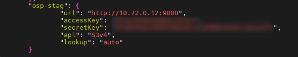

<h1 style="color:orange">Cài đặt minio gateway</h1>
Minio gateway có tác dụng biến minio thành proxy cho s3 của aws hoặc cho minio khác. Minio gateway chỉ xuất hiện ở version từ 2020 đến 7/2022 để phục vụ mục đích phổ biến s3 API cho cộng đồng. Tham khảo: https://blog.min.io/deprecation-of-the-minio-gateway/

Chuẩn bị: <br>
- minio version: RELEASE.2020-02-27T00-23-05Z<br>
- server minio gateway ip: 10.72.0.12:9000

<h2 style="color:orange">1.Config supervisord</h2>
Minio sử dụng supervisord để chạy daemon trên ubuntu 20.04

Config supervisord:
```
# vim /etc/supervisor/conf.d/minio.conf

[program:minio]
command=/usr/local/bin/minio gateway s3 https://s3-sgn09.fptcloud.com
stopasgroup=true
autostart=true
autorestart=true
startretries=1
user=ubuntu
directory=/home/ubuntu
redirect_stderr=true
stdout_logfile=/var/log/minio/output.log
stdout_logfile_maxbytes=10MB
stdout_logfile_backups=10
environment =
        LANGUAGE=C.UTF-8,
        LC_ALL=C.UTF-8,
        MINIO_ACCESS_KEY=<ACCESS_KEY>,
        MINIO_SECRET_KEY=<SECRET_KEY>
```
Trong đó:
- `https://s3-sgn09.fptcloud.com` là endpoint của object storage tương tự minio
- `MINIO_ACCESS_KEY`: là access_key có quyền thao tác với bucket của https://s3-sgn09.fptcloud.com
- `MINIO_SECRET_KEY`: là secret_key có quyền thao tác với bucket
<h2 style="color:orange">Config nlp-engine</h2>

    # vim /home/ubuntu/nlp-engine-v4/fptai_nlp/config.py
<br>
Trong đó: minio_endpoint là ip 10.72.0.12:9000<br>
minio bucket là bucket trên `https://s3-sgn09.fptcloud.com` mà access_key và secret_key có quyền thao tác (ACCESS_KEY và SECRET_KEY ở trên)<br>

<br>
<h2 style="color:orange">2.Kiểm tra</h2>
Kiểm tra bằng mc client:

<br>
url là endpoint của minio gateway

Sau khi train xong check trên `https://s3-sgn09.fptcloud.com`:<br>
<br>