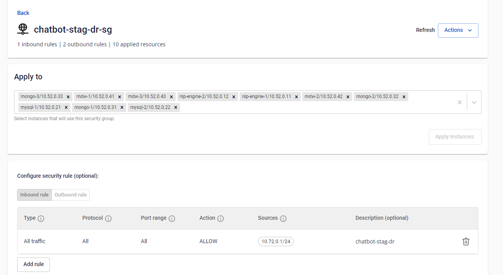
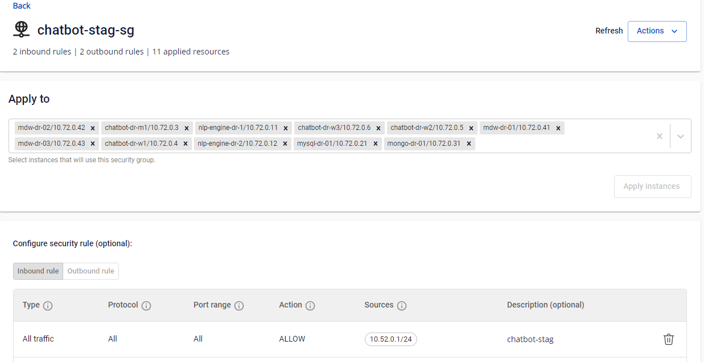
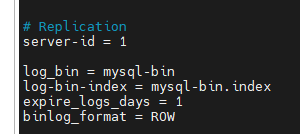
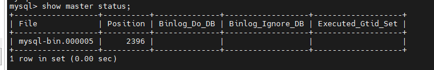
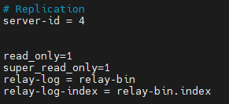
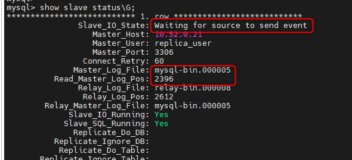

<h1 style="color:orange">Cài đặt mysql-replication cho DR</h1>

Tham khảo: https://phoenixnap.com/kb/mysql-master-slave-replication
<h2 style="color:orange">1.Chuẩn bị</h2>
Server cài đặt mysql-master: 10.52.0.21<br>
server cài đặt mysql-slave: 10.72.0.21<br>
2 server nằm trong 2 mạng LAN khác nhau

- Mở firewall port 3306 giữa 2 server (ufw, console cloud)<br>
<br>
<br>
<h2 style="color:orange">2.Cài đặt master</h2>
Config của master:

<br>
Tạo user replication

    mysql> CREATE USER '[user_name]'@'[ip_address]' IDENTIFIED WITH mysql_native_password BY '[password]';
    mysql> GRANT REPLICATION SLAVE ON *.* TO '[user_name]'@'[ip_address]';
    mysql> FLUSH PRIVILEGES;
<h3 style="color:orange">2.1. Khóa database</h3>
Để khóa log file position

    mysql> FLUSH TABLES WITH READ LOCK;
    mysql> show master status;
<br>
<h3 style="color:orange">2.2. dump db master</h3>
Nếu như cài đặt replicate cho 1 master đã có sẵn data. Bắt buộc phải dump data từ master và đẩy vào slave

    # mysqldump -u root -p --all-databases > alldatabases.sql
Chuyển file dump sang server slave, trên con slave, restore db:

    # mysql -u your_username -p < alldatabases.sql
<h2 style="color:orange">3. Cài đặt slave</h2>
Trên server slave, cop nguyên config từ master, đổi mỗi phần replicate

<br>
Lưu ý: 
- server-id phải khác với master hoặc các node slave khác.
- read_only=1: để disable user khác root ghi (thêm,sửa,xóa,update) vào db
- super_read_only=1: để disable root ghi vào db
Để tắt read_only, sửa các giá trị này về 0 và restart mysql. Hoặc vào mysql CLI:

      mysql> SET GLOBAL super_read_only = 0;
      mysql> SET GLOBAL read_only = 0;
để check status read_only của 1 db: 

    mysql> SELECT @@global.read_only, @@global.super_read_only;
Restart mysql slave để nhận cấu hình:
    
    # systemctl restart mysql
<h2 style="color:orange">3.1. Start replication</h2>

    mysql> CHANGE REPLICATION SOURCE TO
    SOURCE_HOST='master_server_ip',
    SOURCE_USER='replica_user',
    SOURCE_PASSWORD='password',
    SOURCE_LOG_FILE='mysql-bin.000005',
    SOURCE_LOG_POS=2396;
Lưu ý: `LOG_FILE` và `LOG_POS` phải giống với `master status`.<br>
Start replica:

    mysql> START REPLICA;
    mysql> SHOW REPLICA STATUS\G;
<br>
<h2 style="color:orange">4. Unlock table master</h2>

    mysql> UNLOCK TABLES;
<h2 style="color:orange">5. Up mysql slave khi xảy ra Disaster</h2>
Các bước để restore slave mysql khi master mysql chết

1. Master mysql chết
2. Vào mysql slave 

       mysql> STOP REPLICA;
3. sửa config mysql slave, comment 2 dòng:

       read_only=1
       super_read_only=1
4. Restart mysql slave

hoặc có thể ko cần restart mysql slave bằng cách vào mysql tắt cấu hình dynamic:

    mysql> SET GLOBAL super_read_only = 0;
    mysql> SET GLOBAL read_only = 0;
<h2 style="color:orange">5. Force replicate master-slave</h2>
Khi slave ko chặn ghi mà bị ghi vào slave -> conflict với master -> replicate ko chạy nữa. Yêu cầu phải force replica cho slave.

Các bước thực hiện:
stop replica -> reset master -> sau đó chạy change replication source to source_host= < master_ip> ,source_user= < user replication> ,source_password=< pass replication> , source_logfile= <logfile từ master> , source_log_pos=<position từ master>;
-> start replica

```
mysql> STOP REPLICA;
mysql> RESET SLAVE ALL;
mysql> CHANGE REPLICATION SOURCE TO 
    SOURCE_HOST = '<master_ip>',
    SOURCE_USER = '<replication_user>',
    SOURCE_PASSWORD = '<replication_password>',
    SOURCE_LOG_FILE = '<master_log_file>',
    SOURCE_LOG_POS = <master_log_position>;
mysql> START REPLICA;
mysql> SHOW REPLICA STATUS\G;

Để an toàn thì giới hạn read_only cho mysql-slave