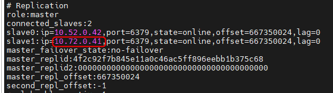

<h1 style="color:orange">Cài đặt redis-replication cho DR</h1>
<h2 style="color:orange">1. Chuẩn bị</h2>
2 server cài redis 7.2.0: 
- master: 10.52.0.41 
- slave: 10.72.0.41 

<h2 style="color:orange">2. Cài đặt</h2>
Thêm 1 dòng vào `/etc/redis/redis.conf`:

    slaveof 10.52.0.41 6379
    # systemctl restart redis

Check câu lệnh `info` trên server redis-master:
 
