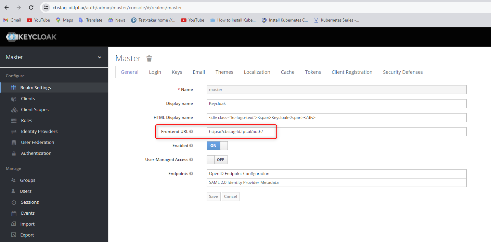

<h1 style="color:orange">Cài đặt keycloak cho DR</h1>
Chuẩn bị:

- server cài keycloak: 10.72.0.251
- server cài mysql-DR là nơi lưu data cho keycloak, đồng thời cũng là slave của mysql master trên site chính. IP: 10.72.0.21
<h2 style="color:orange">1. Cài đặt mysql</h2>
Trong bài viết, mysql đã được replicate data từ master, đã có user cho keycloak với quyền đầy đủ cho keycloak.<br>

Unlock ghi vào database:

    mysql>  SET GLOBAL read_only = 0;
    mysql>  SET GLOBAL super_read_only = 0;
Check master và slave status trên node master (trên site chính) và slave (trên site DR), đảm bảo cho Log_Position của 2 file giống nhau
<h2 style="color:orange">2. Cài đặt keycloak DR</h2>
Trên server cài đặt keycloak (10.72.0.251):

- Cài đặt docker
- Tạo file docker compose để chạy keycloak

      # mkdir /root/iam && cd /root/iam
      # vim docker-compose.yaml
paste vào nội dung:
```
version: '3.8'
services:
  iam-svc:
    image: "gcr.io/fpt-ai/iam:v3.1"
    ports:
      - 8088:8080
      - 8443:8443
    environment:
      DB_ADDR: "10.72.0.21"
      DB_DATABASE: "keycloak"
      DB_PASSWORD: "<mysql_password_for_keycloak>"
      DB_PORT: "3306"
      DB_USER: "keycloak"
      DB_VENDOR: "mysql"
      KC_PROXY: "edge"
      KEYCLOAK_FRONTEND_URL: "https://cbstag-id.fpt.ai/auth/"
      KEYCLOAK_PROXY: "edge"
      PROXY_ADDRESS_FORWARDING: "true"
    restart: always
    deploy:
      resources:
        limits:
          cpus: '1'
          memory: 2g
        reservations:
          cpus: '0.25'
          memory: 600M
```
Lưu ý: 
- trong config của file docker-compose ko cần 2 biến `KEYCLOAK_PASSWORD` và `KEYCLOAK_USER` vì 2 biến này đã được lưu sẵn trong mysql.
- Biến `KEYCLOAK_FRONTEND_URL` phải giống với cấu hình có sẵn của keycloak đã có

<br>
Tạo container chạy keycloak:

    # docker compose up -d
<h2 style="color:orange">3. Cài đặt nginx</h2>
Trên nginx cụm DR

    # cd /etc/nginx/conf.d/ && vim iam.conf
paste vào
```
server {
    listen 80;
    server_name cbstag-id.fpt.ai;
    return 301 https://cbstag-id.fpt.ai$request_uri;
}

server {
    server_name cbstag-id.fpt.ai;

    access_log /var/log/nginx/cbstag-id.fpt.ai.access.log main;
    error_log /var/log/nginx/cbstag-id.fpt.ai.error.log error;

    location / {
        proxy_pass http://10.72.0.251:8088;
        proxy_pass_request_headers      on;
        proxy_set_header                Host $host;
        proxy_set_header  X-Real-IP $remote_addr;
        proxy_set_header  X-Forwarded-Proto https;
        proxy_set_header  X-Forwarded-For $remote_addr;
        proxy_set_header  X-Forwarded-Host $host;

        # Redirect root URL to /auth/realms/FptSmartCloud/account/
        location = / {
            return 301 /auth/realms/FptSmartCloud/account/;
        }
    }

    include /etc/nginx/ssl/fpt.ai-ssl.conf;
}
```

    # nginx -s reload