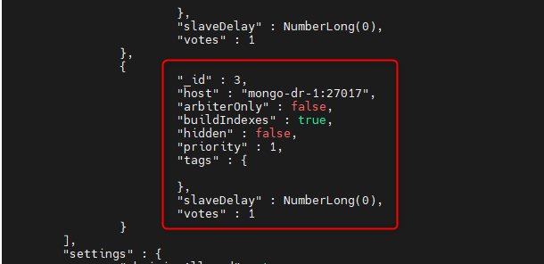
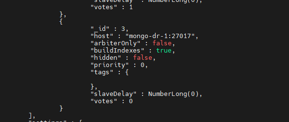
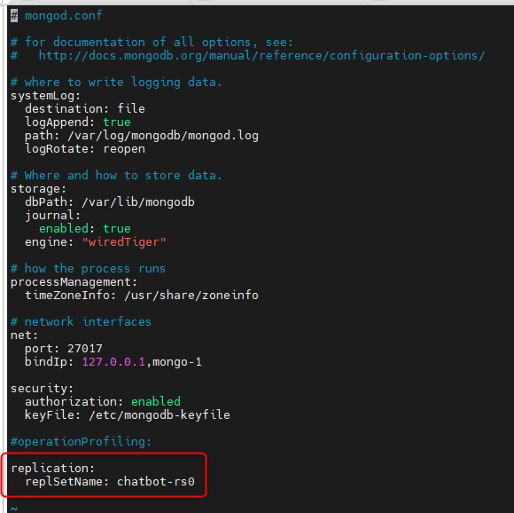

<h1 style="color:orange">Cài đặt mongodb DR</h1>

Cấu hình node mongodb DR, vô hiệu hóa bình bầu. Tham khảo: https://www.mongodb.com/docs/manual/tutorial/configure-a-non-voting-replica-set-member/#:~:text=To%20configure%20a%20member%20as,priority%20values%20to%200%20.

Trên node master, truy cập vào mongo-shell

    > rs.conf()
 
Check trong mongo cluster có node id=3 (mongo-dr-1:27017) với mong muốn set node này thành node passive không voting.

Để set node này thành node passive:

    > cfg = rs.conf();
    > cfg.members[n].votes = 0;
    > cfg.members[n].priority = 0;
    > rs.reconfig(cfg);
Sau đó check lại config:

    > rs.conf()
 
<h2 style="color:orange">1. Restore mongodb DR</h2>
Vào file config mongo

    # vim /etc/mongod.conf
comment dòng: 
 

    replication:
      replSetName: chatbot-rs0
Sau đó restart mongodb

    # systemctl restart mongodb