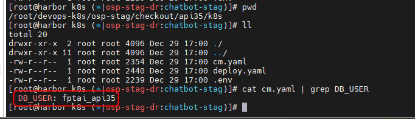

<h1 style="color:orange">Script-deploy service k8s sử dụng ansible</h1>
CI/CD của chatbot sử dụng ansible để build image và deploy.

- Hướng dẫn thực hiện deploy trên cụm `chatbot-stag-dr` quản lý trên https://k8s-manage.fci.vn/:<br>
https://k8s-manage.fci.vn/dashboard/c/c-m-98kvq4zz/explorer#cluster-events<br>

<br>
- Code ansible deploy cụm dev `chatbot-stag-dr`: https://gitlab.fci.vn/chatbot/fptai-devops-dev<br>
branch: osp-dev
<br>
<h2 style="color:orange">1. Khái quát chung Script-deploy</h2>

```
# git clone ssh://git@gitlab.fci.vn:2222/chatbot/fptai-devops-dev.git
# cd fptai-devops-dev/public.cloud/
```
<br>
Chạy lệnh ví dụ: <br>

```
# cd ./fptai-devops-dev/public.cloud/
# ansible-playbook -i inventories/osp-stag-dr deploy-stag.yaml --vault-id vp_stag@$HOME/.ssh/vp/stag -e "service=api35"
```
Trong đó:
- `inventories/osp-stag-dr` là path chứa file hosts.yaml và var để chạy playbook<br>
<br>
10.51.0.240 là host mà ansible sẽ chạy playbook
- `deploy-stag.yaml` là file playbook
- `vault-id` là option define sử dụng vault-pass để giải mã những biến được mã hóa trong phần var: `vp_stag` là tên các biến, `@HOME/.ssh/vp/stag` là path của file giải mã. VD:<br>
<br>
- option `-e` define biến environment. Trong ví dụ là `service=api35` thì sẽ deploy service api35 lấy var trong path `inventories/osp-stag-dr/group_vars/api35/` và template file manifest trong `inventories/osp-stag-dr/group_vars/api35/`
<br>
<br>

-----> Nhìn chung, script sẽ ssh vào VM 10.51.0.240 (có kết nối đến rancher cụm osp-stag-dr), tạo 1 file configmap từ phần var đã define trong path `inventories/osp-stag-dr/group_vars/api35/`, và 1 file deploy.yaml từ template đã define trong `inventories/osp-stag-dr/group_vars/api35/` và apply vào cụm `osp-stag-dr` bằng kubectl-client.
<h2 style="color:orange">2. Chi tiết</h2>

- B1: Script deploy ssh vào server build 10.51.0.240 bằng user root, vàp path: `/root/devops-k8s/osp-stag/checkout`
- B2: Tạo thư mục `api35` và change directory vào đó, gitclone code từ repo `ssh://git@gitlab.fci.vn:2222/chatbot/fptai-v3-api.git`, branch mặc định là `v4/staging`
<br>
- B3: Build image trong thư mục git vừa clone và đẩy lên private registry, trong ví dụ sử dụng `https://cbdev-harbor.fpt.ai`
- B4: Sau đó tạo thư mục `k8s` trong path `/root/devops-k8s/osp-stag/checkout/api35` (trên 10.51.0.240) để tạo configmap dựa trên file `osp-stag-dr/group_vars/api35/vars.yaml` và file `template-stag/api35/.env.j2`;<br>
Tạo file deployment dựa trên file `osp-stag-dr/group_vars/api35/vars.yaml` và file `template-stag/api35/deploy.yaml.j2`; File deploy.yaml này apply deployment sử dụng image vừa được tạo ở B3<br>
<br>
2 File này sẽ được apply vào cụm osp-stag-dr trên rancher qua client kết nối bằng file `/root/.kube/clusters/osp-stag-dr.yaml` (trên 10.51.0.240)
<br>
<h3 style="color:orange">2.1. Tạo ingress-nginx cho service</h3>

```
# cd fptai-devops-dev/public.cloud/playbooks/
# ansible-playbook -i ../inventories/osp-stag-dr/ deploy-ing-stag.yaml --vault-id vp_stag@$HOME/.ssh/vp/stag -e "ingress_name=api35"
```
<h3 style="color:orange">2.2. Tạo endpointslice</h3>
Mục đích tạo endpointslice để cấu hình các service trong k8s ko gọi qua ip trực tiếp mà gọi qua endpointslice -> để nếu có đổi IP thì chỉ cần sửa endpointslice chứ ko cần phải sửa toàn bộ configmap của các service

```
# cd fptai-devops-dev/public.cloud/playbooks/
# ansible-playbook -i ../inventories/osp-stag/ deploy-eps-stag.yaml --vault-id vp_stag@$HOME/.ssh/vp/stag -e "endpointslice_name=redis namespace=chatbot-stag"
```
<br>
<h3 style="color:orange">2.3. Các command mẫu</h3>

Command deploy service:
```
# ansible-playbook -i inventories/osp-stag-dr deploy-stag.yaml --vault-id vp_stag@$HOME/.ssh/vp/stag -e "service=api35"
# ansible-playbook -i inventories/osp-stag-dr deploy-stag.yaml --vault-id vp_stag@$HOME/.ssh/vp/stag -e "service=bl35"
# ansible-playbook -i inventories/osp-stag-dr deploy-stag.yaml --vault-id vp_stag@$HOME/.ssh/vp/stag -e "service=msgr-be"
```

Command deploy endpoinslice
```
# ansible-playbook -i ../inventories/osp-stag/ deploy-eps-stag.yaml --vault-id vp_stag@$HOME/.ssh/vp/stag -e "endpointslice_name=redis namespace=chatbot-stag"
# ansible-playbook -i ../inventories/osp-stag/ deploy-eps-stag.yaml --vault-id vp_stag@$HOME/.ssh/vp/stag -e "endpointslice_name=mysql namespace=chatbot-stag"
# ansible-playbook -i ../inventories/osp-stag/ deploy-eps-stag.yaml --vault-id vp_stag@$HOME/.ssh/vp/stag -e "endpointslice_name=mongo namespace=chatbot-stag"
```

Command deploy ingress
```
# ansible-playbook -i ../inventories/osp-stag-dr/ deploy-ing-stag.yaml --vault-id vp_stag@$HOME/.ssh/vp/stag -e "ingress_name=api35"
# ansible-playbook -i ../inventories/osp-stag-dr/ deploy-ing-stag.yaml --vault-id vp_stag@$HOME/.ssh/vp/stag -e "ingress_name=bl35"
# ansible-playbook -i ../inventories/osp-stag-dr/ deploy-ing-stag.yaml --vault-id vp_stag@$HOME/.ssh/vp/stag -e "ingress_name=msgr-be"
```
Lưu ý: ko phải service nào cũng phải có ingress, có những service cài lên có thể gọi nội bộ trong k8s, ko cần phải public nên ko cần ingress
<h2 style="color:orange">3. Add env cho service</h2>
Trong quá trình làm việc sẽ được yêu cầu add env cho service, yêu cầu phải update configmap và restart lại deployment. Hướng dẫn sử dụng biến của service api35 cụm osp-stag-dr.

Team developer chatbot, ví dụ: anhvh16, luynt yêu cầu update env `DB_USER` của service `api35` thành giá trị `fptai_api`
- B1: update var `db_user: 'fptai_api35'` trong file var: `inventories/osp-stag-dr/group_vars/api35/`
<br>
- B2: khi chạy script deploy, configmap tạo từ `template-stag/api35/.env.j2` sẽ đọc giá trị này từ `inventories/osp-stag-dr/group_vars/api35/`
<br>
Kiểm tra trên server deploy (10.51.0.240)<br>
<br>

Nếu ko có biến này trong file template và var thì có thể tự thêm vào. Ví dụ: muốn add env `ENV_TEST: test123` thì thêm dòng:
- `env_test: 'test123'` vào file `inventories/osp-stag-dr/group_vars/api35/`
- `ENV_TEST={{ env_test }}` vào file `template-stag/api35/.env.j2`
<h3 style="color:orange">3.1. thêm env các service frontend</h3>

Các service frontend ko đọc env từ configmap trong k8s mà env được đẩy vào build luôn cùng image. Ví dụ: service `livechat36`

