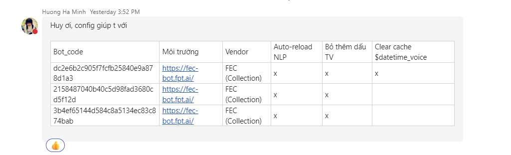
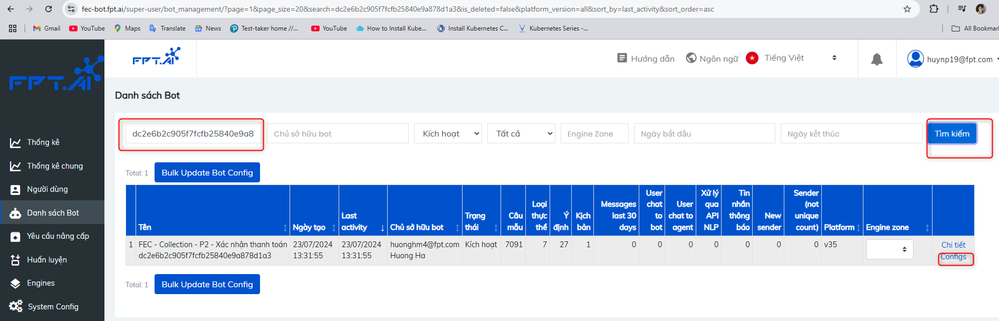
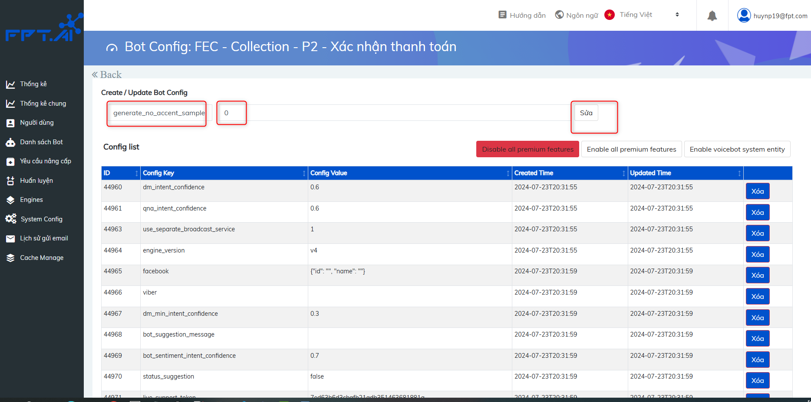
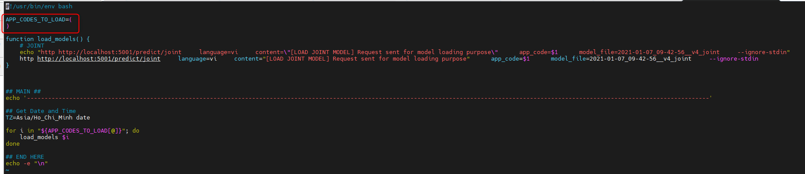
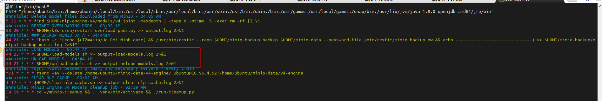
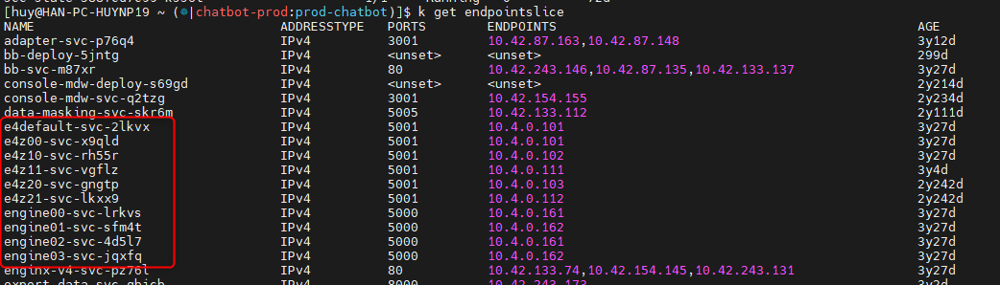
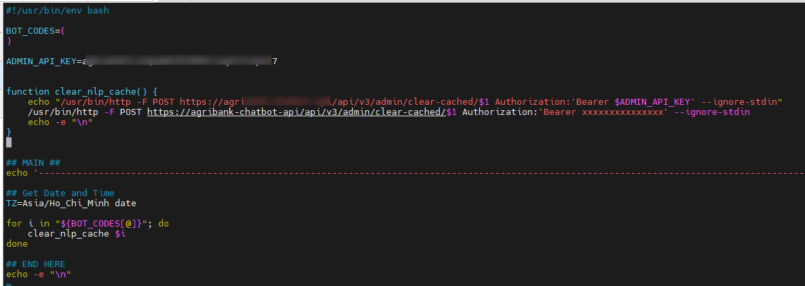
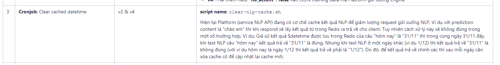

<h1 style="color:orange">Note bot-code</h1>
Trong quá trình làm việc sẽ được đội bot-builder nhờ add config cho bot

<br>
| Bot_code | Môi trường	| Vendor | Auto-reload NLP | Bỏ thêm dấu TV | Clear cache $datetime_voice |
| -------- | ----------- | --------- | ------- | ------ | ------- |
| dc2e6b2c905f7fcfb25840e9a878d1a3 | https://fec-bot.fpt.ai/ | FEC (Collection) | x | x | x |
| 2158487040b40c5d98fad3680cd5f12d | https://fec-bot.fpt.ai/ | FEC (Collection) | x | x |
| 3b4ef65144d584c8a5134ec83c874bab | https://fec-bot.fpt.ai/ | FEC (Collection) | x | x |

<h2 style="color:orange">1. Bỏ thêm dấu Tiếng Việt</h2>
Mục đích: khi train  thì ngoài data đội bot-builder (BB) làm thì hệ thống tự động thêm data từ chính những câu đấy (mà không có các dấu tiếng Việt)

Ví dụ một câu như: "Tôi ăn cơm" thì một câu không có dấu tiếng Việt của nó là "Toi an com" -> đội bot-builder hay có yêu cầu là không dùng tính năng này.

1. Vào path trên browser https://fec-bot.fpt.ai/super-user/dashboard/ ( yêu cầu phải có tài khoản môi trường này và có đủ quyền).
<br>
2. Nhập mã bot (bot_code ở trên) -> Tìm kiếm -> Configs -> phần `Config Key` nhập `generate_no_accent_sample`; với Config Value=0
<br>

<h3 style="color:orange">1.1. Note để phân quyền user đăng nhập được vào /super-user/dashboard/</h3>
Sau khi deploy xong, vào pod bl35. Ví dụ ở đây:

       # kubectl exec --stdin --tty f35-bl-deploy-6dbc87445-tq7kp  -- /bin/bash
       chạy lệnh tạo superuser
       # python manage.py createsuperuser
Nếu user đã được tạo thì chạy lệnh:
```
$) python manage.py shell
>>> from django.contrib.auth import get_user_model
>>> User = get_user_model()
>>> user = User.objects.get(email="huynp19@fpt.com")
>>> user.is_staff = True
>>> user.is_admin = True
>>> user.is_superuser = True
>>> user.save()
```
Đối với những cụm dùng code cũ, vd: 1mg, myvib ko dùng keycloak, ko có UI keycloak thì cũng exec vào pod fptid (pod chạy SSO), chạy lệnh
```
$) python manage_gcloudbuild.py shell
>>> from django.contrib.auth.models import User
>>> from django.contrib.auth import get_user_model
>>> User = get_user_model()
>>> user = User.objects.get(email="huynp19@fpt.com")
>>> user.is_active = True
>>> user.save()
```
<h2 style="color:orange">2. Auto reload nlp</h2>
SSh vào 2 con NLP:
Trong file load_models.sh array trong là APP_CODES_TO_LOAD

<br>
Ví dụ:
```
APP_CODES_TO_LOAD=(
a5f4b1bcc9ec6fb38f05d0eba1eb6f41
0552bdb784f1214cad5361014ad504a2
27157f6cecc00d55400fb97dc1c79e86
4b4bff1a6b1cfa8052002c6ebeade0e3
)
```
Chạy script để load model lên RAM:
   
    # /home/ubuntu/load-models.sh
Tương tự file `unload-models.sh` cũng add vào array: `APP_CODES_TO_KEEP_LOADED`, tức là chỉ unload những bot khác mà không unload các bot có trong array. Mục đích của việc này là unload các bot linh tinh bị load lên trong quá trình sử dụng mà không đụng chạm gì đến các bot quan trọng nhất của khách hàng. Các bot linh tinh thì có thể là bot của các anh chị em bên mình tạo bừa để test, xong model bị load lên gây tốn RAM... Tuy nhiên, thường để array này trống cũng được vì trong crontab đã đặt job load model lên trước.
<br>
<h3 style="color:orange">2.1. Note zone</h3>

Với môi trường chatbot-production, có những zone sau: zone00, zone10, zone11, zone20, zone21
- zone20 và zone21 thì dựng lên nhưng chưa dùng, để backup zone10 và zone11
- zone VIP là zone10 và zone11
Nhưng thực ra khái niệm VIP chỉ là chung chung: Gọi tên vậy để phân biệt giữa server ưu tiên hơn với các server khác. Mọi người do ko hiểu ở dưới hoạt động chính xác thế nào nên mới dùng từ VIP đấy để mô tả
- Con zone11 là của riêng HC
<br>
- engine00-03 là của engine-v3, hiện tại chỉ còn 1 số ít bot sử dụng

Để xác định xem bot code thêm vào script load_models.sh trên con nlp zone nào: Truy cập vào mysql:
```
mysql> use fptai_v3;
mysql> select * from application where code="9d30033d7a4e98fd7d2de835b06774e9";
mysql> select * from application where code="156976741adac6a8c6f0a4f0125f8ec1";
```
Nếu engine_zone trống thì để thêm bot code vào script trên con engine z00 (10.4.0.101), nếu có giá trị zone thì tùy vào zone nào mà thêm vào script trên engine đó.
<h2 style="color:orange">3. Clear cache nlp</h2>

Tương tự file `clear-nlp-cache.sh`
<br>
Để clear cache bot-code: vào script  clear-nlp-cache.sh paste botcode vào script phần `BOT_CODES`.<br>
Trong đó, ADMIN_API_KEY lấy từ config map của deploy api35.

Tác dụng của script clear-nlp-cache.sh:
<br>