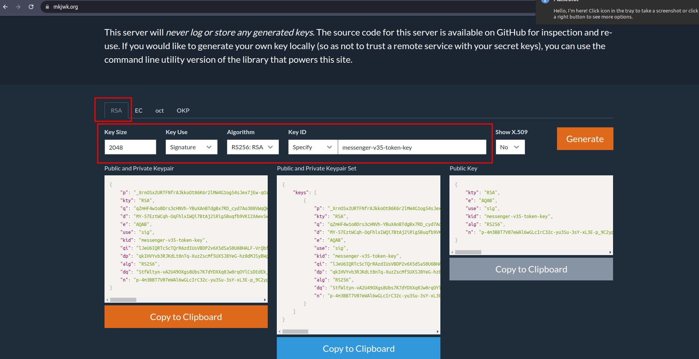

<h1 style="color:orange">Checklist xây dựng môi trường mới</h1>
Hướng dẫn viết dựa trên việc cài đặt cụm agribank.

Tham khảo: https://wiki.fci.vn/pages/viewpage.action?pageId=50900469

1. [Byhand] Dự kiến tài nguyên, điền vào file excel quy hoạch định cỡ (hạ tầng): https://fptsoftware362.sharepoint.com/:x:/r/sites/FCI_AI_OPS/_layouts/15/doc2.aspx?sourcedoc=%7B7456988c-0db3-47d3-b7ff-9c173c0b183a%7D&action=edit&activeCell=%27VCB-CHATBOT%27!C43&wdinitialsession=752c627d-7377-4997-8853-e4fc8e995920&wdrldsc=15&wdrldc=1&wdrldr=AccessTokenExpiredWarningUnauthenticated%2CRefreshin
<br>
Nhận hạ tầng từ team ops (ngaihv2, hieuny)
2. [Python] Kiểm tra tài nguyên được cấp có đúng với yêu cầu: `chatbot-dedicated-deploy/chatbot-3.5-platform/check-infra`
3. [Byhand] Lấy IP SNAT và yêu cầu mở firewall đến các service cần thiết bằng ticket trên userservice (VD: acr.fci.vn, console-cloud, zabbix6,...)
4. [Byhand] Cài k8s-ingress-nginx, tạo namespace chatbot, add secret acr.fci.vn (để có quyền pull image).
5. [Byhand] Add kubeconfig từ rancher lên control-node (node chạy ansible) và deploy-server (10.51.0.240). Chi tiết xem path `/root/.kube/clusters`
6. [Byhand] List toàn bộ domain cần thiết để submit lên `userservice` yêu cầu tạo A record mới. Tham khảo: https://wiki.fci.vn/display/AICHATBOT/AGRIBANK-Chatbot<br>
    Lưu ý: 1 số domain khi add cloudflare không được đi qua WAF vì sẽ bị add header X-Frame-Options: SAMEORIGIN (vd: agribank-livechat.fpt.ai, agribank-chatapi.fpt.ai, agribank-id.fpt.ai,...)
7. [Byhand] Tạo ticket xin FOS bucket trên https://s3-sgn10.fptcloud.com/. Tham khảo bucket `fci-chatbot-agribank-public`
8. [Byhand] duplicate `keepass` group từ project gần nhất và update các entry trong quá trình deploy<br>
<br>
9. [Byhand] Tạo vault_pass cho môi trường mới
10. [Python] gen các password, token và secret cần thiết cho hệ thống sử dụng script python: `chatbot-dedicated-deploy/chatbot-3.5-platform/secret-generator`<br>
Để gen ra jwk: kty: "RSA", algorith: "RS256", key use: "signature", key id: "messenger-v35-token-key"
<br>
11. Clone wiki project gần nhất và điền vào wiki.fci.vn. Tham khảo: https://wiki.fci.vn/display/AICHATBOT/AGRIBANK-Chatbot
12. Tạo MS Teams webhook URL để điền vào code devops deploy (EDIT -> Configured -> Configure -> Create new)<br>
<br>
<br>
13. [Ansible] Cài đặt các package setup cơ bản ban đầu cho các server ubuntu 20.04 (`trừ 2 server cài NLP`): chatbot-dedicated-deploy/chatbot-3.5-platform/init-ubuntu-20.04
14. [Ansible] cài đặt các module cho hệ thống chatbot (dùng password, token, secret gen từ bước 10)
   ```
   - kafka-cluster: chatbot-dedicated-deploy/chatbot-3.5-platform/kafka-cluster
   - redis (master-slave): chatbot-dedicated-deploy/chatbot-3.5-platform/redis-replica
   - mysql (master-slave): chatbot-dedicated-deploy/chatbot-3.5-platform/mysql-replication
   - mongo (replica-set): chatbot-dedicated-deploy/chatbot-3.5-platform/mongo-rs-7.0
   - nfs: chatbot-dedicated-deploy/chatbot-3.5-platform/nfs
   - ELK stack: chatbot-dedicated-deploy/chatbot-3.5-platform/elastic-6.8-cluster
   ```
15. [Byhand] Cài đặt keycloak cho cụm (clone từ môi trường trước, thay đổi tham số): chatbot-dedicated-deploy/chatbot-3.5-platform/chatbot-services/agribank-chatbot/fptid<br>
   Lưu ý: setup new-client, policy cho key cloak (tương tự keycloak agribank): chatbot-dedicated-deploy/-/blob/main/chatbot-3.5-platform/fptid-keycloak/README.md
16. [Byhand] Install và setup front-proxy (nginx để forward traffic từ k8s). Tham khảo: `agri-chatbot-frontproxy1:10.96.4.3` cụm agribank
17. [Python] Tạo sysconfig.sql: chatbot-dedicated-deploy/chatbot-3.5-platform/sysconfig-generator
18. [Byhand] Review patch deploy cho mysql(bl35) và mongo(msgr-be) + file sysconfig.sql vừa tạo để apply cho mysql và mongodb vừa cài: chatbot-dedicated-deploy/chatbot-3.5-platform/init-db
    ```
    mysql: chatbot-dedicated-deploy/chatbot-3.5-platform/init-db/1.run_mysql_patches.sql
    mysql: sysconfig.sql vừa tạo
        # source $HOME/sysconfig.sql
    mongodb: chatbot-dedicated-deploy/chatbot-3.5-platform/init-db/4.run_mongodb_patches.js
    ```
19. [Byhand] Clone code các service trên gitlab thành branch riêng cho từng môi trường. VD: customers/agribank/prod
20. [Byhand] Clone devops code từ project trước(tham khảo agribank), thay các biến cho môi trường mới. Tham khảo code deploy: chatbot-dedicated-deploy/chatbot-3.5-platform/chatbot-services/agribank-chatbot
    ```
    - Tạo endpointslice
    - Tạo ingress-nginx
    - Deploy các service(service nào tham khảo cụm agribank)
    ```
21. [Ansible] Set up backup đẩy lên FOS đã xin ở bước 7 cho mysql và mongodb: chatbot-dedicated-deploy/chatbot-3.5-platform/backup-db.<br>
Lưu ý: liên hệ ngaihv2 hoặc hieuny để tạo rule retain backup của 30 ngày gần nhất.
<h2 style="color:orange">Sau khi cài đặt môi trường xong</h2>

1. [Byhand] Add super-user có quyền trên `super-user/dashboard/` . Ví dụ: agribank-chatbot.fpt.ai/super-user/dashboard/
2. [Ansible] Cài đặt zabbix-proxy (tham khảo: 10.96.4.52) để đẩy metric giám sát lên https://zabbix6.fci.vn/
3. [Ansible] Cài đặt zabbix-agent lên các server trong cụm để đẩy metric đến zabbix6. Tạo dashboard giám sát các server trong cụm k8s. Tham khảo: https://zabbix6.fci.vn/zabbix.php?action=dashboard.view&dashboardid=223
4. Test luồng hệ thống, train, predict trên bl35. Ví dụ `agribank-chatbot.fpt.ai`
5. Review NFS
6. Review NLP cronjob
7. Review dữ liệu nhạy cảm trên devops code (phải mã hóa secret,token,password) trước khi đẩy lên gitlab
8. Hoàn thiện documentation:
    ```
    - https://wiki.fci.vn/display/AICHATBOT/2.+Chatbot+Projects
    - https://wiki.fci.vn/display/AIOPS/Chatbot
    ```
9. Add các user cần thiết vào server. VD: anhvh16, cannd2 vào server mysql, mongodb
