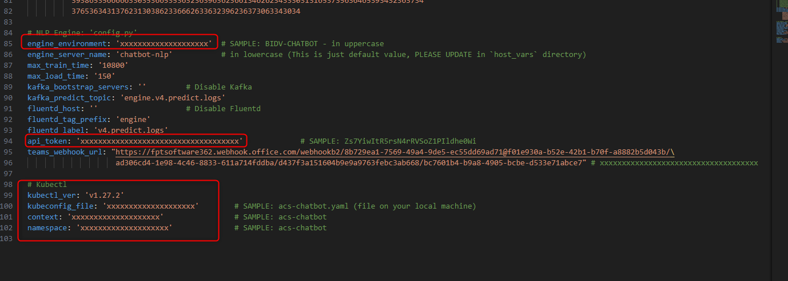

<h1 style="color:orange">NLP-engine-v4</h1>
Môi trường chatbot hiện tại đang sử dụng Nlp-engine-v4 đóng vai trò là engine để train model, predict intent.
Hướng dẫn sử dụng cụm agribank

Mô hình nlp-engine-v4:<br>
<br>
- Luồng train: `api35` gửi data train (nằm trong path: `/go/bin/training` pod api35) và train request+callback URL (là domain api35. VD: agribank-chatbot-api.fpt.ai) đến master NLP qua deployment `enginx-4` (forward đến IP NLP qua endpointslice) -> master NLP đẩy data+request đến redis -> NLP worker liên tục chọc vào redis, nếu thấy có job sẽ lấy data về train. Train xong sẽ lưu model vào minio, đồng thời gửi train reuslt cho master -> master sẽ gửi train result về cho callback URL (api35).
- Luồng predict: `api35` gửi predict request đến master, master load model từ minio -> lấy model từ redis, nếu redis ko có sẽ lấy từ minio, đồng thời load model lên redis -> gửi lại cho api35. Ngoài ra, path: `/home/ubuntu/nlp-engine-v4/models` cũng đóng vai trò là cache giữa đoạn redis và minio.

Lưu ý: redis của NLP khác với redis của hệ thống
<h2 style="color:orange">1. Cài đặt engine-v4</h2>

Requirements:
- 2 server ubuntu20.04
- nlp-engine-v4 sử dụng python3.8 và minio version 2020-02-27T00-23-05Z
- control-server (máy local chạy ansible phải cài python, dvc)

Sử dụng ansible: `chatbot-dedicated-deploy/chatbot-3.5-platform/engine-v4/`. Lưu ý phải sửa những file sau:<br>
<br>

Script sẽ pull code nlp từ 2 repo gitlab nội bộ:<br>
- ssh://git@gitlab.fci.vn:2222/chatbot/nlp-engine-v4.git nhánh `voicebot-python3.8`
- ssh://git@gitlab.fci.vn:2222/chatbot/engine-joint-v4.git nhánh `voicebot`

Sau đó pull các file cần thiết từ FOS, S3, lưu vào `/tmp/chatbot-nlp1-ubuntu/` và `/tmp/chatbot-nlp2-ubuntu/` rồi đẩy sang 2 server cài engine.
<h3 style="color:orange">1.1. Note file vars.yaml</h3>

<br>
- minio_endpoint: địa chỉ IP minio của engine 1
- access và secret_key cho minio
- redis_requirepass: redis password
- nlp_api_domain_name: domain của `api35`
- admin_api_key: key của `api35` (lấy từ configmap của api35)
- restic_pwd: password cho restic dùng để backup minio
<br>
- engine_environment: AGRIBANK-CHATBOT (cho môi trường agribank)
- api_token: token tự gen
- kubectl là tên file kubectl, context và namespace của file kubectl trên máy local path: `@HOME/.kube/clusters`: trong trường hợp cài kubectl trên nlp để restart pods. Nếu ko cần có thể comment phần này trong file init-setup.yaml
<br>
Sau khi deploy xong thực hiện train thử model và predict để test.
<h3 style="color:orange">1.2. Note cài đặt nlp</h3>

- Nlp engine, minio, redis thường được cài chung trên 1 VM.
- NLP và minio sử dụng supervisor là service để chạy daemon. Tham khảo path: `/etc/supervisor/conf.d`. Trong đó, worker train, worker chạy master, worker predict thường được cho chung vào 1 file (1 VM vừa là master, predict, train). Trên thực tế, có thể tách các thành phần này ra mỗi thành phần 1 VM:<br>
<br>
<h3 style="color:orange">1.3. Config nlp</h3>

File config NLP nằm trong path: `/home/ubuntu/nlp-engine-v4/fptai_nlp/config.py`. Nếu có thay đổi gì trong config thì sẽ thay đổi trong file này -> `supervisorctl reload` để NLP ăn cấu hình mới.
<br>
`FPTAI_MAX_TRAIN_TIME: 3600`: nếu bot nào train lâu hơn 3600s thì sẽ timeout -> tăng lên 7200,10800 nếu bot-builder than phiền là bot train hay bị timeout.
<h2 style="color:orange">2. Các lưu ý trong quá trình maintain</h2>
<h3 style="color:orange">2.1. Lỗi bot train lâu, bị timeout</h3>
Một số môi trường nlp dùng CPU, thỉnh thoảng bot-builder sẽ báo là bot train bị lâu hoặc train bot (thường là do train 2 bot cùng lúc)

<br>

Để kiểm tra: vào VM nlp-engine đang dùng để training: 
```
# ps -aux | grep train
```
<br>
Nếu thấy có 2 job đang train CPU thì chắc chắn sẽ timeout do train 2 bot 

Để khắc phục:<br>
1. Vào VM chạy server NLP, chạy lệnh kill cả 2 process đang train: `kill -9 <pid>`
2. Vào `/super-user/dashboard/` xóa bot code đang train
3. Nếu đang không trong giờ call, có thể giới hạn lại số lượng worker train =1 trong path: `/etc/supervisor/conf.d/nlp-engine-v4.conf`<br>
<br>
Sau đó chạy lệnh `supervisorctl reload` để supervisor ăn cấu hình mới.<br>
Lưu ý: phải xác nhận với PM và bot-builder là đang không trong giờ KH call thì mới chạy reload nlp. Sau khi reload xong chạy command: `/home/ubuntu/load-models.sh` để load những bot-code của KH lên RAM.
<h3 style="color:orange">2.2. Lỗi đầy RAM trên NLP</h3>
Nguyên nhân do code của NLP chưa tối ưu, nếu có nhiều model, mỗi lần predict thì sẽ load model hiện tại lên RAM. Tuy nhiên, nếu train 1 model mới và predict thì sẽ load model mới nhất lên nhưng ko xóa bỏ model cũ -> model cũ chiếm RAM, ko có tác dụng gì<br>

<br>
Để khắc phục:
- Nếu server ko có tải thì chỉ cần `supervisorctl reload`
- Nếu server đang chạy prod, thì phải kill từng process duplicate đi để lại process với latest model trên RAM. Để check pid và các process:

      # ps -aux | grep v4_joint

Để phòng ngừa:
- Đặt crontab chạy script `unload-models.sh` unload toàn bộ model vào buổi đêm và `load-models.sh` lên vào rạng sáng trước khi KH sử dụng.<br>
- Tham khảo script `/home/ubuntu/check-ram.sh` trên nlp zone00 (10.4.0.101) cụm prod: script có tác dụng nếu quét thấy RAM trống còn ít sẽ unload-model (chỉ làm được vì zone00 là cho KH vãng lai, ít tiền nên ko đảm bảo response time cho họ)
- Tham khảo script `/home/ubuntu/load-models-upgrade.sh` trên zone10 (zone vip: 10.4.0.102): script mỗi ngày sẽ query bot-code nào thuộc zone10 (zone vip) trên mysql và load bot-code đó lên RAM.
<h3 style="color:orange">2.3. Lỗi ko load được bot-code lên RAM</h3>

Lỗi khi chạy script `load-models.sh`, ko load được bot lên, trả về `712` thay vì `200`. Nguyên nhân job trên redis và RAM đã bị lệch.

Để khắc phục:<br>
Lưu ý: nếu môi trường đang chạy product cần có confirm từ PM và PO chatbot.
1. Vào VM cài NLP:
```
# redis-cli
127.0.0.1:6379> auth <password>
127.0.0.1:6379> FLUSHDB
127.0.0.1:6379> exit
# supervisorctl reload
```
2. Chạy script `load-models.sh` để load model lên lại<br>