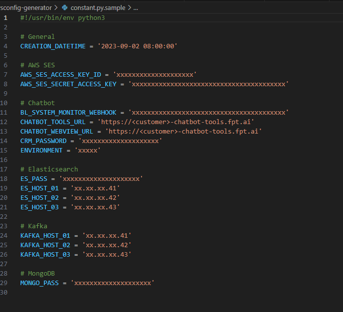
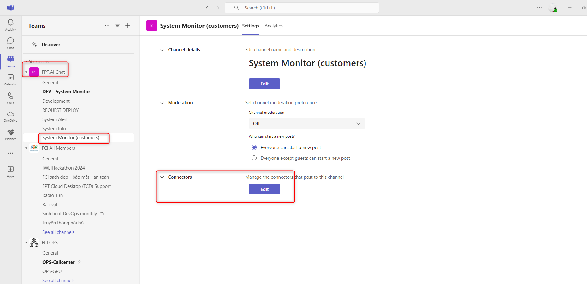

<h1 style="color:orange">Script gen password cho ansible</h1>

Script gen password cho ansible khi cài môi trường mới: `chatbot-dedicated-deploy/chatbot-3.5-platform/secret-generator`

<br>
Trong đó:
- CUSTOMER_ID: là tên viết tắt của KH. Ví dụ agribank là `agri` (viết lower-case)
- VAULT_FILE_PATH: nằm ở path `@HOME/.ssh/vp/` trên máy local
- CERT_FILE_PATH: là cert cho domain `.fpt.ai`
<br>
- vault_fptid_secret: là client secret của client chatbot (fptai_chat) realm `FptSmartCloud`
<br>
- docker_login_password: là password account robot có quyền pull only trên acr.fci.vn
<br>
<br>
- vault_aws_fptai_static_s3_secret_access_key: là secret key của s3 object (VD: FOS hoặc AWS)
- vault_signature_jwk: là jwk, để gen: kty: "RSA", algorith: "RS256", key use: "signature", key id: "messenger-v35-token-key"<br>
<br>
<h2 style="color:orange">1. Tác dụng script</h2>
Chạy script: 

    # python3 generate_secrets.py
Script sẽ lấy các biến từ trong file config.py, với `INIT_FORMATED_SECRETS` thì shuffle các kí tự từ INIT STRING và thêm `CUSTOMER_ID` vào đầu (random kí tự upper và lower).<br>
Đối với `NON_SHUFFLED_SECRETS` thì giữ nguyên không đổi.<br>
Các dãy token, password, secret sẽ được mã hóa bằng ansible-vault sử dụng file `VAULT_FILE_PATH` và đẩy kết quả ra file `vault.yml`<br>
Lưu ý: `CUSTOMER_ID` sẽ = với tên kí tự được hash và tên file `VAULT_FILE_PATH`. VD: `CUSTOMER_ID`= agri<br>
<br>
<h1 style="color:orange">Script gen sysconfig cho chatbot</h1>

Script gen sysconfig cho ansible khi cài môi trường mới: `chatbot-dedicated-deploy/chatbot-3.5-platform/sysconfig-generator`.<br>
<br>
Trong đó:
- CREATION_DATETIME: là thời điểm chạy script
- `AWS_SES_ACCESS_KEY_ID` và `AWS_SES_SECRET_ACCESS_KEY` là access và secret key cố định (giống nhau ở tất cả môi trường), lấy trong table mysql: fptai_v3.sys_config
    ```
    select * from fptai_v3.sys_config;
    ```
- `BL_SYSTEM_MONITOR_WEBHOOK` là webhook bắn vào teams của từng môi trường 
<br>
<br>
- `CHATBOT_TOOLS_URL` và `CHATBOT_WEBVIEW_URL`: là domain chatbot-tools.fpt.ai của môi trường. Ví dụ với agribank là `agribank-chatbot-tools.fpt.ai`
- `CRM_PASSWORD`: là password cố định (giống nhau ở tất cả môi trường), lấy trong table mysql: fptai_v3.sys_config.
- `ENVIRONMENT`: Tham khảo table mysql: fptai_v3.sys_config. VD: với môi trường agribank = AGRIBANK-CHATBOT
- `ES_PASS`: password của user `chatbot_rw` trên elasticsearch, chính là `vault_es_pass` trong scrypt gen password.
- `ES_HOST`: là IP của elasticsearch
- `KAFKA_HOST`: là IP của kafka
<h2 style="color:orange">Tác dụng script</h2>
Chạy script:

    # python3 gen_sysconfig.py

Script sẽ đọc env từ file `constant.py` để gen ra file sysconfig.sql
Apply file này vào mysql:

    # fptai -u root -p
    mysql> use fptai_v3;
    mysql> source ~/sysconfig.sql
<br>
Service `bl35` sẽ đọc bảng này để config hệ thống.<br>
