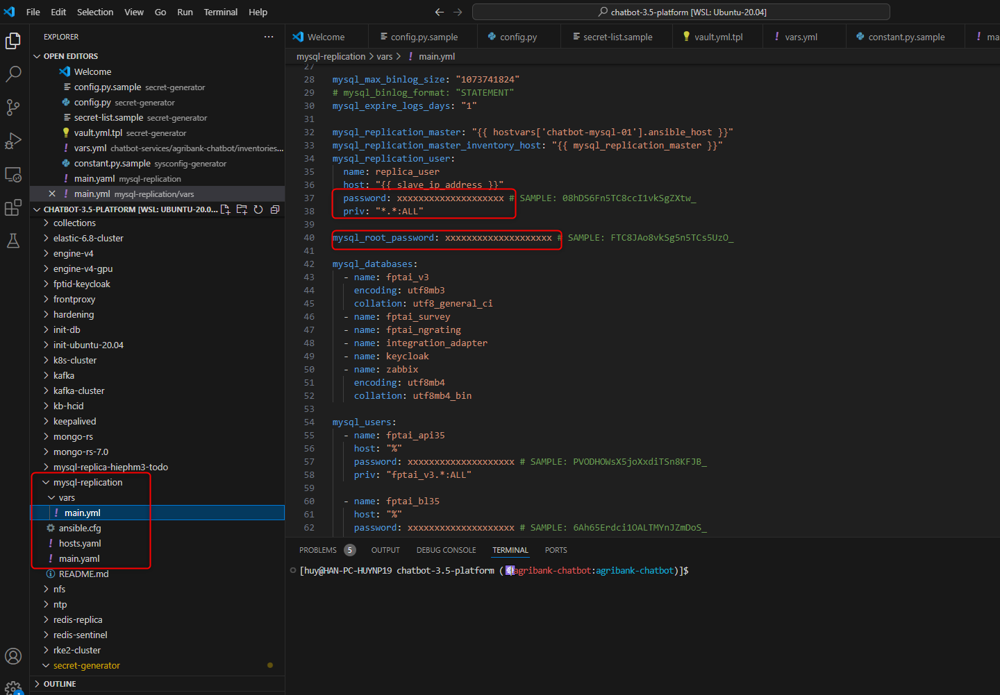
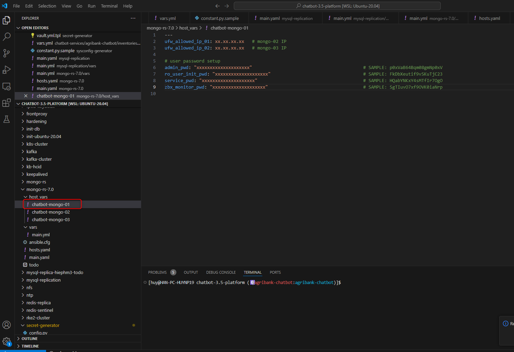
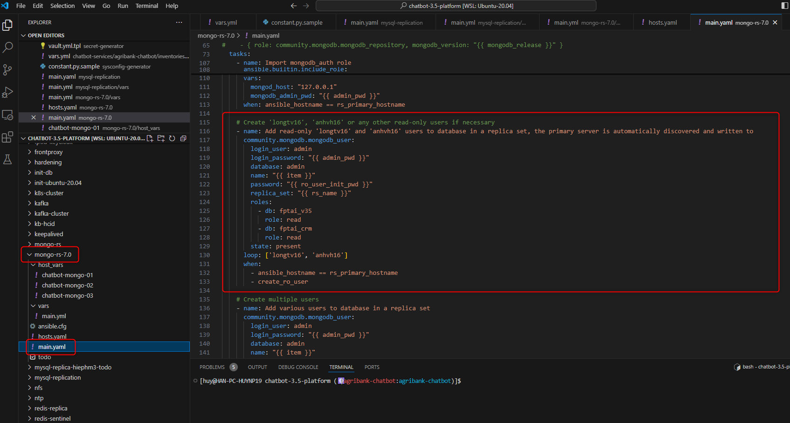
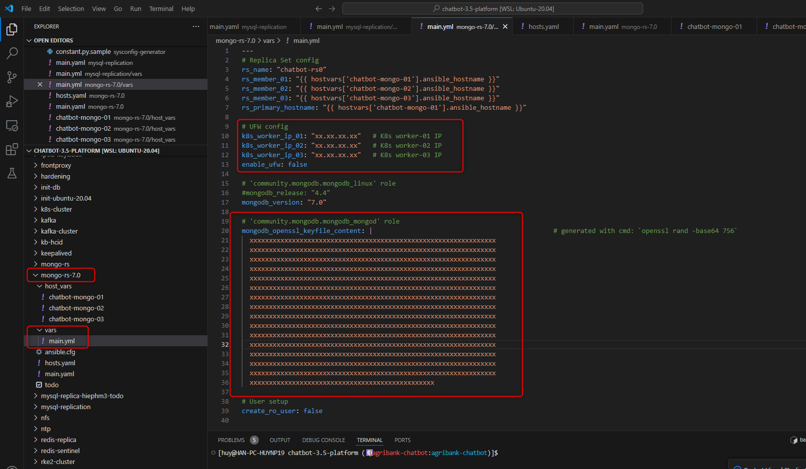
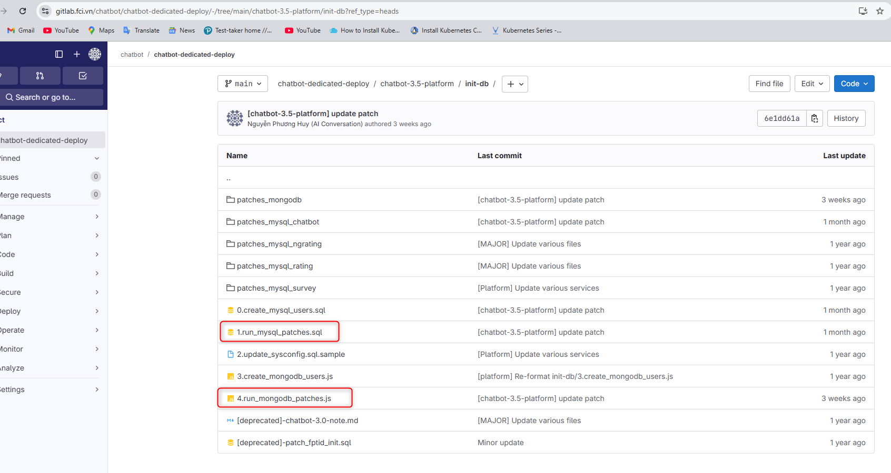
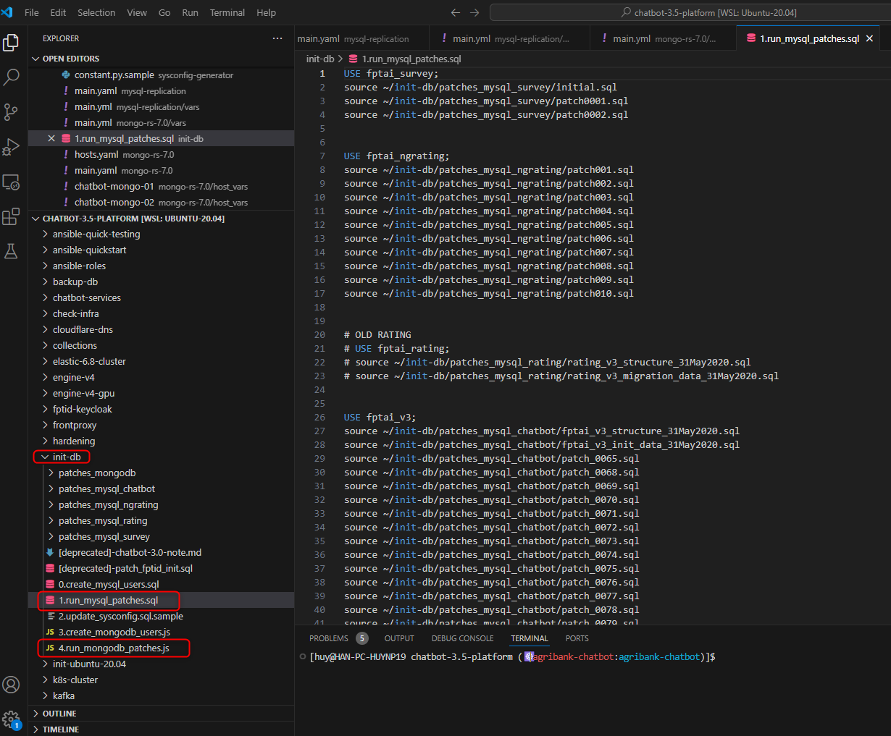
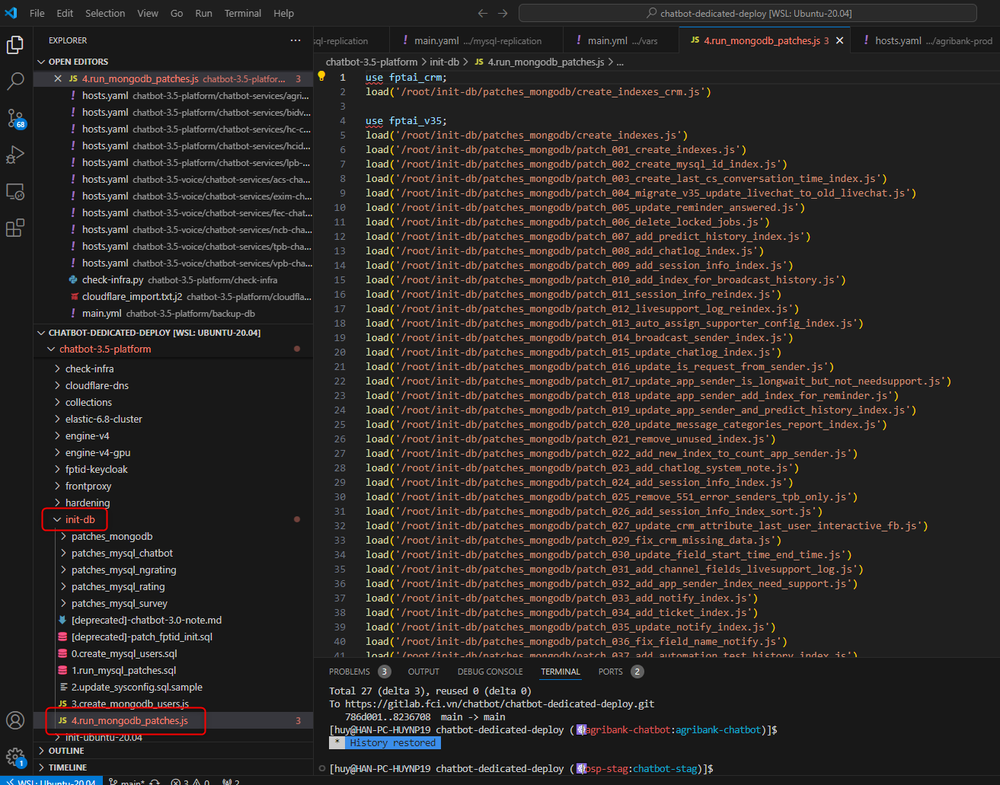
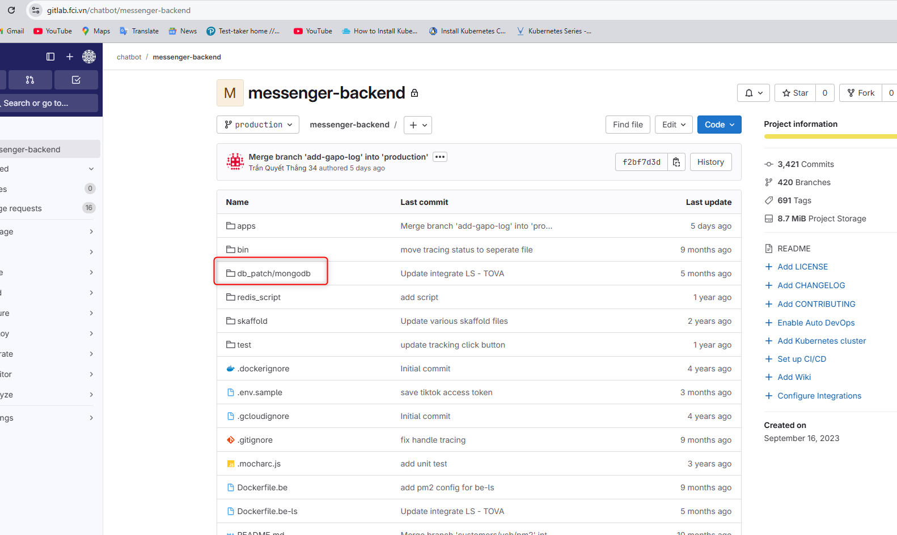
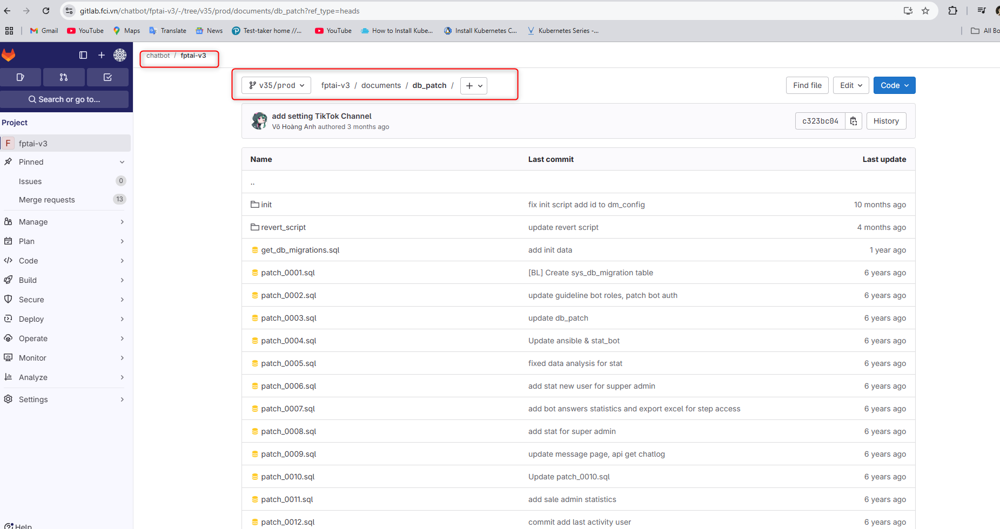
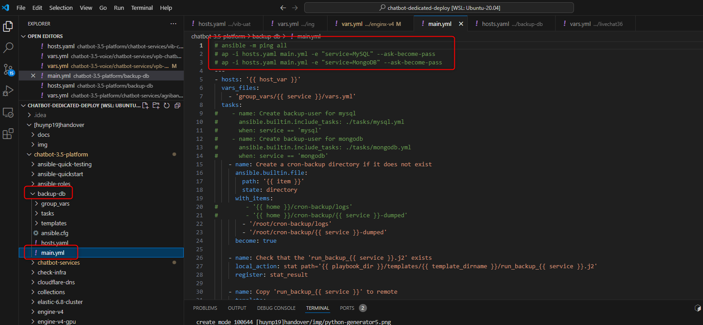

<h1 style="color:orange">Note deploy Database</h1>
Hệ thống chatbot lưu system_config, metadata,... vào mysql; lưu vào mysql; Lưu chatlog vào mongodb

Yêu cầu: server cài đặt chạy ubuntu20.04
<h2 style="color:orange">1. Mysql</h2>

Deploy mysql sử dụng script `chatbot-dedicated-deploy/chatbot-3.5-platform/mysql-replication`. Script deploy mysql master-slave, tạo các db và user cần thiết cho service chatbot.<br>
Sửa file main `chatbot-dedicated-deploy/chatbot-3.5-platform/mysql-replication/vars/main.yml`:<br>
<br>
Trong đó:
- `mysql_replication_user`: là `mysql_replication_user` trong scrypt gen password `secret-generator`
- `mysql_root_password`: là `mysql_root_pass` trong scrypt gen password `secret-generator`
- `fptai_api35`, `fptai_vl35`,...: là user của từng service chatbot trên k8s, là `vault_db_pass` trong scrypt gen password `secret-generator`
- `keycloak`: là user cho keycloak, `mysql_keycloak_pass` trong scrypt gen password `secret-generator`
- `zabbix`: là user có tác dụng lưu data zabbix nếu cài zabbix trong cụm
- `zbx_monitor`: là user có tác dụng để zabbix-agent lấy metric của mysql

Lưu ý: Sau khi cài xong mysql, ssh vào node slave, block ghi để tránh bị conflict master-slave:
```
mysql> SET GLOBAL super_read_only = 1;
mysql> SET GLOBAL read_only = 1;
```
<h2 style="color:orange">2. Mongodb</h2>

Deploy mongodb-7.0 sử dụng script `chatbot-dedicated-deploy/chatbot-3.5-platform/mongo-rs-7.0`. Script deploy mongodb-7.0 replicaset, tạo các db và user cần thiết cho service chatbot.<br>
<br>
- `admin_pwd`: là password admin của mongo, `mongo_admin_pass` trong scrypt gen password `secret-generator`
- `ro_user_init_pwd`: là password các user cần thiết vào quản lý mongo<br>
<br>
- `service_pwd`: là user các service chatbot, `vault_mongo_pass` trong scrypt gen password `secret-generator`.
- `zbx_monitor_pwd`: là user có tác dụng để zabbix-agent lấy metric của mongodb.

<br>
- `k8s_worker_ip`: là ip các node worker k8s, dùng để allow firewall trên các node mongo
<h2 style="color:orange">3. Chạy patch db</h2>
Sau khi cài đặt xong db, phải tạo các bảng, các index để chatbot lưu dữ liệu.

Chạy patch db: `chatbot-dedicated-deploy/chatbot-3.5-platform/init-db`<br>
<br>

<h3 style="color:orange">3.1. Chạy patch mysql</h3>

1. Chuyển file init-db vào note master mysql.
2. Giải mã các file
```
# ansible-vault decrypt --vault-id vp_ded@$HOME/.ssh/vp/ded  init_db/patches_mysql_chatbot/fptai_v3_init_data_31May2020.sql
# ansible-vault decrypt --vault-id vp_ded@$HOME/.ssh/vp/ded  init_db/patches_mysql_chatbot/fptai_v3_init_data_31May2020.sql
# ansible-vault decrypt --vault-id vp_ded@$HOME/.ssh/vp/ded  init_db/patches_mysql_chatbot/fptai_v3_structure_31May2020.sql
# ansible-vault decrypt --vault-id vp_ded@$HOME/.ssh/vp/ded  init_db/patches_mysql_rating/rating_v3_migration_data_31May2020.sql
# ansible-vault decrypt --vault-id vp_ded@$HOME/.ssh/vp/ded  init_db/patches_mysql_rating/rating_v3_structure_31May2020.sql
# ansible-vault decrypt --vault-id vp_ded@$HOME/.ssh/vp/ded  init_db/patches_mysql_survey/initial.sql
```
3. Vào mysql-cli, chạy từng lệnh trong patch theo thứ tự: `chatbot-dedicated-deploy/chatbot-3.5-platform/init-db/1.run_mysql_patches.sql`
Chạy các lệnh trên để tạo bảng cần thiết trên mysql.

Lưu ý: có thể apply sysconfig.sql trong bước này
```
    # fptai -u root -p
    mysql> use fptai_v3;
    mysql> source ~/sysconfig.sql
```
<br>
<h3 style="color:orange">3.2. Chạy patch mongo</h3>

1. Chuyển file init-db vào note master mongodb.
2. Vào mongo-cli, chạy từng lệnh trong patch theo thứ tự: `chatbot-dedicated-deploy/chatbot-3.5-platform/init-db/4.run_mongo_patches.js`
<br>
Chạy các lệnh trên để tạo bảng cần thiết trên mongodb.
<h3 style="color:orange">3.3. Lưu ý</h3>

Những patch này có thể update theo thời gian, theo dõi source code msgr-be và bl35 thường xuyên để update những patch trong `init-db`

để update patch mongodb:<br>
<br>
để update patch mysql:<br>
<br>
<h2 style="color:orange">4. Cài đặt backup</h2>

Note backup các môi trường chatbot(môi trường voicebot ko cần backup): https://wiki.fci.vn/display/AIOPS/Chatbot

Cài đặt backup cho mysql hoặc mongo sử dụng ansible: `chatbot-dedicated-deploy/chatbot-3.5-platform/backup-db`
<br>

Script sẽ cài s3cmd và cài bash script để dump các db cần thiết và dùng s3cmd đẩy lên FOS (script được đặt crontab trên server để chạy daily)