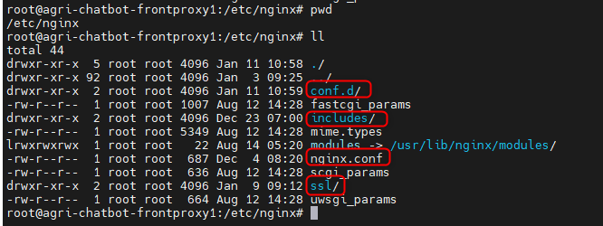
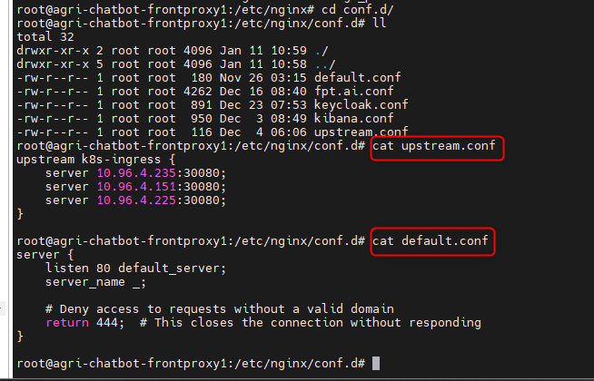
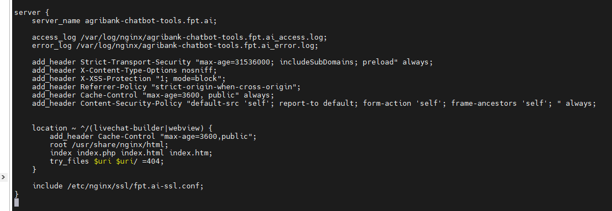
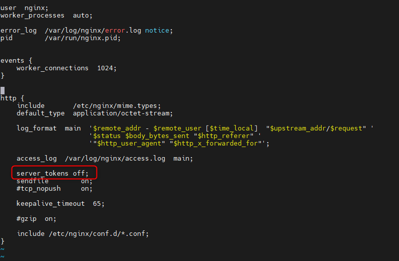
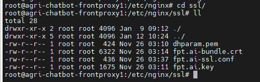

<h1 style="color:orange">Note cấu hình cài nginx fptai</h1>

Hướng dẫn sử dụng cấu hình cài nginx của cụm agribank. 
- Ubuntu: 20.04
- nginx version: 1.26

 
Sau khi cài nginx trên node front-proxy. Phải cài thêm directory `conf.d`, `includes`, `ssl`, `nginx.conf`
<h2 style="color:orange">1. Conf.d</h2>

Folder conf.d chứa file config để forward đến các dịch vụ chatbot 
 
- Trong đó, file `upstream.conf` là file chứa IP của các node k8s worker và 30080 là port của ingress-nginx.
- File `default.conf`có tác dụng chặn truy cập IP public front-proxy:80, 443
<h3 style="color:orange">1.1. Note webview</h3>

Lưu í: domain `agribank-chatbot-tools.fpt.ai` nằm trong file `fpt.ai.conf`, có tác dụng serve static file
 
- `sever_name`: là domain mà block này sẽ xử lý
- `access_log`: path file log nginx cho những request đến domain này và mã trả về (vd:200,404,503,...)
- `error_log`: path file error nginx cho những request đến domain này (error xảy ra trong quá trình process, không phải kết quả trả về 400 hay 500)
- `root /usr/share/nginx/html;`: Set root directory trên con nginx để phục vụ hiển thị web tĩnh cho domain này.
- `location`: define URL path cho domain này. Ví dụ khi truy cập "https://agribank-chatbot-tools.fpt.ai/livechat-builder" thì nginx sẽ trả về nội dung trong "/usr/share/nginx/html/livechat-builder", tương tự truy cập "https://agribank-chatbot-tools.fpt.ai/webview" thì nginx trả về nội dung trong folder "/usr/share/nginx/html/webview", ... 
- `index`: List ra những file được index để trả về cho request nếu những file này tồn tại trong directory được yêu cầu (vd: webview). Nginx sẽ index những file này theo thứ tự, nếu không define config này thì mặc định nginx sẽ tìm file tên "index.html" để import.
- `try_files`: Define hành động khi access 1 file. Nginx sẽ check nếu file có tồn tại, nếu không sẽ thử access URI như là 1 directory, nếu cả 2 fail thì trả về 404
<h2 style="color:orange">2. nginx.conf</h2>

Lưu ý: thêm options `server_tokens off;` vào file nginx.conf
 
Option này sẽ giấu version nginx khi truy cập vào các domain
<h2 style="color:orange">3. ssl</h2>
Folder ssl là folder chứa file config ssl cho domain

 
Trong đó: 
- `fpt.ai-ssl.conf`: file config ssl cho domain nginx
- `fpt.ai-bundle.crt`: là file cert-chain của fptai (chỉ có tác dụng với domain *.fpt.ai, là cert xịn, phải renew mỗi năm 1 lần)