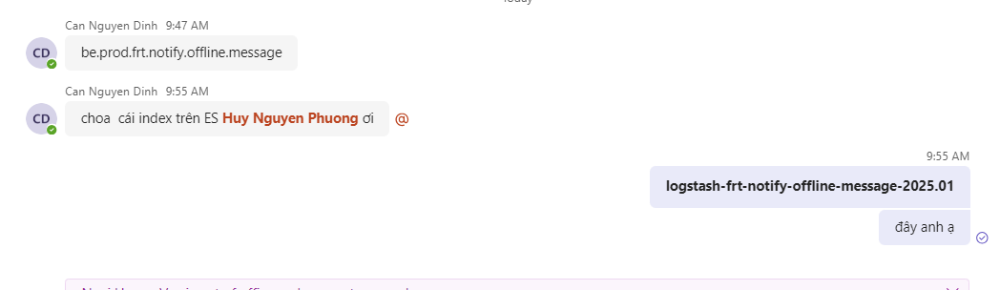
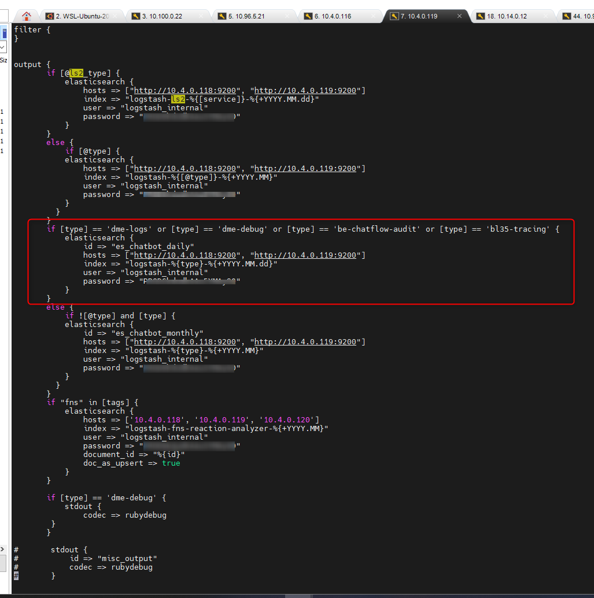
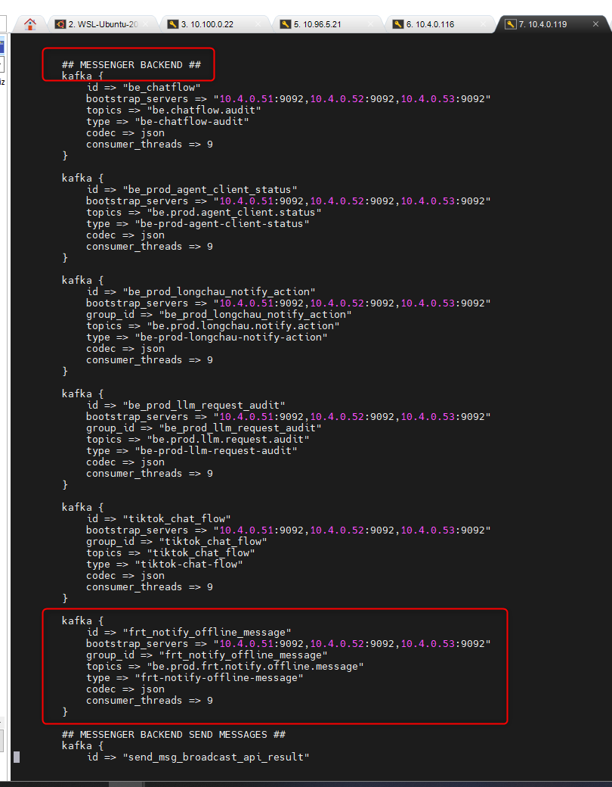
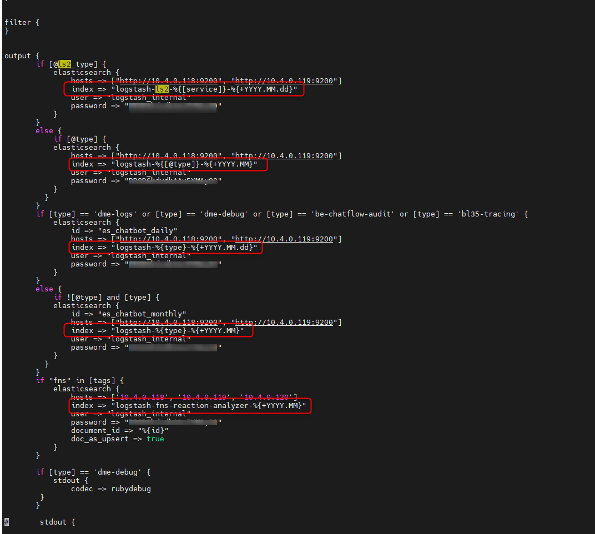
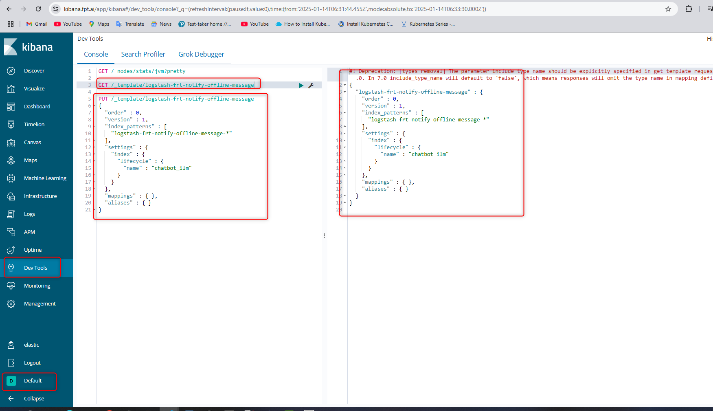
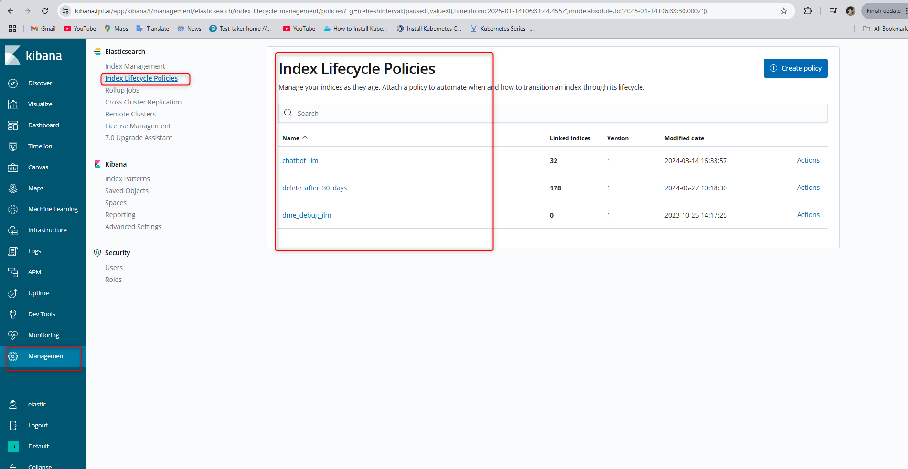
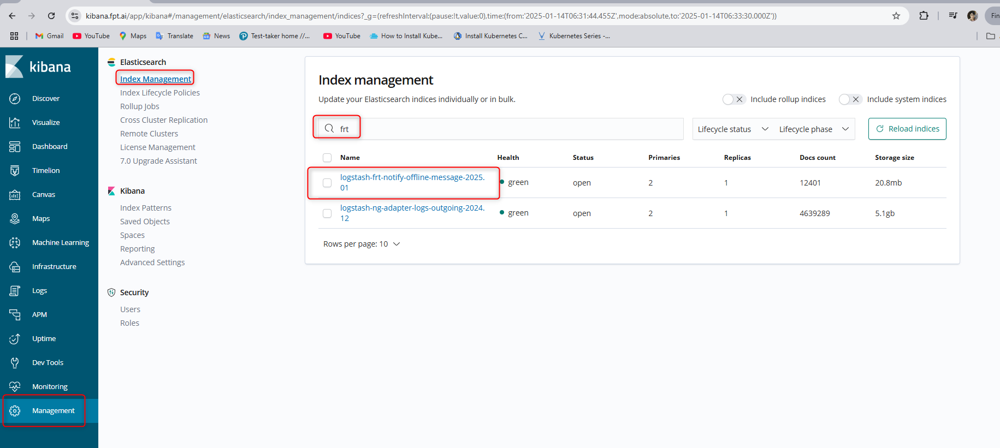
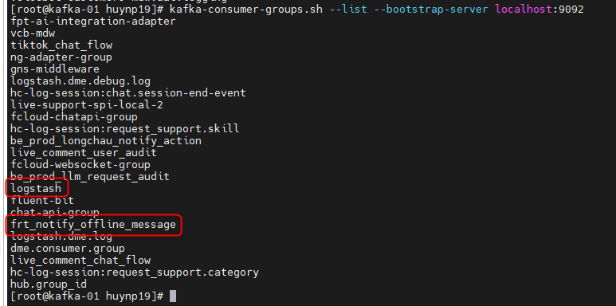
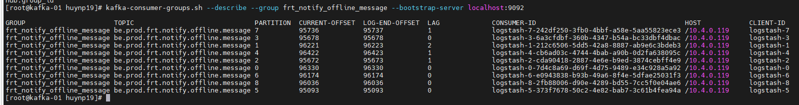

<h1 style="color:orange">Add index elasticsearch</h1>
Hướng dẫn sử dụng cụm chatbot-prod. Trong quá trình làm việc, sẽ được team dev yêu cầu đẩy log lên elasticsearch để dễ theo dõi

Ví dụ: <br>
Add index lên elasticsearch từ topic kafka: `be.prod.frt.notify.offline.message`, thường index này khi các service đẩy vào kafka sẽ được tự động thêm (ops không phải làm gì)
<h2 style="color:orange">1. Check topic trên kafka</h2>

Ssh vào 1 trong 3 node kafka: 10.4.0.51-53. Chạy lệnh để check xem topic đã tồn tại:
```
# kafka-topics.sh --bootstrap-server localhost:9092 --list | grep <tên_topic>
```
Trên các môi trường dedicated, thường kafka được cài trên các node mdw 1-3

Câu lệnh check log kafka thời gian thực:
```
kafka-console-consumer.sh --bootstrap-server localhost:9092 --topic <tên_topic>
kafka-topics.sh --bootstrap-server localhost:9092 --describe --topic <tên_topic>       #describe topic
```
<h2 style="color:orange">2. Add config logstash</h2>
Chatbot-prod sử dụng logstash để lấy log từ kafka đẩy vào elasticsearch

Vào logstash cụm chatbot-prod: 10.4.0.119 (backup 10.4.0.118) vào path: `/etc/logstash/conf.d/misc.conf` để add block config. Với nhũng cụm dedicated thì logstash thường nằm trên mdw3.

Lưu ý, hỏi lại dev xem dung lượng log hàng ngày ntn để biết chia index theo ngày hay theo tháng, log này là log của service nào.<br>
Chia index theo ngày thì update trường type vào block index ngày<br>
<br>
Ví dụ trong hình là log của service: "msgr-be". Thêm vào phần output:
<br>
Trong đó:
- `bootstrap_servers` là ip các node kafka
- `topics` là tên topic trên kafka
- `type` là tên index khi đẩy lên elastic. VD: type = frt-notify-offline-message thì index đẩy lên elastic là `logstash-frt-notify-offline-message-2025.01`. Chi tiết xem block output của logstash
<br>

`LƯU Ý:` Sau khi add config logstash chưa restart logstash để ăn cấu hình mới vội, mà lên elasticsearch, thêm index template để index mới lên có mapping và các policy cố định:<br>
1. Vào `kibana.fpt.ai` -> space `Default` -> `Dev Tools` add index template:

```
PUT /_template/logstash-frt-notify-offline-message
{
  "order" : 0,
  "version" : 1,
  "index_patterns" : [
    "logstash-frt-notify-offline-message-*"
  ],
  "settings" : {
    "index" : {
      "lifecycle" : {
        "name" : "chatbot_ilm"
      }
    }
  },
  "mappings" : { },
  "aliases" : { }
}
```
<br>
Trong đó:
- lifecycle là `chatbot_ilm` (xóa index sau 60 ngày), nếu đánh index theo ngày thì nhét vào lifecycle: `delete_after_30_days`
<br>
- mapping để trống, vì khi index được đẩy lên elastic, mặc định các field sẽ được đánh type tự động (cấu hình elastic).

Hoặc có thể đánh type thủ công. Ví dụ 1 index template khác:
```
PUT /_template/fptai-predict
{
  "order": 10,
  "version": 1,
  "index_patterns": [
    "logstash-fptai-predict-*"
  ],
  "settings" : {
    "index" : {
      "lifecycle" : {
        "name" : "chatbot_ilm"
      }
    }
  },
  "mappings": {
    "_default_": {
      "dynamic": false,
      "properties": {
        "result.entities.real_value" : {
            "enabled" : false
        }
      }
    }
  },
  "aliases": {}
}
```
Chú ý phần mapping: field `result.entities.real_value` sẽ không được index. Các field còn lại vẫn được index tự động

2. Restart logstash để ăn cấu hình mới
   
       # systemctl restart logstash
3. Check log logstash xem có vấn đề gì ko

       # tail -f /var/log/logstash/logstash-plain.log
4. Kiểm tra index trên elastic qua kibana<br>
<br>
<h2 style="color:orange">3. check consumer group kafka</h2>

Vào node kafka, chạy câu lệnh check consumer-group:

    # kafka-consumer-groups.sh --list --bootstrap-server localhost:9092
<br>
Nó chính là trường `group_id` trong block config logstash. Nếu không có trường `group_id` thì sẽ ở trong group mặc định `logstash`<br>

Để check lag kafka:

    # kafka-consumer-groups.sh --describe --group frt_notify_offline_message --bootstrap-server localhost:9092
    hoặc
    # kafka-consumer-groups.sh --describe --group logstash --bootstrap-server localhost:9092 | grep <group_id>
<br>
Lag tiệm cận =0 thì logstash đang hoạt động bthg.