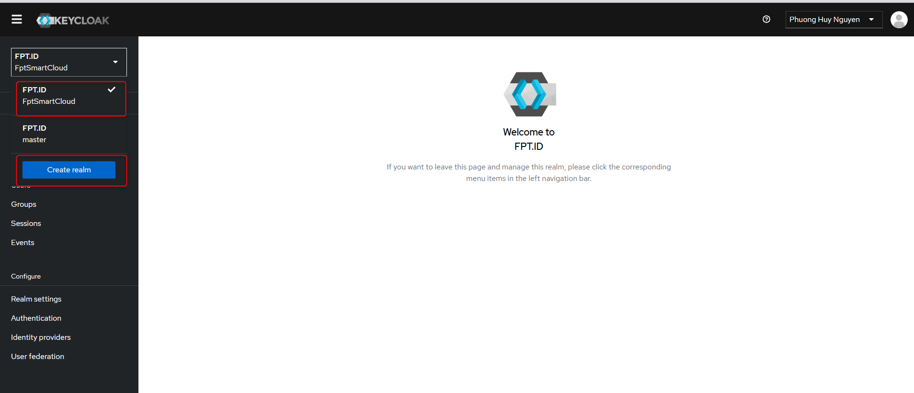

<h1 style="color:orange">6. Deploy keycloak</h1>
Hướng dẫn sử dụng cụm agribank làm mẫu. Deploy version keycloak 26.0.7.

File config-map keycloak:
```
apiVersion: v1
data:
      KC_HOSTNAME: agribank.com.vn
      KC_HTTP_ENABLED: "true"
      KC_HEALTH_ENABLED: "true"
      KC_BOOTSTRAP_ADMIN_USERNAME: admin
      KC_BOOTSTRAP_ADMIN_PASSWORD: "password"
      KC_DB: mysql
      KC_DB_URL: jdbc:mysql://10.96.5.11/keycloak
      KC_DB_USERNAME: keycloak
      KC_DB_PASSWORD: <password>

      KC_PROXY_HEADERS: "xforwarded"
      KC_HTTP_RELATIVE_PATH: "/auth"
kind: ConfigMap
metadata:
  name: iam-cm
  namespace: agribank-chatbot
```
File deploy
```
---
apiVersion: v1
kind: Service
metadata:
  name: iam-svc
  namespace: agribank-chatbot
spec:
  type: NodePort
  selector:
    app: iam
  ports:
    -  port: 8080 # listen on this port
       targetPort: 8080 # forward traffic to this port of containers
       nodePort: 30007
---
apiVersion: apps/v1
kind: Deployment
metadata:
  name: iam
  labels:
    app: iam
  namespace: agribank-chatbot
spec:
  selector:
    matchLabels:
      app: iam
  replicas: 1
  revisionHistoryLimit: 3
  strategy:
    rollingUpdate:
      maxSurge: 1         # how many pods we can add at a time
      maxUnavailable: 1   # maxUnavailable define how many pods can be unavailable
    type: RollingUpdate   # during the rolling update
  template:
    metadata:
      namespace: agribank-chatbot
      labels:
        app: iam
        rel: 'keycloak'
        img_tag: '26.0.7'
      annotations:
        kubernetes.io/change-cause: 'Update configmap: ts=1734939275'
    spec:
      containers:
        - name: iam
          image: quay.io/keycloak/keycloak:26.0.7
          args:
            - start
            - "--spi-login-protocol-openid-connect-legacy-logout-redirect-uri=true"
          imagePullPolicy: IfNotPresent
          resources:
            requests:
              cpu: 500m
              memory: 1Gi
            limits:
              cpu: 4
              memory: 8Gi
          envFrom:
            - configMapRef:
                name: iam-cm
          ports:
          - name: http
            containerPort: 8080
            protocol: TCP
```

Config nginx expose nodeport:
```
upstream iam {
    server 10.96.4.x:30007;
    server 10.96.4.x:30007;
    server 10.96.4.x:30007;
}

server {
    server_name agribank;
    access_log /var/log/nginx/agribank.access.log;
    error_log /var/log/nginx/agribank.error.log;

    charset utf-8;
    client_max_body_size 100M;

    location / {
        proxy_pass http://iam;

        proxy_pass_request_headers      on;
        proxy_set_header                Host $host;
        proxy_set_header  X-Real-IP $remote_addr;
        proxy_set_header  X-Forwarded-Proto https;
        proxy_set_header  X-Forwarded-For $remote_addr;
        proxy_set_header  X-Forwarded-Host $host;


        # Redirect root URL to /auth/realms/FptSmartCloud/account/
        location = / {
            return 301 /auth/realms/FptSmartCloud/account/;
        }
    }
    include /etc/nginx/ssl/fpt.ai-ssl.conf;
}
```
<h2 style="color:orange">2. Set up keycloak sau khi cài đặt</h2>

1. Create realm `FptSmartCloud`, lưu í chính xác viết hoa, thường.<br>
<br>
2. Vào realm `FptSmartCloud` -> `clients` tạo client `fptai_chat`:
<br>
-> chỉnh `Settings`: tương tự cụm agribank.

Lưu ý:
<br>
Tuyệt đối ko turnoff `client authentication` -> reset client secret<br>
3. Vào realm `FptSmartCloud` -> `Realm settings` -> set up tab `General`, `Login`, `Email`, `Themes`, `Key`, `Sessions`<br>
Lưu ý: 1 số code chưa hỗ trợ RSA-OAEP -> vô hiệu hóa RSA-OAEP hoặc đưa RS256 lên đầu<br>
<br>
4. Vào realm `FptSmartCloud` -> `Authentication` -> `Policies` để cài policy password<br>
<br>