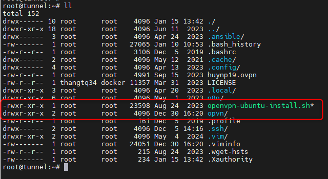
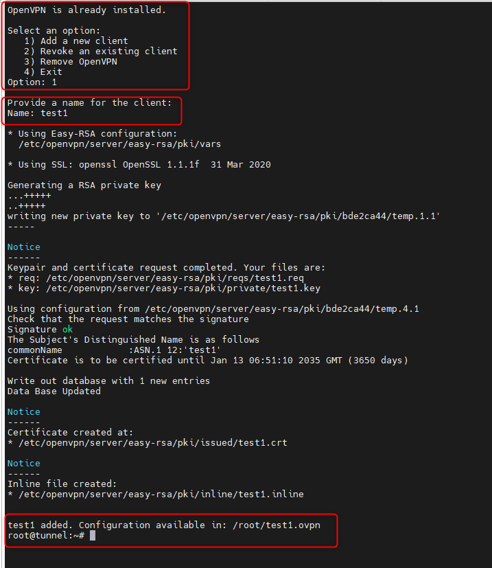
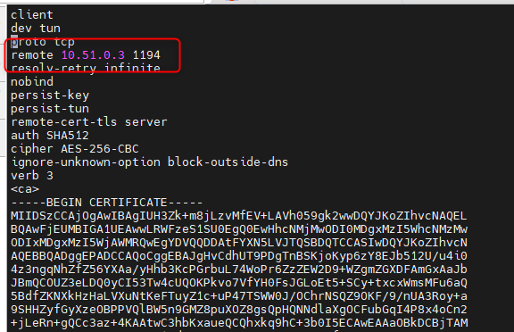
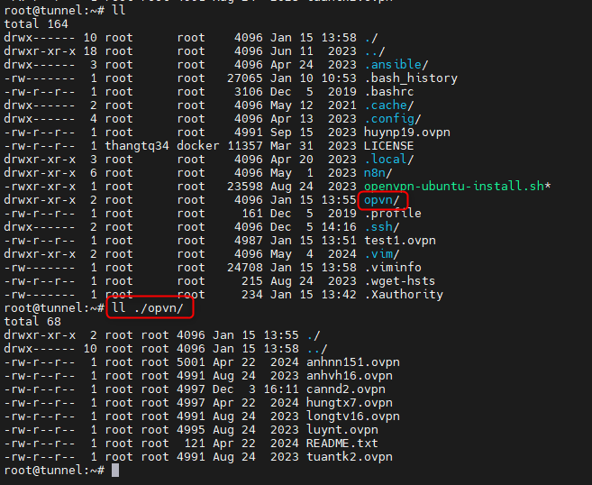

<h1 style="color:orange">Openvpn cho cụm dev</h1>

Hướng dẫn sử dụng openvpn để truy cập vào cụm dev hoặc staging qua server tunnel mà KHÔNG CẦN add ssh-key. Tham khảo cài đặt: https://longvan.net/cong-dong/huong-dan-cai-dat-openvpn-tren-ubuntu-20-04/

Trên server tunnel-dev: 10.51.0.3 path `/root/`:

Gõ lệnh tạo user:
```
./openvpn-ubuntu-install.sh
```
<br>
<br>

    # vim test1.opvn
    thay dòng 
    remote 10.51.0.3 1194 
    thành
    remote <ip_public> 1194
<br>
Sau đó chuyển file .opvn vừa tạo vào folder `/root/opvn/`
<br>
Tương tự với cụm osp-stag và osp-stag-dr.