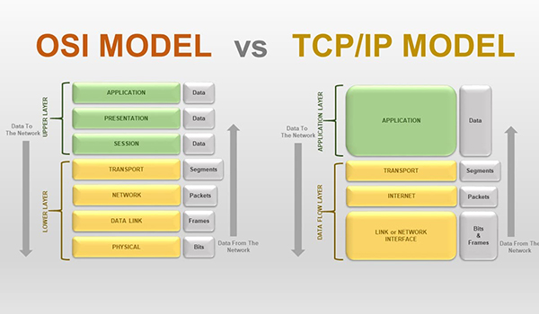
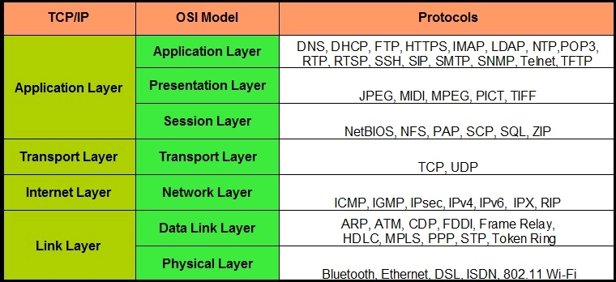

# Network protocol (giao thức mạng)

## Khái niệm
- Mô hình OSI và TCP/IP là mô hình mạng cơ bản kết nối giữa các máy tính khác nhau có thể truyền thông với nhau
- Mô hình liên kết giữa các hệ thống mở

## `Mô hình tham chiếu giao thức OSI và TCP/IP`

### Với mô hình OSI
#### Máy truyền
- Tầng 7 là tầng application, người dùng sẽ chuyển vào dữ liệu như hình ảnh, video,...
- Dữ liệu được chuyển xuống tầng 6, tầng này biến đổi dữ liệu thành dạng chung để mã hóa và nén dữ liệu.
- Tầng 5 (session) là tầng phiên có chức năng bổ sung thông tin cho phiên chuyển
- Tầng 4 chia dữ liệu ra làm nhiều segment, bổ sung thông tin quyết định phương thức vận chuyển
- Tầng 3 segment tiếp tục bị cắt ra thành packet để định tuyến (Source and destination IP)
- Tầng 2 chia packet thành nhiều frame và tiếp tục bổ sung thông tin kiểm tra gói dữ liệu cho máy nhận (Source and destination MAC)
- Tầng 1 frame chia thành các bit nhị phân: 0,1 để truyền dữ liệu qua dây cáp quang.

Mỗi tầng khi dữ liệu truyền xuống sẽ thêm header của tầng đó, ở tầng 2 gói tin được gắn thêm FCS
#### Máy nhận
- Tầng 1 nhận các chuỗi bit nhị phân vào vùng đệm và báo với tầng 2 đã nhận được dữ liệu.
- Tầng 2 kiểm tra FCS xem có lỗi không, nếu có sẽ hủy gói tin. Sau đó kiểm tra MAC Adress xem có đúng địa chỉ máy nhận hay không, nếu đúng bóc header và gửi lên lớp 3.
- Tầng 3 kiểm tra địa chỉ IP có phải của máy nhận hay không, nếu đúng bóc lớp header tầng 3 và gửi lên tầng 4.
- Tầng 4 phục hồi lỗi và xử lý lỗi bằng cách gửi các gói tin ACK, NAK(gói tin phản hồi xem các gói tin chứa dữ liệu đã được gửi đến máy nhận hay chưa). Sau khi sửa lỗi sắp xếp segment và gửi lên tầng 5.
- Tầng 5 kiểm tra tính toàn vẹn gói tin rồi bóc header tầng 5 chuyển lên tầng 6.
- Tầng 6 chuyển đổi định dạng dữ liệu cho phù hợp rồi gửi lên application.
- Tầng 7 bóc header cuối cùng và hiển thị ở máy nhận ảnh, video,...

## `Mô hình TCP/IP và các giao thức sử dụng`

### `So sánh TCP/IP và OSI`
| OSI | TCP/IP |
| ------ | ----------- |
| Trong đa số TH, là mô hình đã cũ có tính chất tham khảo   | Thông dụng hơn |
| Mỗi tầng khác nhau sẽ có công dụng khác nhau, không liên quan đến nhau | Trong tầng Application có tầng session và tầng presentation liên kết với nhau |
| Hỗ trợ kết nối định tuyến và không dây    | Hỗ trợ truyền thông kết nối từ tầng mạng. |
| Giao thức độc lập | Phụ thuộc giao thức |

### `Phân biệt UDP và TCP`

| UDP | TCP |
| ------ | ----------- |
| Truyền không tin cậy | Truyền thông tin cậy, đảm bảo dữ liệu truyền từ nguồn đến đích |
| Cấu trúc phần đầu đơn giản | Cấu trúc header phức tạp |
| | Sử dụng cơ chế xác nhận khi truyền để đảm bảo độ tin cậy |
| Phù hợp ứng dụng thời gian thực như: game, trực tiếp | Phù hợp ứng dụng website