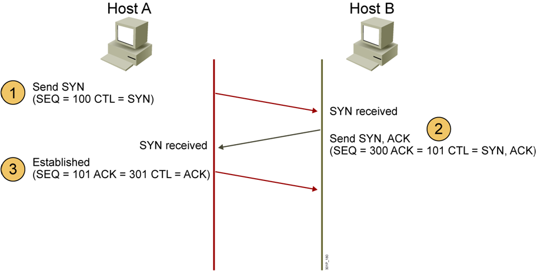
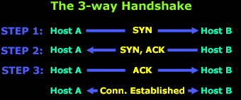
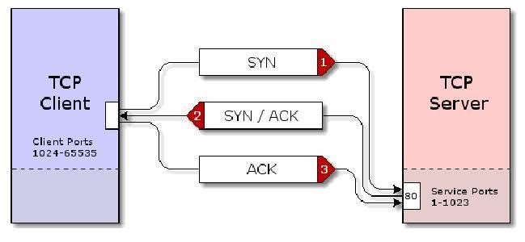
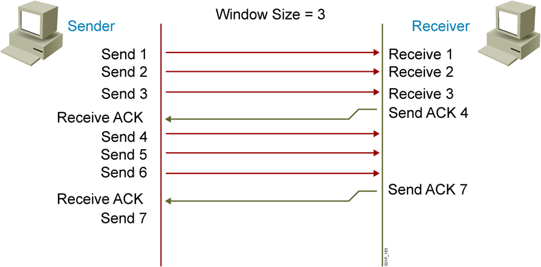

# `Bắt tay 3 bước trong TCP`

TCP khác biệt UDP ở chỗ TCP là giao thức connection-oriented có nghĩa là nó luôn thiết lập kênh kết nối trước khi truyền.

Mỗi TCP segment khi truyền đều có mục đích và điều này được trợ giúp bởi TCP flag options có sẵn trong giao thức TCP. Các cờ có độ dài 1 bit, tổng cộng là 6 và được gửi trong header của TCP. Các loại cờ TCP:
- Cờ 1 - `SYNchronization`: là cờ thường được sử dụng nhiều nhất, dùng để bắt đầu quá trình bắt tay 3 bước trong TCP.
- Cờ 2 - `ACKnowledgement`: là cờ xác nhận khi bản tin đã được nhận.
- Cờ 3 - `FINished`: là cờ thông báo ngắt kết nối
- Cờ 4 - `Reset(RST)`: là cờ yêu cầu truyền lại
- Cờ 5,6 - `Urgent Pointer và Push`: là 2 cờ yêu cầu ưu tiên xử lý gói tin.

Thiết lập kênh kết nối bằng quy trình `bắt tay 3 bước`:

- B1: host A gửi gói tin có cờ SYN được bật lên cho host B có sequence number là 100. (thường là PC gửi yêu cầu đến server)
- B2: Host B nhận được gói tin thì B gửi lại gói tin có cờ SYN được bật lên, kèm theo đó là cờ ACK (để xác nhận).

ACK=101(sequence number của A+1) nghĩa là ” này A, tôi đã nhận được gói tin có SEQ = 100, tôi mong muốn nhận thêm gói tin có SEQ= 101). Khi gửi gói tin đi thì nó đánh số thứ tự SEQ= 300

SYN/ACK packet được gửi ngược lại bằng cách đổi 2 IP của server và client, client IP sẽ thành IP đích và server IP sẽ thành IP bắt đầu
- B3: Sau khi kết nối đã được thiết lập thì A gởi tin để đáp ứng nhu cầu của B.

Gói tin được đánh số SEQ = 101: để đáp ứng nhu cầu của B

ACK =301(sequence number của B+1) dùng để báo là đã nhận được gói tin có SEQ = 300.

Và chỉ có cờ ACK được bật lên bởi gói tin bước 3 được dùng để báo nhận cho gói tin bước 2.

-> quá trình connection được thiết lập và dữ liệu sẽ lưu thông tự do giữa hai bên.

- `Trong thực tế`: Các chương trình máy con ( như web browser, ftp, ...) bắt đầu connection với máy chủ bằng cách gửi 1 packet với cờ "SYN" đến máy chủ :

SYN packet này thường được gửi từ các cổng cao ( 1024 -65535 ) của máy con đến những cổng trong vùng thấp ( 1 -1023 ) của máy chủ . Chương trình trên máy con sẽ hỏi hệ điều hành cho 1 cổng để mở connection với máy chủ . Những cổng trong vùng này được gọi là "cổng máy con" ( client port range). Tương tự như vậy, máy chủ sẽ hỏi HĐH để nhận được quyền chờ tín hiệu trong máy chủ , vùng cổng 1 - 1023 . Vùng cổng này được gọi là "vùng cổng dịch vụ" ( service port ) . Ví dụ Web Server sẽ luôn chờ tín hiệu ở cổng 80 và IE sẽ connect vào cổng 80 của máy chủ.

Các cổng dịch vụ từ 0-> 1023 
Các cổng client từ 1024 ->65533

- Các cổng dịch vụ phổ biến: 21-FTP,  23-Telnet,  25-STMP,  80 HTTP,  53 Domain name server.

Server nhận bản tin Syn ở cổng nào thì sẽ gửi lại ACK từ cổng đó.

Trong trường hợp server không chấp nhận connection, thay vì SYN/ACK bits được bật, server sẽ bật bit RST/ACK ( Reset Acknowledgement ) và gởi ngược lại RST/ACK packet. Hoặc ICMP cổng không chấp nhận để thông báo cho client rằng yêu cầu đã bị từ chối .

server bắt buộc phải gửi thông báo lại bởi vì TCP là chuẩn tin cậy nên nếu client không nhận được thông báo thì sẽ nghĩ rằng packet đã bị lạc và gửi lại thông báo mới.

## `Qúa trình kết thúc TCP`

- Trong quá trình này, ở Bước 2 máy B gửi bản tin ACK cho máy A là đã nhận được thông báo yêu cầu ngắt kết nối của A.
- Bước 3: máy B ngắt kết nối và gửi bản tin FIN yêu cầu ngắt kết nối máy B cùng ACK cho A
- Bước 4: A gửi ACK xác nhận.
## `Fixed windowing`

Thay vì gửi từng byte rồi đợi ACK thì Sender sẽ gửi nhiều byte cùng lúc. ( Window Size bằng bao nhiêu sẽ gửi bấy nhiêu)

Receiver sau khi nhận được byte thứ 3 sẽ ACK=4 để xác nhận và yêu cầu byte thứ 4.

ở cơ chế Fixed Windowing thì Window Size cố định, nhưng có trường hợp ta không giữ cửa sổ cố định được.

