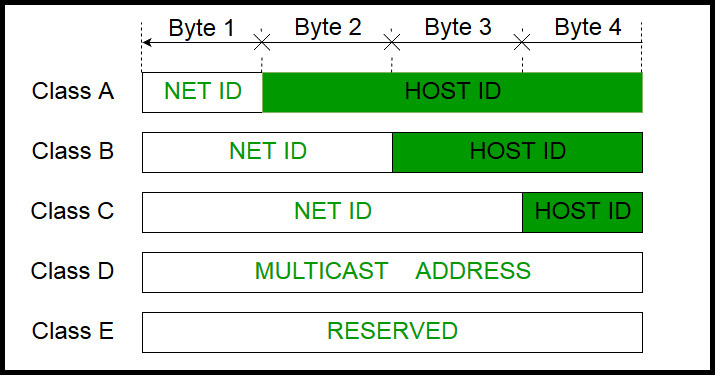
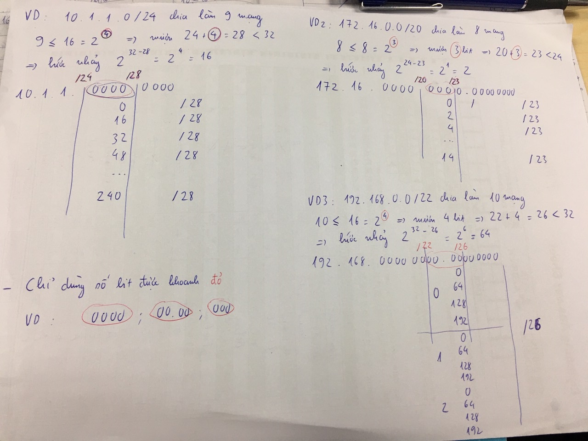
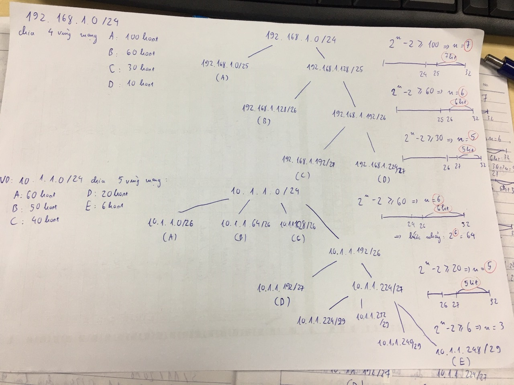

# Địa chỉ IPv4
Địa chỉ IPv4 gồm 4 octet, mỗi octet có 8 bit, tổng là 32 bit.

Địa chỉ IPv4 bao gồm 2 phần là địa chỉ mạng(NET ID) và địa chỉ host(HOST ID)

Bao gồm 5 lớp: 

- `Lớp A:` 8 bit network trong đó 1 bit đầu bằng 0 – 24 bit host: 0.0.0.0 đến 126.255.255.255, như vậy sẽ có 127 dải mạng, mỗi dải mạng lớp A có đến 16,777,216 host.
- `Lớp B:`16 bit network trong đó 2 bit đầu bằng 10 – 16 bit host: 128.0.0.0 đến 191.255.255.255, lớp B có 16,384 dải mạng, mỗi dải mạng lớp B sẽ có tối đa 65,536 host.
- `Lớp C:` 24 bit network trong đó 3 bit đầu bằng 110 – 8 bit host: 192.0.0.0 đến 223.255.255.255, và lớp C có 2,097,152 dải mạng, mỗi dải mạng lớp C sẽ có tối đa 256 host.
- `Lớp D:` 4 bit đầu bằng 1110 – 28 bit dùng cho multicast. 224.0.0.0 đến 239.255.255.255
- `Lớp E:` 4 bit đầu bằng 1111 – 28 bit còn lại chưa rõ. 240.0.0.0 đến 255.255.255.255
## `Unicast`
Unicast là khái niệm truyền thông tin từ 1 host này đến 1 host khác.
Địa chỉ unicast là địa chỉ IPv6.

## `Multicast`
Là khái niệm mà thông tin từ 1 host truyền tới các host chỉ định trong 1 vùng mạng.

## `Broadcast`
Là khái niệm thông tin từ 1 host truyền tới tất cả các host trong 1 vùng mạng.
 
Địa chỉ broadcast là địa chỉ quảng bá; tất cả các bit phần host = 1. Khi 1 gói tin gửi tới địa chỉ broadcast thì tất cả máy tính trong mạng LAN đều nhận được tin đó.

VD: địa chỉ IP: 192.168.10.100/27

1100 0000.1010 1000.0000 1010.011/0 0100 
1111 1111.1111 1111.1111 1111.111/0 0000 
    192  .  168    .   10    .0110  0000 = 192.168.10.96 

Địa chỉ host: 192.168.10.100/27 
subnetmask(hostID=0, netID=1): 255.255.255.224 
địa chỉ broadcast: 192.168.10.128(các bit hostID ->1)

VD2: địa chỉ IP: 10.1.1.200/26
0000 1010. 0000 0001. 0000 0001. 11/00 1000 
1111 1111. 1111 1111. 1111 1111. 11/00 0000 

Địa chỉ host: 10.1.1.200/26 
Subnetmask: 255.255.255.192 
Địa chỉ broadcast: 10.1.1.255

## `Chia địa chỉ IPv4`
Khái niệm bước nhảy: 2^x
trong đó: x là số bit còn lại của mỗi octet. VD:
10.41.0.1/13 thì x=16-13=3 
172.16.0.0/20 thì x=24-20=4 
192.168.0.0/22 thì x=24-22=2
### `Chia đều`

Số địa chỉ trong 1 mạng = 2^n-2. VD: trong vùng mạng 10.1.1.0/28 có những địa chỉ host: 
10.1.1.1/28 
10.1.1.2/28 
10.1.1.3/28 
... 
10.1.1.13/28 
10.1.1.14/28 
Địa chỉ 10.1.1.15/28 là địa chỉ subnet

### `Chia tối ưu (VLSM)`
<b>3 Bước</b>:

- B1: Sắp xếp trình tự mạng con theo số host giảm dần
- B2: Xác định số bit cần phải mượn là host cho mỗi mạng con theo nguyên tắc với n bit mượn thì 2^n-2 >= nhu cầu.
- B3: chia

