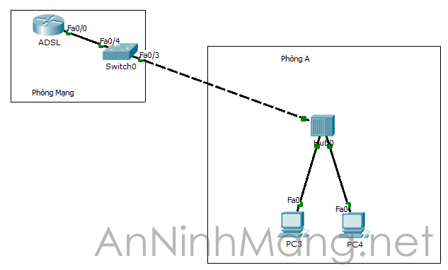

## `Các mode hoạt động của cổng switch`
switch port mode:
- mode auto: mode mặc định, tự động chuyển lên trunk hoặc mode access.
- mode access: kết nối các host cho phép nhận và chuyển gói tin.
- mode desirable: gửi tất c4ả bản tin đàm phán kết nối lên trunk
- mode trunk: kết nối giữa các VLAN qua 1 cổng vật lý duy nhất.

## Switch port-security

Switch port-security có tác dụng giới hạn máy tính kết nối vào switch bằng cách sử dụng bảng CAM (Content Addressable Memory) lưu trữ địa chỉ MAC của các card mạng.

Switch quy định port nào có địa chỉ MAC nào truy cập và số lượng MAC do admin điều khiển.

Nếu vi phạm thì cổng sẽ shut down hoặc port bị đưa vào trạng thái không hoạt động.

VD:

Switch (config-if)#switchport port-security  
Switch(config-if)#sw port-security maximum 2 (2 PC là tối đa)  
Switch(config-if)#sw port-security mac-address 0010.113D.8954(lưu địa chỉ MAC thủ công)  
Switch(config-if)#sw port-security mac-address 00D0.BA47.5D57  
Switch(config-if)#sw port-security violation shutdown (nếu vi phạm cổng bị shutdowwn)

hoặc có thể để cho switch tự cho phép địa chỉ MAC truy cập đến khi đạt ngưỡng tối đa (first come first serve):

Switch(config-if)#switchport port-security mac-address sticky