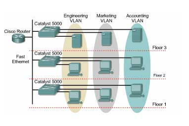
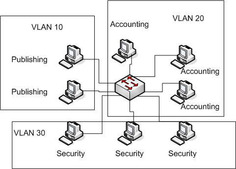
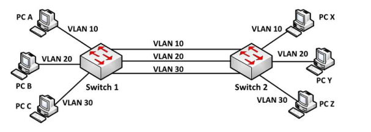
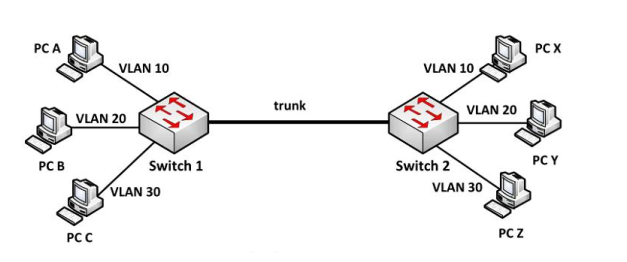
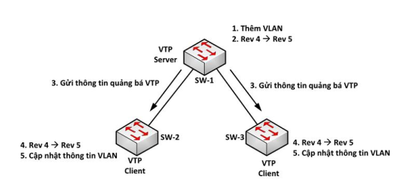

# `LAN (Local area network)`
LAN là mạng cục bộ kết nối với nhau trong một hệ thống mạng tại một khu vực nhất định (Công ty, trường học, nhà ở,...).

Một mạng LAN cơ bản cần có một máy chủ (Server), các máy trạm (client), các thiết bị ghép nối (Switch, Hub, Repeater, Access Point), cáp mạng (cable). Tiếp đến là yếu tố không thể thiếu là NIC (Network Interface Card) hay còn gọi là card mạng. Card mạng là cổng ghép nối máy tính (client, server) với cable.
# `VLAN (Virtual local area network)`
Là mạng LAN ảo. Khi tất cả các thiết bị kết nối với nhau trong 1 mạng LAN thi bất cứ 1 thiết bị nào tiếp nhận thông tin, các thiết bị còn lại cũng sẽ nhận được. Vậy làm thế nào để điều chỉnh luồng thông tin này không cho tất cả các thiết bị khác biết mà chỉ những thiết bị được chỉ định? VLAN đóng vai trò này.
`VLAN chia mạng LAN thành những vùng quảng bá khác nhau (broadcast domain)`
Tất cả các cổng trong switch mặc định đều nằm trong vlan1 (vlan mặc định, không thể xóa).

- Tác dụng VLAN:
     + Tiết kiệm băng thông của hệ thống mạng: LAN chia mạng LAN thành nhiều đoạn (segment) nhỏ, mỗi đoạn đó là một vùng quảng bá (broadcast domain). Khi có gói tin quảng bá (broadcast), nó sẽ được truyền duy nhất trong VLAN tương ứng.
     + Tăng khả năng bảo mật: Các thiết bị khác VLAN không thể truy nhập vào nhau
     + Giúp mạng có tính linh động cao: VLAN có thể dễ dàng di chuyển các thiết bị khi chỉ cần cấu hình lại.
- inter VLAN: là cấu hình interface của VLAN, có chức năng tương tự một interface bình thường.

# `Trunk`

Gỉa sử khi có nhiều VLAN kết nối giữa các switch thì phải kết nối nhiều đường dây giữa các switch để cho mỗi dây cho 1 VLAN chạy qua:

Điều này gây ra việc lãng phí và có thể xảy ra "loop".

Chúng ta có thể giải quyết vấn đề này bằng `trunk`: Kết nối này cho phép tất cả luồng dữ liệu chỉ cần đi qua 1 cổng vật lý duy nhất mà vẫn đảm bảo được tính riêng tư của VLAN. Cụ thể:

- `Trunk` có thể được cấu hình trên dây nối giữa router và switch hoặc giữa các switch với nhau.

- Phân biệt gói tin nào đi qua VLAN nào bằng cách thêm frame header "tagging" vào mỗi gói tin theo chuẩn giao thức 802.1Q(dot1Q)

- Khi cấu hình trunk, ta có thể dùng lệnh switchport trunk allowed vlan 10,20 để khống chế những vlan nào có thể qua cổng trunk:
switch(config)int f0/0
sw(config-if)switchport mode trunk
sw(config-if)switchport trunk allowed vlan 10,20,...
sw(config-if)switchport trunk allowed vlan add 30

# `VTP (Vlan trunking protocol)`
Là giao thức đồng bộ giữa các switch kết nối trunking giúp cho việc đồng bộ Vlan trên các switch 1 cách dễ dàng. vd: chỉ cần cấu hình vlan trên 1 switch server mà các switch khác cũng được cấu hình vlan.

Trong VTP domain, switch có 3 mode hoạt động:

Một trong những thành phần quan trọng trong các thông tin quảng bá VTP là tham số “revision-number”.  Mỗi thành phần VTP server điều chỉnh thông tin VLAN, nó tăng “revision-number” lên 1, rồi sau đó VTP Server mới gửi thông tin quảng bá VTP đi. Khi một switch nhận một thông điệp VTP với “revision-number” lớn hơn, nó sẽ cập nhật cấu hình VLAN.

VTP gửi thông điệp quảng bá qua “VTP domain” mỗi 5 phút một lần, hoặc khi có sự thay đổi xảy ra trong quá trình cấu hình VLAN. Một thông điệp VTP bao gồm “revision-number”, tên VLAN (VLAN name), số hiệu VLAN. Bằng sự cấu hình VTP Server và việc quảng bá thông tin VTP tất cả các switch đều đồng bộ về tên VLAN và số liệu VLAN của tất cả các VLAN.

- VTP server: duy nhất trong 1 VTP domain. VTP server có thể thêm, sửa, xóa VLAN. Nó lưu cấu hình trong NVRAM của nó và gửi tất cả thông điệp qua các cổng trunk.
- VTP client: Nhận thông tin VLAN từ VTP server và đồng bộ nó sau đó gửi mọi thông tin ra các cổng trunk.
- VTP transparent: chỉ chuyển tiếp thông tin mà nó nhận được, không dồng bộ hay gửi thông tin cập nhật cho các switch khác. Switch hoạt động ở “transparent-mode” chỉ có thể tạo ra các VLAN cục bộ. Các VLAN này sẽ không được quảng bá đến các switch khác.

### `Cấu hình VTP domain:`
switch(config)#vtp domain tên_domain 
switch(config)#vtp mode server/client/transparent 
`(tùy xem admin muốn cấu hình switch đó thuộc mode gì)` 
switch(config)#vtp password cisco