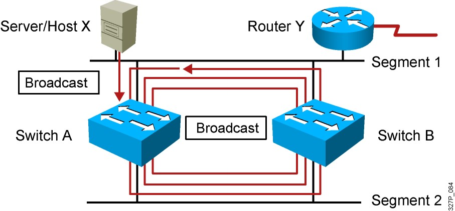
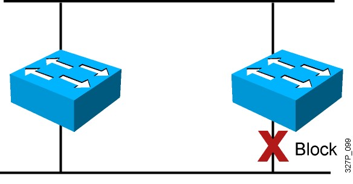
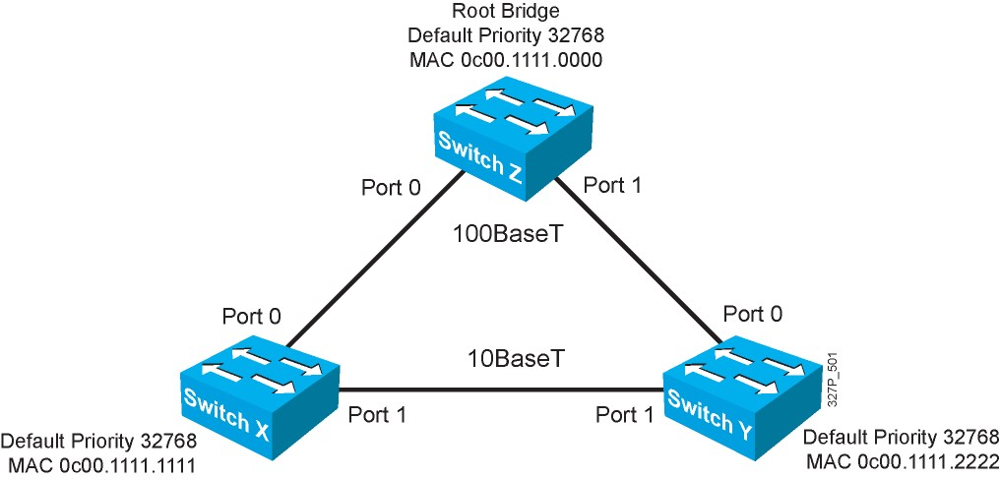
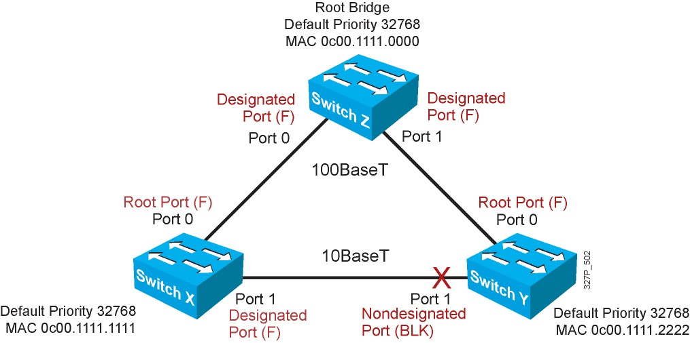

## `Khái niệm`
Mỗi khi switch nhận được 1 gói tin không có địa chỉ MAC đích, nó sẽ đẩy ra các cổng còn lại. Nếu như các switch được nối với nhau nhiều hơn 1 cổng thì bản tin sẽ được truyền đi truyền lại giữa các switch gây ra hiện tượng "loop".

Spanning-tree là giao thức mặc định trong switch được sinh ra để chống loop. Về cơ bản nó sẽ block các đường không cần thiết trong chuyền.
Tìm ra được các đường bị block (block-port) này qua 4 bước:
- Bầu chọn Root Switch
- Bầu chọn Root port
- Bầu chọn Designated port
- Port còn lại là Alternated Port

## 1. Bầu chọn root-switch

Ban đầu, các switch sẽ gửi gói tin BPDO (bridge protocol data unit) 2s/1 lần qua các port để xác định thông số bình bầu root-switch

Quy định root-switch qua các thông số:
- Priority(của switch): 32768 + vlan ID: switch có priority MIN thì ưu tiên MAX
- MAC Address Switch:Nếu priority = nhau, switch nào có MAC address MIN thì ưu tiên MAX

Khi bầu xong Root-switch thì chỉ có Root-switch được gửi BPDU(2s/1 lần). Việc gửi đó để duy trì cây spanning tree đó không bị Loop. Mỗi khi có switch mới kết nối vào thì sẽ tiến hành gửi bản tin BPDU giữa các switch để bình bầu lại.

Theo nguyên tắc đánh số MAC của nhà sản xuất thì khi bầu chọn root-switch nó sẽ chọn switch đời đầu làm root-switch. Nên trong thực tế ta không bao giờ cho bầu chọn bằng MAC mà ta chỉnh priority.

## `2. Bầu chọn root-port`

- Là port cung cấp đường về Root-switch mà có tổng path-cost là nhỏ nhất
- Khi bầu chọn Root-port thì Root-Switch không tham gia quá trình bầu chọn này
- Mỗi non-Rootswitch chỉ có 1 Root-port
- Path-cost là giá trị cost trên từng cổng của Switch.

- Nguyên tắc tính tổng path-cost: tính từ Root-switch --> switch đang muốn tính

Đi ra: không cộng
Đi vào: cộng cost

## `3. Designated port`
- Tất cả các port của Root-sw đều là Designated port
- Trên 1 phân đoạn nếu port đối diện là Root-port thì mình là Designated port(không có ý nghĩa ngược lại).
- Là port cung cấp đường về Root-sw trên phân đoạn mạng đang xét mà có tổng path-cost là nhỏ nhất.
## `4. Block port`

Những đường không phải là root-port trên các con switch khác thì sẽ bị block

## `STP timer`
- Helo timer: định kỳ sau thời gian 2s sẽ gửi BPDU
- Forward timer: 15(s)
- Max-age times: 20(s)

Nếu Root-Sw chết hay port block không nhận được BPDU thì mất 20s nó mới hoạt động (tự mở lên hoặc bầu chọn lại Root-sw)
## `STP state`
- Các trạng thái khi Switch khởi động:

Disable: down
Blocking: nhận BDPU, ko gửi BPDU, không học MAC, không forward frame
Listening: nhận BDPU, gửi BPDU, không học MAC, không forward frame
Learning: nhận BDPU, gửi BPDU, học MAC, không forward frame
Forwarding: nhận BDPU, gửi BPDU, học MAC, forward frame
- Việc chuyển từ trạng thái: Blocking sang listening mất 20(s)
- Việc chuyển từ trạng thái: Listening sang Leaning mất 15(s)
- Việc chuyển từ trạng thái: Leaning sang Forwarding mất 15(s)

Vậy khi Switch khởi động xong hoặc khi cắm dây vào port thì phải mất 50(s) đèn chuyển sang màu xanh.

## `BPDU guard`
BPDUGuard sẽ cấm không cho switch lạ trao đổi BPDU với mạng. Khi switch nhận được BPDU trên portfast với tính năng BPDUGuard thì cổng sẽ bị đưa vào trạng thái errdisable. Muốn sử dụng lại cổng này thì phải cho phép cổng một cách thủ công hoặc đợi khoảng thời gian errdisable hết hạn. Mặc định, tính năng BPDU guard bị khóa trên tất cả các Port của switch.

+Ta có thể cấu hình BPDU ở mode Global của switch , sẽ tác động lên tất cả các Port của switch chỉ bằng 1 câu lệnh.

Switch (config)#spanning-tree portfast bpduguard default

+ Ngoài ra , ta cũng có thể tắt hoặc mở tính năng BPDU guard trên từng Port:

Switch (config_if)#[no] spanning-tree bpduguard enable

+ Ta không nên cấu hình BPDU guard cho Uplink port vì gói BPDU sẽ được nhận và lập tức Port sẽ chuyển sang chế độ errdisable.Điều này sẽ làm cho Port đó không thể sử dụng trong mạng.
