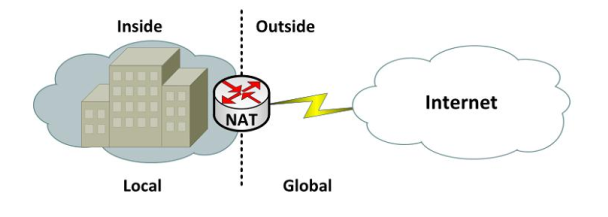
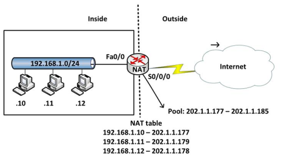

# NAT (Network Address Translation)

Nat (Network Address Translation) là một kỹ thuật cho phép chuyển đổi từ một địa chỉ IP này thành một địa chỉ IP khác. Thông thường, NAT được dùng phổ biến trong mạng sử dụng địa chỉ cục bộ, cần truy cập đến mạng công cộng (Internet). Vị trí thực hiện NAT là router biên kết nối giữa hai mạng.

Trong giai đoạn gói tin được truyền từ mạng internet (public) quay trở lại NAT, NAT sẽ thực hiện nhiệm vụ thay đổi địa chỉ đích đến thành địa chỉ IP bên trong hệ thống mạng cục bộ và chuyển đi.

- Ưu:
    + Tiết kiệm địa chỉ IPv4
    + Giấu IP trong LAN -> bảo mật
- Nhược: 
    + làm tăng tải router
    + Khi dùng NAT, CPU tốn thời gian đổi địa chỉ IP, tằng độ trễ

## `Địa chỉ IP private và IP public`

- IP private: Mỗi thiết bị trong LAN sẽ có 1 IP private riêng, có thể kết nối với nhau trong cùng LAN những không thể kết nối với internet bên ngoài. Muốn kết nối phải dùng NAT chuyển từ IP private -> IP public.
    + Thường những địa chỉ: 10.0.0.0 10.255.255.255  172.16.0.0 172.31.255.255  192.168.0.0 192.168.255.255  là những địa chỉ `private` theo RFC 1918.
- IP public: Là các địa chỉ còn lại. Các địa chỉ public là các địa chỉ được cung cấp bởi các tổ chức có thẩm quyền (IPS).
## `Một số thuật ngữ`

- Địa chỉ inside local: là IP private
- Địa chỉ inside global: là IP public
- Địa chỉ outside local: là địa chỉ IP của một thiết bị bên ngoài khi nó xuất hiện bên trong mạng. Địa chỉ này không nhất thiết là địa chỉ được đăng ký, nó được lấy từ không gian địa chỉ bên trong. VD: 172.16.20.200
- Địa chỉ outside global: là địa chỉ IP gán cho một thiết bị ở mạng bên ngoài. Địa chỉ này được lấy từ địa chỉ có thể dùng để định tuyến toàn cầu từ không gian địa chỉ mạng. VD: 202.2.2.2
## `Các kỹ thuật NAT`
### `NAT static`
Chuyển từ 1 địa chỉ private cố địng sang 1 địa chỉ public cố định. VD:

Note: vùng mạng giữa PC và R1 với vùng mạng giữa R2 và switch có thể trùng nhau nhưng không liên quan.

Cấu hình NAT trên router 2: 
R2(config)#ip nat inside source static tcp 192.168.1.2 80 113.171.1.2 80

R2(config)#ip nat inside source static udp 192.168.1.3 53 113.171.1.2 53 
R2(config)#int f0/0
R2(config-if)ip nat outside
R2(config)#int f0/1
R2(config-if)ip nat inside
### `NAT dynamic`
Dynamic NAT được dùng để ánh xạ một địa chỉ IP này sang một địa chỉ khác một cách tự động, thông thường là ánh xạ từ một địa chỉ cục bộ sang một địa chỉ được đăng ký. Bất kỳ một địa chỉ IP nào nằm trong dải địa chỉ IP công cộng đã được định trước đều có thể được gán một thiết bị bên trong mạng. VD:

Router (config) # ip nat pool abc 202.1.1.177 202.1.1.185 netmask 255.255.255.0

Router (config) # access-list 1 permit 192.168.1.0  0.0.0.255 `(0.0.0.255 là địa chỉ wildcard)`

Router (config) # ip nat inside source list 1 pool abc

Router (config) # interface fa0/0

Router (config-if) # ip nat inside

Router (config) # interface s0/0/0

Router (config-if) # ip nat outside
### `NAT overload (PAT: Port address translation`
Là kĩ thuật chuyển đổi IP private -> IP public. Mỗi phiên NAT được định danh bằng 1 port ID (1->65535) => từ 1 địa chỉ ISP cung cấp có thể đại diện cho 65535 địa chỉ private. VD:

Cấu hình: 
- B1: Định nghĩa những địa chỉ IP private được NAT
R(config)#access-list 1 permit 192.168.1.0 0.0.0.255
- B2: Thực hiện NAT 
R(config)#ip NAT inside source list 1 interface f0/1 overload (`f0/1 là cổng ra`)
- B3: Đặt NAT vào int 
R(config)#int f0/0
R(config-if)#ip nat inside
R(config)#int f0/1
R(config-if)#ip nat outside

Kiểm tra: R#show ip nat translation

## `Port forwarding`
Port forwarding là quá trình chuyển một port cụ thể trong hệ thống mạng cục bộ LAN từ một client/terminal/node qua một client/terminal/node của một network khác, điều này sẽ cho phép các clients/terminals/nodes bên ngoài có thể truy cập vào clients/terminals/nodes trong mạng LAN bằng cách sử dụng cái port đó từ bên ngoài thông qua cái Router/Modem/Firewall đã mở chức năng NAT.

Như vậy, các máy tính từ xa (máy vòng quanh thế giới trên internet ấy) sẽ sử dụng Port forwarding để kết nối với một máy tính khác trong mạng LAN và đây cũng chính là cách mà các chương trình Torrent sử dụng để chia sẻ file giữa 2 máy tính với nhau nên ta còn gọi là peer to peer (PP) sharing đó.

- Port forward là việc cần thiết để mở cửa giữa máy mình (seeder/leech) và máy người kia (peer/leech) để đạt được tốc độ transfer giữa hai máy một cách tối ưu (cao nhất). Đa số các DSL Router hoặc DSL Modem có NAT đều sử dụng firewall để chặn các dòng truy cập từ các máy trong LAN (internal network) với mạng Internet, một đường mòn được đào (open/ forward) xuyên qua firewall để các máy tính trong LAN có thể truy cập vào được với máy tính ngoài Internet thông qua 1 cổng (port) xác định ta gọi là port forward.