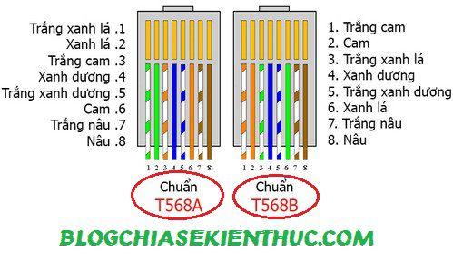
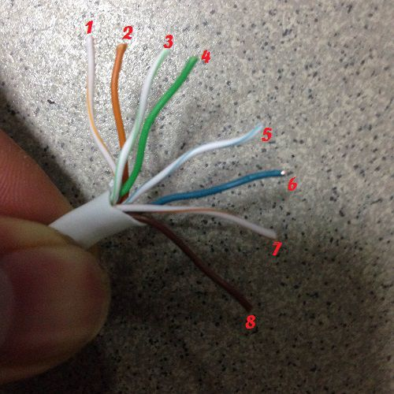
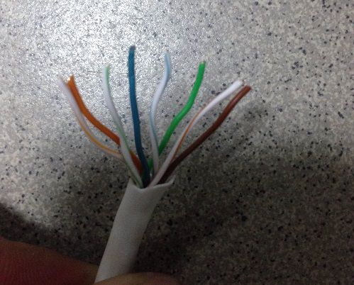
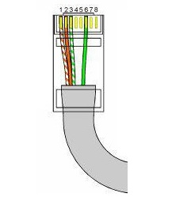
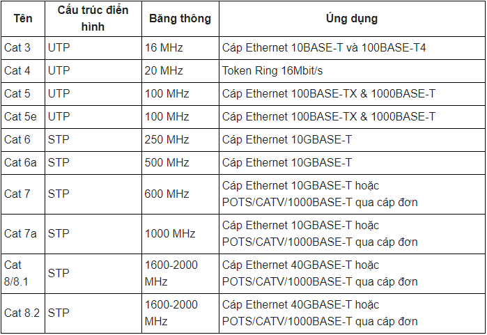
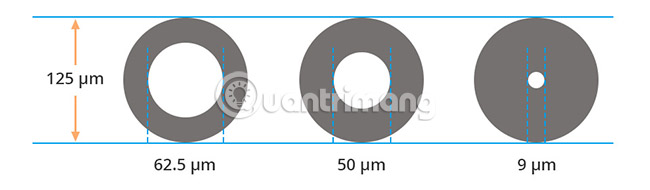
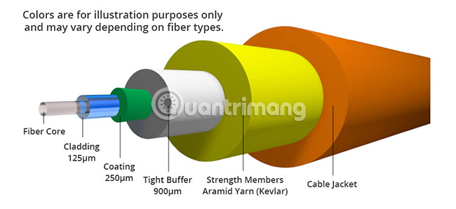
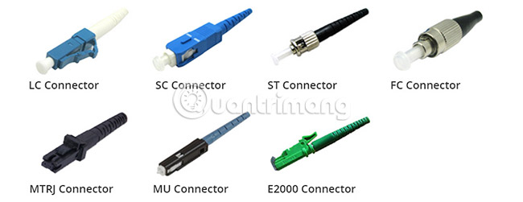

# `Dây cáp đồng (cáp xoắn đôi)`
Là loại cáp mà trong đó 2 dây dẫn xoắn lại với nhau vì hai dây dẫn mang tín hiệu tương đương nhưng lại ngược chiều -> gây ra nhiễu xuyên âm

## `Cáp xoắn đôi có 2 loại`

- `Cáp STP(Shield twisted pair)`
là cáp xoắn đôi được che chắn bởi vỏ chống nhiễu.
- `Cáp UTP(Unsheild twisted pair)` là cáp xoắn đôi không được che chắn bởi vỏ chống nhiễu.

## `RJ45 và RJ11`
### `RJ45(dây mạng 8 sợi)`

Là loại đầu dây mạng dùng để kết nối mạng LAN hoặc dùng để kết nối giữa các thiết bị như PC với PC, PC với Modern,...

Đối với đầu RJ45 có 2 kiểu bấm: bấm thẳng và bấm chéo:
- Nếu như bạn bấm cả 2 đầu cùng 1 chuẩn, ví dụ như A – A hoặc B – B thì đó gọi là bấm thẳng.
- Còn nếu như bạn bấm 1 đầu là chuẩn A, còn đầu còn lại là chuẩn B thì đó gọi là bấm chéo.

`Vậy khi nào bấm cáp thẳng? Khi nào bấm chéo?`

- Bấm cáp thẳng: khi nối giữa 2 thiết bị khác loại. VD: switch đến router, switch đến PC, hub đến PC hoặc server. -> Lý do: Đầu nhận của bên này là đầu gửi của bên kia.
- Bấm cáp chéo: khi nối giữa 2 thiết bị cùng loại. VD: switch đến switch, router đến router, PC đến PC,... -> Lý do: Đầu nhận của bên này là đầu nhận của bên kia luôn nên phải đảo chéo lại để có thể gửi nhận đúng.

#### `Bấm dây mạng 8 sợi`
- Chuẩn B: Sắp xếp theo thứ tự: 
   1. Trắng cam
   2. Cam
   3. Trắng xanh lá
   4. Xanh lá
   5. Trắng xanh dương
   6. Xanh dương
   7. Trắng nâu
   8. Nâu

Sau đó đổi thứ tự 4 và 6 là sẽ có chuẩn dây T568B: 

- Chuẩn A: Sắp xếp theo thứ tự: Xanh lá-Cam- Xanh dương- Nâu. Với dây 2 màu (vd:trắng cam, trắng xanh) đứng trước.

Sau đó lại đổi chỗ 4,6 là xong
#### `Bấm dây mạng 4 sợi`
Nếu chỉ muốn dùng 4 dây để bấm mạng: 

Sử dụng chân 1,2,3,6 với thứ tự:
1. Trắng cam
2. Cam
3. Trắng xanh lá
4. Xanh lá

## `Cáp Ethernet`
Cáp xoắn đôi STP và UTP khi sử dụng đầu nối RJ45 hoặc RJ11 đều được gọi là cáp Ethernet

Tốc độ truyền tải các loại cáp: Cat3 (16 Mbps), Cat4 (20 Mbps), Cat5 (100 Mbps), Cat5e (100 Mbps), Cat6 (250 Mbps), Cat6a (250 Mbps), Cat7 (600 Mbps), Cat7a (1000 Mbps).

## `Cáp quang (Cabaple Optical Fiber)`

Sử dụng lõi thủy tinh được phủ cao su bên ngoài để truyền ánh sáng. Vì ánh sáng không bị hao hụt như tín hiệu điện, cáp có thể truyền với tốc độ 10 Mbps - 100 Gps hoặc cao hơn với khoảng cách tính bằng km.

- `Sợi đơn mode` có đường kính lõi sợi 9/125µm thường được sử dụng trong khoảng cách lớn bởi nó chỉ truyền một bước sóng duy nhất -> không có nhiễu hoặc chập chờn tín hiệu.
- `Sợi đa mode` có đường kính lõi sợi 50/125µm hoặc 62,5/125µm sử dụng khoảng cách ngắn.

- Đầu nối đa sợi quang: 

Trong đó LC, ST, SC là ba loại được sử dụng phổ biến nhất.

## `Điểm tiến bộ hơn của cáp quang so với cáp ethernet`
- Cáp ethernet mang điện nên có thể bị nhiễm tín hiệu điện từ, cáp quang thì không
- Thông tin truyền qua cáp đồng có thể bị chặn lại và rò rỉ, cáp quang cực khó để chặn
- Tốc độ cáp quang lớn hơn
- Băng thông lớn hơn