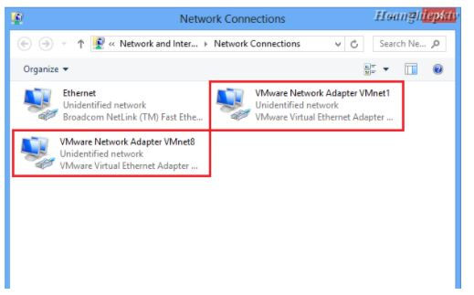
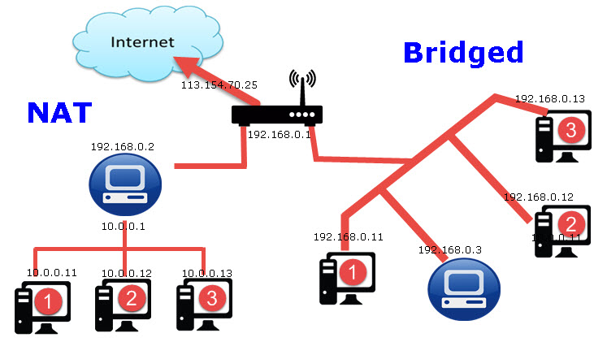

## `Switch ảo`
Cũng giống như switch vật lý, một Virtual Switch kết nối các thành phần mạng ảo lại với nhau. Những  switch ảo hay còn gọi là mạng ảo, chúng có tên là VMnet0, VMnet1, VMnet2… một số switch ảo được gắn vào mạng một cách mặc định. Mặc định khi ta cài Wmware thì có sẵn 3 Switch ảo như sau: VMnet0 chế độ Bridged (cầu nối), VMnet8 chế độ NAT và VMnet1 chế độ Host-only.

Khi ta tạo các VMnet, thì trên máy thật sẽ tạo ra những card mạng ảo tương ứng với VMnet đó, dùng để kết nối Virtual Switch với máy tính thật, giúp máy thật và máy ảo có thể liên lạc được với nhau. Riêng VMnet0 kết nối trực tiếp với card mạng vật lý thông qua cơ chế bắt cầu (bridged) nên không tạo ra card VMnet. VMnet8 mặc định sẽ sử dụng cơ chế NAT. Các VMnet khác khi được thêm vào sẽ là Host-Only.

### `DHCP ảo của WMnet`
DHCP (Dynamic Host Configuration) server ảo đảm nhiệm việc cung cấp địa chỉ IP cho các máy ảo trong việc kết nối máy ảo vào các Switch ảo không có tính năng Bridged (VMnet0).  DHCP  server ảo cấp phát địa chỉ IP cho các máy ảo có kết nối với VMnet Host-only và NAT.

### `LAN Segment`
Các card mạng của máy ảo có thể gắn kết với nhau thành từng LAN Segment. Không giống như VMnet, LAN Segment chỉ kết nối các máy ảo được gán trong một LAN Segment lại với nhau mà không có những tính năng như DHCP và LAN Segment không thể kết nối ra máy thật như các Virtual Switch VMnet.

### `Các cơ chế hoạt động và các mô hình cơ bản  khi cấu hình với switch ảo (VMnet):`
- Chế độ Bridge: ở chế độ này, card mạng trên máy ảo được gắn vào VMnet0, VMnet0 này liên kết trực tiếp với card mạng vật lý trên máy thật.

Máy ảo đóng vai trò như một máy thật có cùng chung môi trường switch với máy thật.
- Chế độ Host-only: 
     + Các máy ảo thấy nhau
     + Các máy ảo và máy thật thấy nhau
     + Máy ảo không kết nối được internet
- Chế độ NAT:
ở chế độ này, card mạng của máy ảo kết nối với VMnet8, VNnet8 cho phép máy ảo đi ra mạng vật lý bên ngoài internet thông qua cơ chế NAT (NAT device). Lúc này lớp mạng bên trong máy ảo khác hoàn toàn với lớp mạng của card vật lý bên ngoài, hai mạng hoàn toàn tách biệt. IP của card mạng máy ảo sẽ được cấp bởi DHCP của VMnet8, trong trường hợp bạn muốn thiết lập IP tĩnh cho card mạng máy ảo bạn phải đảm bảo chung lớp mạng với VNnet8 thì máy ảo mới có thể đi internet.

## `So sánh NAT và bridge`

