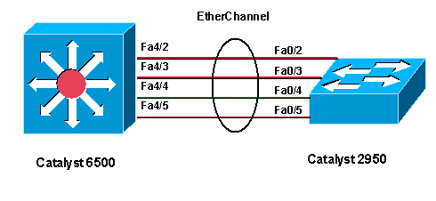

# `Link aggregation`
Là kĩ thuật gom nhiều đường link kết nối giữa các switch thành 1 để không bị STP block 1 cổng
- Tăng băng thông kết nối mà không cần nâng cấp cổng vật lý
- Đảm bảo tính dự phòng

## `Điều kiện để gộp cổng:`
- các cổng phải cùng tốc độ, cùng duplex
- cùng chung vlan
- cùng chung môi trường

+ Có thể gom tối đa 16 cổng trên 1 nhóm và tối đa 8 nhóm trên 1 switch
+ Link-aggregation hỗ trợ trên cả switch layer 2 và 3 (khi cấu hình trên layer 2 thì chú ý cost của port-channel trên spanning-tree)
+ đường gộp được gọi là etherchannel
+ interface đại diện kênh đó là `interface port-channel`

## `Các loại etherchannel`
`PAgP`(port aggregation protocol): độc quyền của cisco

Các mode:
- On : cấu hình thủ công EtherChannel, sẽ đưa tất cả các port tham gia vào Channel mà không cần trao đổi gói tin. Chỉ lên được Channel khi cả 2 cổng cùng ở trạng thái mode on, cùng speeed và duplex. Nếu không sẽ xảy ra mất gói hoặc loops STP sẽ xảy ra.
- Auto : Các port sẻ phản hồi gói tin PAgP từ đầu khác nhưng không tự gửi gói tin PAgP. Thiết kế mode này giảm thiểu các gói tin PAgP.
- Desirable : Các port ở trạng thái này sẻ tự gửi negotiate đến những ports khác để thương lượng lên được 802.3ad.
- Các trạng thái có thể lên được Channel: 
On - On 
Auto - Desirable(chủ động - bị động) 
Desirable - Desirable(chủ động - chủ động) 
Auto - Auto(bị động - bị động) sẽ không lên được Channel
- `Cấu hình:` VD trên: 
Switch3(config)int range f4/2-5 
Switch3(config-if)#channel-protocol pagp 
Switch3(config-if)#channel-group 1 mode {on | auto | desirable}  

`LACP` (link aggregation): chuẩn chung
- On: như PagP
- Active: Port sẽ tự gửi negotiate bằng các gói tin LACP đến những ports khác để thương lượng lên được 802.3ad bằng việc trao đổi gói tin LACP.
- Passive: Các port sẻ phản hồi gói tin LACP từ đầu khác mà nó nhận được nhưng không tự gửi gói tin LACP. Thiết lập này để giảm thiểu việc truyền tải các gói tin LACP.
- Các trạng thái có thể lên được Channel: 
On - On 
Active - Passive(Chủ động - Bị động) 
Active - Active (Chủ động - Chủ động)
- `Cấu hình:` VD trên: 
Switch2(config)#int range f0/2-5 
Switch2(config-if)#channel-group 1 mode {on | passive | active} 
Switch2(config)#int port-channel 1 
Switch2(config-if)#switchport mode trunk