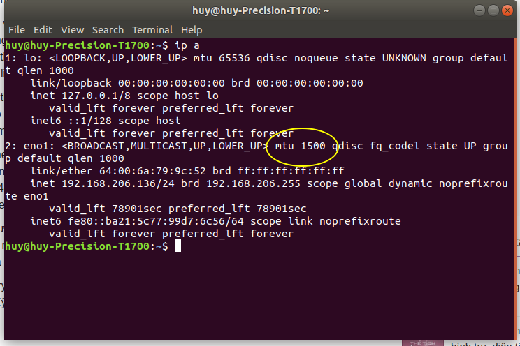
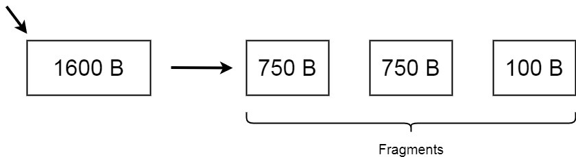
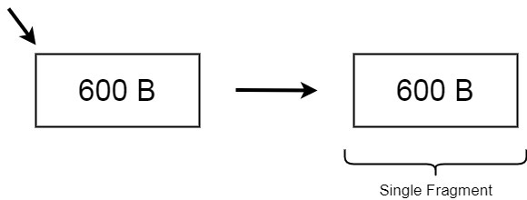

<h1 style="color:orange">MTU</h1>
MTU(Maximum Transmission Unit) là thuộc tính định nghĩa kích thước lớn nhất của một packet có thể truyền đi như 1 cục.
MTU quy định độ dài 1 packet là 1500 bytes. Nếu MTU lớn hớn thì có thể truyền dữ liệu nhiều hơn những sẽ bị chậm hơn (vì kích thước của nó). Việc quy định độ dài 1500 byte 1 packet giúp làm tăng tốc độ truyền. Khi packet >1500byte, chúng sẽ bị chia nhỏ ra thành các packet nhỏ(fragment); (1 fragment = 1500bytes; fragment khác frame; fragment có thể coi như là 1 packet)

MTU quy định độ dài packet truyền của giao thức TCP(thuộc tầng 4), TCP quy định phương thức truyền, còn các packet hoạt động ở tầng 3.

VD: Giả sử MTU = 750bytes mà hệ thống máy gửi gửi packet > MTU:

Tiến trình chia packet thành những frame nhỏ hơn này là Fragmentation. Những fragment này sau đó được ghép lại ở tầng 3 máy nhận.

Giả sử packet gửi đến nhỏ hơn MTU thì tiến trình ghép này không cần thiết:

<h1 style="color:orange">Jumbo frame</h1>
Chuẩn IEEE 802.3 định nghĩa kích thước của ethernet frame là từ 64 đến 1518 bytes. Trong đó, phần header có kích thước 18 bytes, phần FCS có kích thước 4 bytes, còn lại phần payload có kích thước từ 46-1500 bytes. Như vậy, MTU là 1500.

Jumbo frame là frame có size quá kích cỡ thông thường là 1500 bytes, có thể lên đến 9000 bytes. Mục đích của nó để giảm số packet cần sent -> tránh fragment -> tránh mất gói, xác suất mất càng cao nếu càng bị cắt thành nhiều gói -> CPU xử lý để đóng gói, tháo rỡ packet ở hai đầu cũng giảm ( do số packet phải gửi giảm và tránh fragment)

`Tại sao phải cần jumbo frame?`
Việc mở rộng kích thước frames được liệt kê như sau :

- Tăng thêm 4 bytes cho VLAN tagging theo chuẩn IEEE 802.1Q. Kích thước frame tăng lên tối đa thành 1522 bytes.
- Tăng thêm 8 bytes cho thông tin nguồn gốc frames theo Provider Bridge(802.1ad). Kích thước frames tăng lên tối đa thành 1526 bytes.
- 3 AE tăng thêm 64 bytes prefix tăng kích thước tối đa của frame lên thành 1582 bytes.
- T11 cho phép MTU 2500 bytes đối với Fiber Channel over Ethernet(FCoE) frames.
- MPLS mở rộng kích thước frame bằng việc thêm các nhãn vào frames. Kích thước frames tăng thêm (n*4), với n là số nhãn gắn thêm.
- Baby Giant: thường dùng để gọi những frames sử dụng MPLS, 802.1Q, 802.1ad, và 802.3AE. Kích thước của Baby Giant thường lớn hơn ko đáng kể so với chuẩn MTU.
- Mini Jumbo: thường dùng để gọi những frames với MTU là 2500 bytes. Những frames này thường được sử dụng bởi FcoE.
<h2 style="color:orange">Ưu điểm</h2>

- Kích thước frame lớn dẫn đến số lượng frame mà CPU phải xử lý giảm.
- Số lượng frame giảm dẫn đến kích thước phần header cũng giảm. Trong điều kiện tải nặng, phần header sẽ tiêu tốn một phần băng thông đáng kể.
- Số lượng frame giảm làm giảm số lượng interrupt của NIC lên CPU. Đối với mỗi frame nhận được, NIC interrupt tới CPU để thông báo rằng nó nhận được một frame mới và CPU sẽ dừng mọi việc đang thực hiện lại để xử lý frame đó. Mỗi interrupt như vậy làm tiêu tốn một số lượng đáng kể chu kỳ của CPU.
- Kích thước frame lớn cũng làm tiết kiệm nhiều chu kỳ của CPU do giảm số lần dữ liệu di chuyển trong bộ nhớ. Ở cả hai phía gửi và nhận, việc di chuyển data trong bộ nhớ hiệu quả hơn với những frames lớn bởi vì bộ nhớ được tổ chức thành các “pages”. Kích thước mỗi page thường là 4Kbytes, 8Kbytes hoặc 16Kbytes.
- Kích thước frame lớn dẫn đến hiệu quả của việc sử dụng bộ đệm trên thiết bị tăng lên.
- Hiệu quả hoạt động của router và switch được quyết định bởi số lần phân tích header mỗi frame nhận được để xem xét chuyển tiếp frame đó đi đâu. Số lượng frame giảm tất nhiên sẽ làm tăng hiệu năng của các thiết bị này.
<h2 style="color:orange">Nhược điểm</h2>
Nhược điểm duy nhất của Jumbo frame đó là nó không phải là một chuẩn và do đó, không phải thiết bị nào cũng hỗ trợ. Việc thiết kế mạng có hỗ trợ jumbo frame mà sử dụng thiết bị của nhiều nhà cung cấp khác nhau cần tính toán đến việc tương thích giữa chúng.

VD: 1 đầu truyền quy định mtu=1500bytes mà 1 đầu dùng jumbo frame thì sẽ lấy mtu 1500 làm chuẩn.
<h2 style="color:orange">Kích thước</h2>

- Theo chuẩn IEEE 802.3, trong header frame ethernet có 4 bytes FCS(Frame Check Sequence) dùng để check lỗi frame trong quá trình truyền tải. Khi kích thước frame tăng lên, khả năng kiểm tra lỗi frame của FCS giảm đi. Kích thước tối đa để FCS có thể kiểm tra lỗi chính xác là 12000 bytes. Và như vậy nếu kích thước frame cứ tiếp tục tăng thì đến một lúc nào đó FCS sẽ không thể kiểm tra lỗi frame được nữa.
- Với kích thước trong khoảng 9000 bytes đủ lớn để đóng gói theo chuẩn NFS (Network File System). 
---------> mtu =9000 bytes

Mtu 1500 thích hợp trong việc chuyền cho những ứng dụng trực tuyến. Mtu 9000 cải thiện đáng kể hiệu năng truyền tải server.