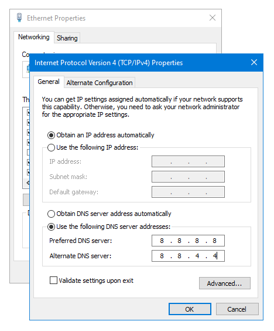

<h1 style="color:orange">DNS</h1>
DNS (Domain Name System), mang ý nghĩa đầy đủ là hệ thống phân giải tên miền. DNS được phát minh vào năm 1984 cho Internet, chỉ một hệ thống cho phép thiết lập tương ứng giữa địa chỉ IP và tên miền.

<h1 style="color:orange">1. Chức năng</h1>
DNS có thể được hiểu như một “người phiên dịch” và “truyền đạt thông tin”. DNS sẽ làm công việc dịch tên miền thành một địa chỉ IP gồm 4 nhóm số khác nhau. Ví dụ như www.tenmien.com thành 421.64.874.899 hoặc ngược lại dịch một địa chỉ IP thành tên miền.

Tuy nhiên, địa chỉ IP vẫn được sử dụng như một nền tảng kết nối bởi các thiết bị mạng. Đó là nơi DNS làm việc phân giải tên domain thành địa chỉ IP để các thiết bị mạng giao tiếp với nhau. Đồng thời, bạn cũng có thể tải một website bằng cách nhập trực tiếp địa chỉ IP thay vì nhập tên domain của website đó.
<h1 style="color:orange">2. Các loại DNS</h1>
Các DNS Server bao gồm:

- Root Name Server
- Local Name Server
<h2 style="color:orange">2.1. Root name server</h2>
Đây là máy chủ tên miền chứa các thông tin(top-domain-level), để tìm kiếm các máy chủ tên miền lưu trữ (authority).

Hiểu đơn giản, nhập tên miền -----> hỏi máy chủ root -------> máy chủ root chỉ đến server lưu trữ web
<h2 style="color:orange">2.2. Local name server</h2>
Server này chứa thông tin, để tìm kiếm máy chủ tên miền lưu trữ cho các tên miền thấp hơn. Nó thường được duy trì bởi các doanh nghiệp, các nhà cung cấp dịch vụ Internet (ISPs).

Hiểu đơn giản, nhập tên miền ---> hỏi local name server -----> local hỏi root name server
<h1 style="color:orange">3. Cách thức hoạt động DNS</h1>
Giả sử muốn truy cập matbao.vn

1. Trước hết chương trình trên máy người sử dụng gửi yêu cầu tìm kiếm địa chỉ IP ứng với tên miền matbao.vn tới máy local name server thuộc mạng của nó.
2. Máy chủ tên miền cục bộ này kiểm tra trong cơ sở dữ liệu của nó có chứa cơ sở dữ liệu chuyển đổi từ tên miền sang địa chỉ IP của tên miền mà người sử dụng yêu cầu không. Trong trường hợp máy chủ tên miền cục bộ có cơ sở dữ liệu này, nó sẽ gửi trả lại địa chỉ IP của máy có tên miền nói trên.
3. Trong trường hợp local name server không có cơ sở dữ liệu về tên miền này nó sẽ hỏi lên các máy chủ tên miền ở mức cao nhất (root name server). Máy chủ tên miền ở mức ROOT này sẽ chỉ cho máy chủ tên miền cục bộ địa chỉ của máy chủ tên miền quản lý các tên miền có đuôi .vn.
4. Tiếp đó, local name server gửi yêu cầu đến máy chủ quản lý tên miền Việt Nam (.VN) tìm tên miền matbao.vn.
5. local name server sẽ hỏi máy chủ quản lý tên miền `.vn` địa chỉ IP của tên miền matbao.vn. Do máy chủ quản lý tên miền .vn có cơ sở dữ liệu về tên miền matbao.vn nên địa chỉ IP của tên miền này sẽ được gửi trả lại cho local name server.
6. Cuối cùng, local name server chuyển thông tin tìm được đến máy của người sử dụng. Người sử dụng dùng địa chỉ IP này để kết nối đến server chứa trang web có địa chỉ matbao.vn.
- Lưu ý: các DNS server này chỉ trả về địa chỉ IP của server chứa thông tin web chứ không trả về nội dung web.
<h1 style="color:orange">4. Nguyên tắc hoạt động DNS</h1>
Mỗi nhà cung cấp dịch vụ vận hành và duy trì DNS server riêng của mình, gồm các máy bên trong phần riêng của mỗi nhà cung cấp dịch vụ đó trong Internet.

Tức là, nếu một trình duyệt tìm kiếm địa chỉ của một website bất kỳ thì DNS server phân giải tên website này phải là DNS server của chính tổ chức quản lý website đó chứ không phải là của một tổ chức (nhà cung cấp dịch vụ) nào khác.

DNS có khả năng tra vấn các DNS server khác để có được một cái tên đã được phân giải. DNS server của mỗi tên miền thường có hai việc khác biệt.

- Thứ nhất, chịu trách nhiệm phân giải tên từ các máy bên trong miền về các địa chỉ Internet, cả bên trong lẫn bên ngoài miền nó quản lý.
- Thứ hai, chúng trả lời các DNS server bên ngoài đang cố gắng phân giải những cái tên bên trong miền nó quản lý. DNS server có khả năng ghi nhớ lại những tên vừa phân giải. Để dùng cho những yêu cầu phân giải lần sau. Số lượng những tên phân giải được lưu lại tùy thuộc vào quy mô của từng DNS.
<h1 style="color:orange">5. Sử dụng DNS</h1>

Mặc định khi dùng mạng nhà cung cấp nào thì dùng DNS nhà cung cấp đó, tuy nhiên có thể cài bằng tay.
<h1 style="color:orange">6. Các loại DNS thông dụng</h1>

- DNS Google: 8.8.8.8 
- DNS OpenDSN:  
208.67.222.222 
208.67.220.220​ 
- DNS Cloudflare: Cloudflare là một dịch vụ DNS trung gian, giúp điều phối lưu lượng truy cập qua lớp bảo vệ CloudFlare:  
1.1.1.1 
1.0.0.1 
- DNS VNPT:  
203.162.4.191 
203.162.4.190  
- DNS Viettel: 
203.113.131.1 
203.113.131.2 
- DNS FPT: 
210.245.24.20 
210.245.24.22 
