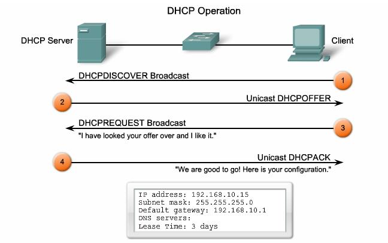

<h1 style="color:orange">DHCP</h1>
<h2 style="color:orange">1. DHCP là gì?</h2>
DHCP (Dynamic Host Configuration Protocol) có nghĩa là Giao thức cấu hình máy chủ.
<h2 style="color:orange">2. DHCP hoạt động như thế nào?</h2>
Được giải thích một cách ngắn gọn nhất về cách thức hoạt động của DHCP chính là khi một thiết bị yêu cầu địa chỉ IP từ một router thì ngay sau đó router sẽ gán một địa chỉ IP khả dụng cho phép thiết bị đó có thể giao tiếp trên mạng.

Như ở các hộ gia đình hay các doanh nghiệp nhỏ thì router sẽ hoạt động như một máy chủ DHCP nhưng ở các mạng lớn hơn thì DHCP như một máy chỉ ở vai trò là máy tính.

Cách thức hoạt động của DHCP còn được giải thích ở một cách khác thì khi một thiết bị muốn kết nối với mạng thì nó sẽ gửi một yêu cầu tới máy chủ, yêu cầu này gọi là DHCP DISCOVER. Sau khi yêu cầu này đến máy chủ DHCP thì ngay tại đó máy chủ sẽ tìm một địa chỉ IP có thể sử dụng trên thiết bị đó tồi cung cấp cho thiết bị địa chỉ cùng với gói DHCPOFFER

Khi nhận được IP thì thiết bị tiếp tục phản hồi lại máy chủ DHCP gói mang tên DHCPREQUEST. Lúc này là lúc chấp nhận yêu cầu thì máy chủ sẽ gửi tin báo nhận (ACK) để xác định thiết bị đó đã có IP, đồng thời xác định rõ thời gian sử dụng IP vừa cấp đến khi có địa chỉ IP mới. 
 

<h2 style="color:orange">3. Cách thức hoạt động</h2>

 
- Khi máy tính/server client được khởi động và xác định cần xin cấp IP động từ DHCP Server. Thì client sẽ gửi gói tin `DHCPDISCOVER` dưới dạng broadcast trên lớp mạng thiết bị mà client đang kết nối tới. Mục đích của `DHCPDISCOVER` là tìm được DHCP Server cấp IP.
- Nếu có tồn tại DHCP Server, thì DHCP Server sẽ nhận được gói tin `DHCPDISCOVER` của client. Lúc này DHCP Server tiến hành rà soát Cơ Sở Dữ Liêu IP đã cấp cho các client khác, xem còn trống IP nào không. Nếu có sẽ tiến hành gởi thông tin địa chỉ IP đính kèm cùng các thông tin khác trong gói tin `Unicast DHCPOFFER` gửi trả về máy tính client.
- Máy tính client khi nhận được gói tin `DHCPOFFER` phản hồi từ DHCP Server sẽ tiến hành đánh giá thông tin IP động được cấp phát. Sau đó sẽ gửi trả lời DHCP Server bằng gói tin `DHCPREQUEST` với nội dung gói tin là thông tin địa chỉ IP trong gói tin `DHCPOFFER` trước đó. `DHCPREQUEST` chính là yêu cầu DHCP Server hãy cấp IP mà bạn đã đề nghị cho tôi đi.
- DHCP server đồng ý cấp IP cho client thông qua gói `Unicast DHCPACK`.