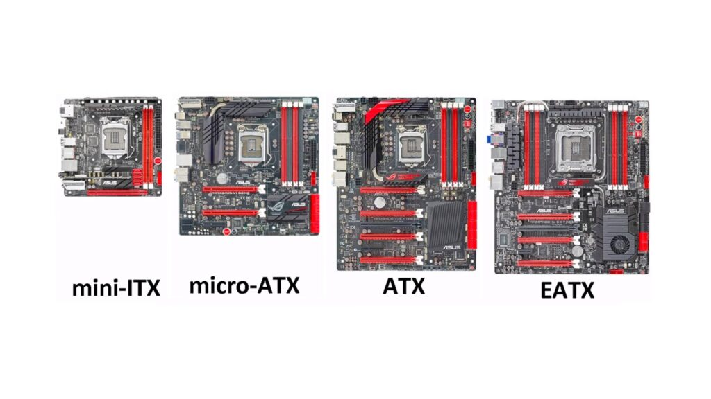
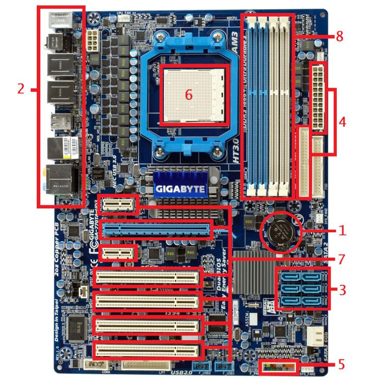
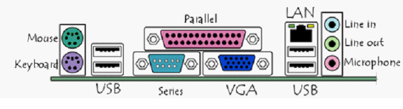

# `Mainboard`
Mainboard là một bảng mạch là nền tảng của toàn bộ máy tính, thường thì bảng mạch này sẽ nằm giữa case pc của bạn. Mainboard có nhiệm vụ là phân phối và cung cấp điện cho toàn bộ các thành phần trên máy. Và bảng mạch mainboard cũng là nơi liên kết các thành phần khác lại với nhau.

Mainboard còn có tên gọi khác là motherboard, main, System Board, mên máy tính, bo mạch chủ. Mainboard được coi là xương sống của máy tính.
## `Kích thước mainboard`

- Cỡ ATX được Intel giới thiệu vào năm 1995, đây là cỡ mainboard tiêu chuẩn và lớn nhất trong 3 cỡ mainboard phổ thông. Nó có kích thước chính xác là 12 x 9,6 inch (30,5 x 24,4 cm). Chuẩn ATX có 6 khe PCIe.
- Cỡ EATX có 7 khe PCIe thường dùng cho server và những máy cao cấp (không thông dụng) không có chuẩn kích thước. Tất cả mainboard lớn hơn ATX đều là Extended-ATX.
- Chuẩn MicroATX ra đời năm 1997, kích thước 9.6 × 9.6 inch (24,4 × 24,4 cm) , có tối đa 4 khe PCIe.
-   Chuẩn Mini-ITX ra đời năm 2001, có kích thước chỉ 6,7 x 6,7 inch(17 x 17 cm) chỉ có 2 khe RAM và một khe cắm card đồ họa duy nhất.
## `Cấu tạo mainboard`
Tất cả những gì kết nối đến máy tính đều được gắn vào mainboard.

1. `Bios và Cmos`: Là hệ thống output và input cơ bản. Là nơi chứa tất cả các thông tin và cài đặt. Nó có thể truy cập, cập nhật và sửa đổi.
2. `Các cổng Input/output`: Gọi tắt là I/O, những cổng này nằm ở trên mainboard phía sau máy tính. Các cổng này thường đều có mã màu được quy định.
     + Microphone: Jack cắm 3.5mm màu hồng
     + Speaker và tai nghe: Jack cắm 3.5mm màu xanh lá đậm
     + Màn hình: Những mainboard cũ thì thường có cổng VGA màu xanh da trời phía sau, nhưng hiện những bo mạch mới thì cổng HDMI đen hoặc trắng.
     + Cổng mạng Ethernet: Không màu
     + Bàn phím và chuột – PS/2 port (bàn phím có lỗ màu tím, còn chuột màu xanh)
     + Cổng USB – USB 2.0 không màu, USB 3.0 có màu xanh da trời

3.  `Đầu nối IDE và Sata` (Đầu nối các thiết bị lưu trữ): Nơi có các đầu nối để gắn với các ổ cứng (disk), SSD với HDD gì cũng nối chỗ này cả.
4. `Nối nguồn`: Đầu ATX (Advanced Technology extended) là đầu lớn nhất trong mainboard để cấp điện cho toàn bộ máy tính.
5. `Cabinet Connections`: Đây là nơi để kết nối nút bật nguồn, đèn LED nút nguồn, đèn nút reset… Những cổng USB và công audio phía trước cũng kết nối ở đây.
6. `CPU Socket`: Socket là nơi để gắn CPU, đây là nơi truyền dữ liệu xảy ra. Bạn cần phải chú ý đến sự tương thích của mainboard (socket) và CPU
7. `Những khe cắm mở rộng`: Đây là nơi mà bạn sẽ gắn thêm card đồ họa để chơi game và một số loại khác như 
– Card mạng 
– Card modem 
– Card âm thanh
8. `Khe cắm ram`: Cũng là một thành phần quan trọng trên mainboard, khi chọn mua mainboard thì bạn cần phải biết máy tính mainboard của mình gắn DDR3 hay DDR4. DDR3 (Double Data Rate 3th Generation) hiện còn sử dụng trong nhiều loại main, mặc dù vẫn khá ngon nhưng DDR4 đang dần phổ biến và trở thành tiêu chuẩn (Double Data Rate 4th Generation). Sau khi chọn mua mainboard thì bạn cần phải mua ram có khe cắm phù hợp.

## `Chipset`
Chipset là thành phần có trên bo mạch chủ, bạn không mua rời như CPU. Cái tên chipset nghĩa là một "bộ" những con chip. Về cơ bản nó đóng vai trò là trung tâm giao tiếp của bo mạch chủ, là vi điều khiển mọi hoạt động truyền tải dữ liệu giữa các phần cứng và là thành phần xác định tính tương thích giữa các phần cứng với bo mạch chủ.

Chipset đi liền với mainboard và khi mua mainboard cũng là mua chipset.
## `Bus`
Những thành phần phần cứng và thiết bị ngoại vi kết nối với bo mạch chủ thông qua các bus. Mọi bo mạch chủ đều hỗ trợ nhiều loại bus khác nhau và mỗi loại bus có tốc độ, băng thông khác nhau.