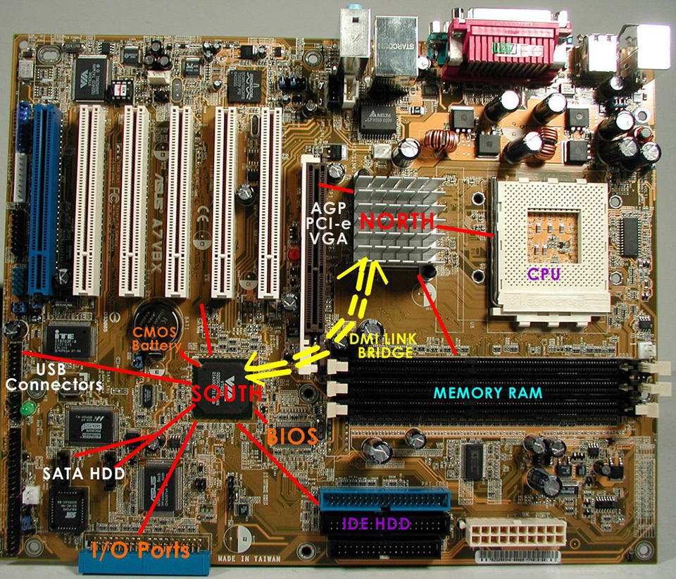

# `Chipset`
Chipset là thành phần có trên bo mạch chủ, bạn không mua rời như CPU. Cái tên chipset nghĩa là một "bộ" những con chip. Về cơ bản nó đóng vai trò là trung tâm giao tiếp của bo mạch chủ, là vi điều khiển mọi hoạt động truyền tải dữ liệu giữa các phần cứng và là thành phần xác định tính tương thích giữa các phần cứng với bo mạch chủ. Những phần cứng này bao gồm CPU, RAM, card đồ họa (GPU) và ổ cứng. Nó cũng cho biết về khả năng nâng cấp, mở rộng hệ thống, thứ gì nâng cấp được hay hệ thống có thể ép xung được hay không.

Thử tưởng tượng trên một cái bo mạch chủ có kích thước không lớn nhưng có hàng tá những con IC như vậy gắn chi chít thì rõ ràng việc sản xuất cũng như hoạt động của bo mạch chủ sẽ không được hiệu quả. Chính vì vậy, các kỹ sư máy tính cần tìm ra một hệ thống tốt hơn và họ bắt đầu tích hợp những con chip đơn lẻ vào nhau, giảm đáng kể số lượng chip điều khiển trên bo mạch chủ.

Chipset cổ điển bao gồm chip cầu Bắc (Northbridge) và chip cầu Nam (Southbridge)
- Northbridge (cầu bắc) sở dĩ có tên gọi này bởi nó nằm gần ở đầu trên, phía bắc của bo mạch chủ. Con chíp này kết nối trực tiếp với CPU và đóng vai trò giao tiếp trung gian đối với các phần cứng tốc độ cao hơn trong hệ thống, nó bao gồm vi điều khiển bộ nhớ RAM, vi điều khiển giao tiếp PCI Express và trên một số thiết kế bo mạch kiểu cũ còn có vi điều khiển AGP (Accelerated Graphics Port). Nếu những phần cứng này muốn nói chuyện với CPU, chúng buộc phải "chuyển lời" qua chip cầu bắc.
- Southbridge (cầu nam) ngược lại nằm ở đầu kia hay phía nam của bo mạch chủ và nó chịu trách nhiệm kiểm soát hoạt động của các phần cứng chậm hơn như các khe PCI mở rộng, kết nối SATA và IDE dành cho ổ cứng, các cổng USB, cổng âm thanh tích hợp, mạng … Và để các phần cứng này giao tiếp với CPU thì trước tiên chúng phải đi qua cầu nam, nhưng sau đó sẽ đến cầu bắc rồi mới đến CPU.
## `Thiết kế kiểu mới`
Trên thực tế việc dữ liệu phải đi qua Southbridge -> Northbridge -> CPU mất thời gian 
Hiện tại CPU làm luôn nhiệm vụ của chip cầu Bắc và có 1 con chip còn lại làm nhiệm vụ chip cầu Nam.
- Intel tích hợp một con chip gọi là Platform Controller Hub hay PCH, nó có vai trò tương tự như chip cầu nam.
- Chipset của AMD cũng không khác mấy, cầu nam giờ đây được gọi là Fusion Controller Hub hay FCH. 
-> Độ trễ được giảm đi đáng kể

## `Chipset quyết định các tùy chọn mở rộng`
Chipset quyết định 3 thứ: sự tương thích của các phần cứng (chẳng hạn như CPU hay RAM mà bạn có thể gắn trên bo mạch chủ), các tùy chọn mở rộng (bạn có thể gắn bao nhiêu thiết bi qua cổng PCI) và khả năng ép xung (OC).