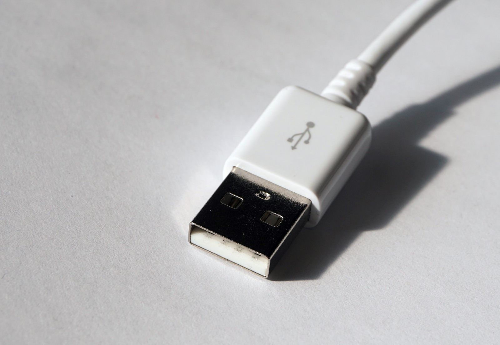
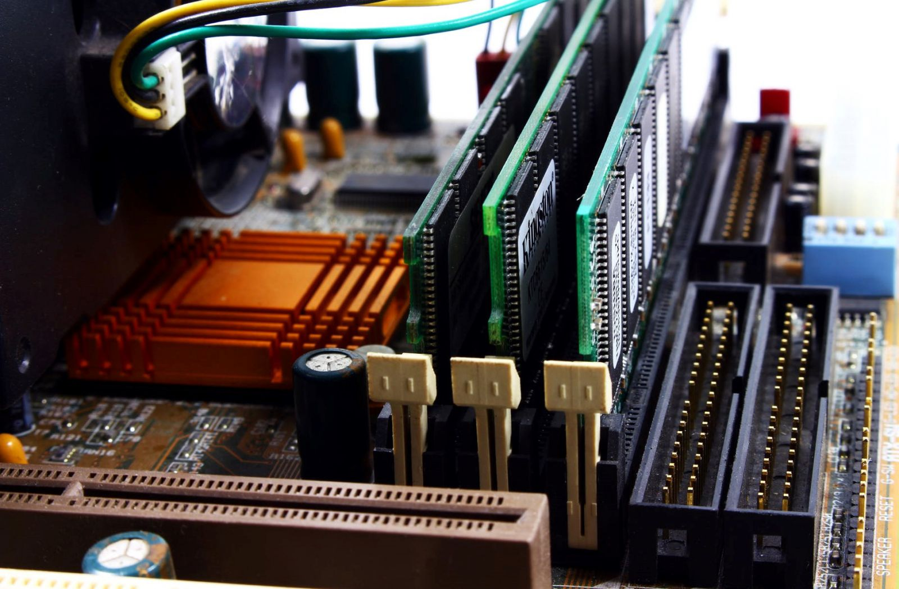
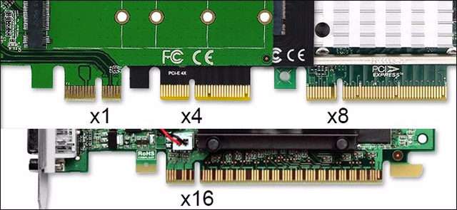

## `PCI`
Khe Cắm PCI có chức năng rất quan trọng, nó là chuẩn kết nối các thiết bị phần cứng như RAM, Card đồ họa, hay các card mạng và các thiết bị ngoại vi với Mainboard để làm việc trực tiếp với CPU hay làm việc qua chipset.

PCI là gì?
PCI là chuẩn kết nối giữa các thiết bị ngoại vi cần xử lý với tốc độ bình thường như chuột, bàn phím, loa, usb.

Nó là những khe cắm có dạng chân cắm có hình dạng và kích thước giống chân cắm của USB, kết nối giữa các thiết bị ngoại vi với Chip cầu nam (Chipset) trung gian để làm việc với CPU.

## `PCIe (Peripheral Component Interconnect-Express)`
PCI express là gì? Để ý một chút thì cái gì có chữ Express có nghĩa là nhanh, tốc độ cao. Cũng vậy PCI express là chuẩn khe cắm tốc độ cao kết nối các phần cứng cần sử dụng tốc độ cao như RAM, Card đồ họa với Chip cầu Bắc sau đó kết nối với CPU, nhưng này nay các Mainboard đã được cải tiến nên các Phần cứng làm việc tới tốc độ cao được kết nối trực tiếp với CPU. Giúp tăng tốc độ xử lý của máy tính lên rất nhiều.

Khe PCI express được đánh giá qua tiêu chí tốc độ truyền dữ liệu, được đánh giá qua các luồng, thường có các định dạng như sau PCI x 1, PCI x 4, PCI x 8, PCI x 16. Ngoài ra còn có PCI x 32 nhưng chuẩn này rất ít, chỉ xuất hiện ở các máy tính đặc biệt.

Vậy PCI x 1, PCI x 4, PCI x 8, PCI x 16 có gì khác nhau? Tốc độ và độ dài ở các khe cắm này thường tỷ lệ với nhau. Chuẩn PCI e truyền dữ liệu theo các luồng riêng biệt mỗi luồng truyền dữ liệu với tốc độ 250MB/s.

theo vậy khe

 PCI x 1 sẽ truyền dữ liệu với tốc độ 500Mb/s,

 PCI x 4 truyền với tốc độ 2GB/s,

PCI  x 8 truyền tốc độ với 4GB/s.

PCI x 16 truyền với tốc độ 8GB/s.

Dễ nhận thấy là các PCI x với chỉ số lớn hơn thì nhiều chân cắm hơn, vì chúng được cấu tạo từ các lane, càng nhiều lane thì chúng càng xử lý với tốc độ cao.

Các khe cắm, PCI x 8, PCI x16 thương để kết nối với RAM, kết nối với Card đồ họa,

Các kết nối PCI nhỏ hơn thường kết nối với card mạng wifi, hoặc cổng USB 3.0.