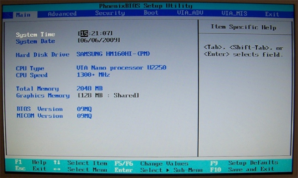
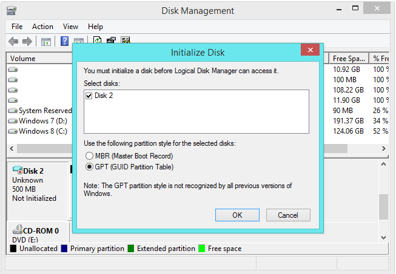

# BIOS
`BIOS (Basic Input/Output System)` tức hệ thống đầu vào và đầu ra cơ bản. Bios là một IC được gắn cố định trên Mainboard (thường gắn nhưng không hàn), và thường giao tiếp trực tiếp với Sourth Bridge chứa dữ liệu và cấu hình của mainboard đó. 
Nói một cách đơn giản thì Bios sẽ kiểm soát và thiết lập cho các thành phần trên máy tính như thứ tự boost ổ cứng, ưu tiên hoạt động nào chạy trước, kết nối thiết bị chuột, bàn phím, tai nghe như thế nào …

## `Cách thức vận hành BIOS`

BIOS được chứa sẵn (thường ở dạng nén dữ liệu) trong các con chip như là PROM, EPROM hay bộ nhớ flash của bo mạch chính. Khi máy tính được mở qua công tắc bật điện hay khi được nhấn nút reset, thì BIOS được khởi động và chương trình này sẽ tiến hành các thử nghiệm khám nghiệm trên các ổ đĩa, bộ nhớ, các con chip có chức năng riêng khác và các phần cứng còn lại.

Sau thời gian ấy, BIOS sẽ chuyển nhiệm vụ kiểm soát lại cho hệ điều hành. Điều đó cũng có nghĩa là, mặc dù máy tính của bạn có hiện đại đến đâu, nếu như không có Bios cũng không thể khởi động được. -> Thành phần tối quan trọng trong mainboard.

## `CMOS`
Khi bạn thực hiện các thay đổi đối với cấu hình BIOS của mình, các cài đặt sẽ không được lưu trữ trên chip BIOS. Thay vào đó, chúng được lưu trữ trên một chip nhớ đặc biệt, được gọi là “CMOS”. CMOS là viết tắt của ” complementary metal-oxide semiconductor.” CMOS là một chip bán dẫn tích hợp, chạy bằng pin bên trong máy tính để lưu trữ thông tin. 

CMOS còn được gọi là Real-Time Clock (RTC), CMOS RAM, Non-Volatile RAM (NVRAM - RAM điện tĩnh), bộ nhớ Non-Volatile BIOS hoặc Complamentary-Symmetry Metal-Oxide-Semiconductor (COS-MOS - tạm dịch là Bán dẫn kim loại ô-xít bù đối xứng)

Thông tin này nằm trong phạm vi từ ngày giờ hệ thống đến cài đặt phần cứng hệ thống cho máy tính của bạn. Nó chứa một lượng nhỏ dữ liệu, thường là 256 byte . Thông tin trên chip CMOS bao gồm các loại ổ đĩa được cài đặt, ngày giờ hiện tại của đồng hồ hệ thống và trình tự khởi động máy tính của bạn.

Trên một số bo mạch chủ, CMOS là một chip riêng biệt. Tuy nhiên, trên hầu hết các mainboard hiện đại bây giờ, nó được tích hợp với RTC (real-time clock- đồng hồ thời gian thực) nằm ở chip cầu nam (southbridge).

Bộ nhớ BIOS của bạn không thay đổi-nó giữ lại thông tin của nó ngay cả khi máy tính của bạn không có nguồn. Bởi vậy đây cũng là lý do tại sao CMOS cần có nguồn điện chuyên dụng riêng, và đó chính là pin CMOS.

VD: khi tắt máy rút nguồn trên máy tính, để 1 khoảng thời gian, bật lại nguồn, thì thứ/ngày/tháng/giờ vẫn được cập nhật trên máy tính.

## `So sánh BIOS và CMOS`
Thông thường mọi người thường nghỉ BIOS và CMOS là 1, nhưng trong thực tế BIOS và CMOS là 2 khái niệm khác nhau.

## `UEFI`
Cũng là BIOS nhưng là một phiên bản tiên tiến hơn 

Khác với BIOS truyền thống vốn có giao diện khá thô sơ, gọi nhắc về thời kỳ mới ra dòng DOS, UEFI có giao diện người dùng đồ họa dễ dàng để xử lý hoặc sử dụng hoặc quản lý hơn nhiều. UEFI trợ giúp sử dụng chuột và cũng có thể trợ giúp các nhân tố đồ họa như giản đồ hoặc biểu tượng nhiều màu sắc, khắc với BIOS truyền thống vốn chỉ có không tới 10 màu và gần như chỉ sử dụng các chữ cái, chữ số và ký tự đặc biệt căn bản (#, %, <,=""> ...).

Bên cạnh những điều đó, UEFI cũng không bị giới hạn về bộ nhớ, số lượng phân vùng tối đa, dung lượng ổ cứng tối đa… như BIOS truyền thống.

<h1 style="color:orange">GPT và MBR</h1>
GPT là một chuẩn mới và chuẩn này đang dần thay thế chuẩn MBR. Chuẩn GPT có nhiều ưu điểm và lợi thế hơn chuẩn MBR. Tuy nhiên chuẩn MBR có tính tương thích cao và trong một số trường hợp thì chuẩn này cực kỳ quan trọng và cần thiết.
Khi thiết lập một ổ đĩa mới trên Windows 8.x hoặc Windows 10, bạn sẽ được hỏi muốn sử dụng chuẩn MBR hay chuẩn GPT.

 
Phải tiến hành chọn các chuẩn MBR (Master Boot Record) hoặc GPT (GUID Partition Table) trước khi phân vùng ổ đĩa vật lý thành các ổ logic.
<h2 style="color:orange">Hạn chế của MBR</h2>
MBR là viết tắt của Master Boot Record. Chuẩn MBR được giới thiệu cùng IBM PC DOS 2.0 vào năm 1983.

Sở dĩ nó được gọi là Master Boot Record vì MBR là một khu vực khởi động đặc biệt nằm ở đầu một ổ đĩa. Khu vực này có một Boot loader được cài đặt trên hệ điều hành và các thông tin về phân vùng Logical của ổ đĩa.

MBR làm việc với các ổ đĩa có kích thước lên đến 2 TB, nhưng nó không thể xử lý ổ đĩa có dung lượng lớn hơn 2 TB.

Ngoài ra MBR chỉ hỗ trợ 4 phân vùng chính. Nếu muốn nhiều phân vùng hơn, bạn phải thực hiện chuyển đổi 1 trong những phân vùng chính thành "extended partition" (phân vùng mở rộng) và tạo phân vùng Logical bên trong phân vùng đó.
<h2 style="color:orange">Lợi thế GPT</h2>
GPT là viết tắt của GUID Partition Table. Đây là một chuẩn mới, đang dần thay thế chuẩn MBR.

GPT liên quan với UEFI - UEFI thay thế cho BIOS, UEFI có giao diện và tính năng hiện đại hơn , và GPT cũng thay thế các hệ thống phân vùng MBR xa xưa bằng các tính năng, giao diện hiện đại hơn.

Lí do được gọi là GUID Partition Table bởi lẽ mỗi phân vùng trên ổ đĩa của bạn có một "globally unique identifier," hay viết tắt là GUID.

Hệ thống này không giới hạn của MBR. Ổ đĩa có thể nhiều hơn, lớn hơn nhiều và kích thước giới hạn sẽ phụ thuộc vào hệ điều hành và hệ thống tập tin của nó.

GPT cho phép một số lượng không giới hạn các phân vùng, và giới hạn này sẽ là hệ điều hành của bạn - Windows cho phép lên đến 128 phân vùng trên một ổ đĩa GPT, và bạn không cần phải tạo Extended partition (phân vùng mở rộng).

Trên ổ đĩa MBR, dữ liệu phân vùng và dữ liệu khởi động được lưu trữ ở một vị trí. Nếu dữ liệu này bị ghi đè hoặc bị hỏng, khi đó bạn sẽ gặp phải các rắc rối. Ngược lại, GPT lưu trữ nhiều bản sao của các dữ liệu này trên đĩa, do đó bạn có thể khôi phục các dữ liệu nếu các dữ liệu này bị lỗi.

GPT cũng lưu trữ các giá trị Cyclic Redundancy Check (CRC) để kiểm tra xem các dữ liệu này còn nguyên vẹn hay không. Nếu dữ liệu này bị lỗi, GPT sẽ phát hiện được vấn đề và cố gắng khôi phục các dữ liệu bị hư hỏng từ một vị trí khác trên ổ đĩa.

MBR không có cách nào để biết được dữ liệu của nó đã bị lỗi. Bạn chỉ có thể nhận biết được các sự cố khi quá trình khởi động không thành công hoặc phân vùng ổ đĩa của bạn biến mất.
<h2 style="color:orange">So sánh GPT và MBR</h2>
Ổ đĩa MBR hay GPT đều có thể là loại ổ cơ bản hoặc ổ động. So với ổ đĩa MBR, ổ đĩa GPT hoạt động tốt hơn ở các khía cạnh sau:

- GPT hỗ trợ các ổ đĩa có dung lượng lớn hơn 2TB trong khi MBR thì không.

- Kiểu phân vùng ổ đĩa GPT hỗ trợ các volume có dung lượng lên đến 18 exabyte và tới 128 phân vùng trên mỗi ổ đĩa, trong khi kiểu phân vùng ổ đĩa MBR chỉ hỗ trợ các volume có dung lượng lên đến 2 terabyte và tối đa 4 phân vùng chính trên mỗi ổ đĩa (hoặc 3 phân vùng chính, một phân vùng mở rộng và ổ đĩa logic không giới hạn).

- Ổ đĩa GPT cung cấp độ tin cậy cao hơn, nhờ khả năng bảo vệ sao chép và kiểm tra dự phòng theo chu kỳ (CRC) của bảng phân vùng. Không giống như các ổ đĩa được phân vùng MBR, dữ liệu quan trọng đối với hoạt động của nền tảng được đặt trong những phân vùng thay vì các sector không được phân vùng hoặc ẩn.

- Ổ đĩa được phân vùng GPT có các bảng phân vùng chính và dự phòng để cải thiện tính toàn vẹn của cấu trúc dữ liệu phân vùng.

Thông thường, MBR và BIOS (MBR + BIOS), GPT và UEFI (GPT + UEFI) đi đôi với nhau. Điều này là bắt buộc đối với một số hệ điều hành (ví dụ: Windows), nhưng lại là tùy chọn đối với những hệ điều hành khác (ví dụ: Linux). Khi chuyển đổi ổ đĩa hệ thống sang ổ GPT, hãy đảm bảo rằng bo mạch chủ của máy tính hỗ trợ chế độ khởi động UEFI.
<h2 style="color:orange">Khả năng tương thích</h2>
Ví dụ khi cài OS, nếu ổ đĩa sử dụng chuẩn GPT mà cài OS bằng BIOS thì hệ thống sẽ ko nhìn được ổ đĩa chuẩn GPT.

Tuy vậy, UEFI hỗ trợ cả 2 chuẩn MBR và GPT.