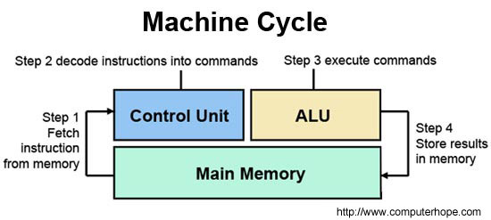
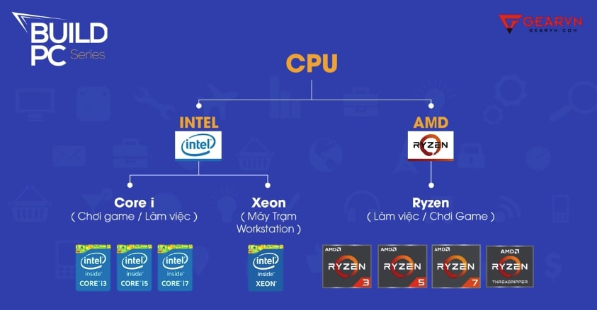
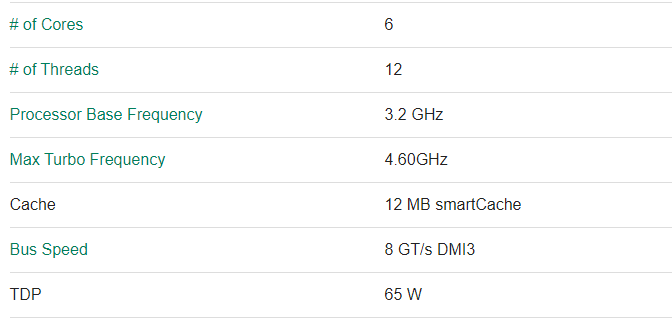

# CPU (Central Processing Unit)
Là bộ vi xử lý trung tâm của máy tính. CPU xử lý tất cả các lệnh mà nó nhận được từ phần cứng và phần mềm chạy trên máy tính.
Để kiểm soát các lệnh và xử lý các luồng dữ liệu đến các bộ phận khác của máy tính thì CPU phụ thuộc rất nhiều vào các chipset, đó là một nhóm các vi mạnh nằm và dính liền với motherboard. Nếu ví CPU như bộ não thì chipset là tủy sống.
## `Cấu tạo`
CPU bao gồm 2 thành phần:

- Khối điều khiển (Control Unit): Nơi trích xuất các lệnh từ bộ nhớ và giải mã, rồi thực hiện những lệnh đó.
- Khối tính toán (bộ số học và logic - arithmetic logic unit): Xử lý các phép toán số học và Logic

2 dòng sản phẩm cung cấp CPU phổ biến hiện nay là intel và AMD

Người ta thường sử dụng dòng của intel vì tính ổn định và độ tương thích cao với các thành phần khác. Tuy vậy hiện nay AMD cũng đã rất tiến bộ và tương thích với nhiều thành phần.

Việc mua AMD sẽ tiết kiệm hơn nhiều và hiệu quả tương đương.
## `Cách CPU hoạt động`
- `Tìm nạp`: Cũng giống như bạn mong đợi, quá trình tìm nạp liên quan đến việc nhận được một lệnh. Lệnh được biểu diễn dưới dạng một chuỗi các số và được chuyển tới CPU từ RAM. Mỗi lệnh chỉ là một phần nhỏ của bất kỳ thao tác nào, vì vậy CPU cần phải biết lệnh nào sẽ đến tiếp theo. Địa chỉ lệnh hiện tại được giữ bởi một `Program Counter` - bộ đếm chương trình (PC). PC và các lệnh sau đó được đặt vào một `Instruction Register` - thanh ghi lệnh (IR). Độ dài của PC sau đó được tăng lên để tham chiếu đến địa chỉ của lệnh tiếp theo.
- `Giải mã` - Khi một lệnh được tìm nạp và được lưu trữ trong IR, CPU sẽ truyền lệnh tới một mạch được gọi là bộ giải mã lệnh. Điều này chuyển đổi lệnh thành các tín hiệu được chuyển qua các phần khác của CPU để thực hiện hành động.
- `Thực thi`: Trong bước cuối cùng, các lệnh được giải mã, gửi đến các bộ phận liên quan của CPU để được thực hiện. Các kết quả thường được ghi vào một CPU register, nơi chúng có thể được tham chiếu bằng các lệnh sau đó. Hãy tưởng tượng nó giống như chức năng của bộ nhớ trên máy tính.
## `Thông số CPU`

- `Core`:
Mỗi nhân đóng vai trò như 1 CPU con được tích hợp trong 1 CPU, giúp hoàn thành đa tác vụ -> tốc độ xử lý tăng.
- `Số luồng (threads)`:
Thì số luồng giống như con đường để đưa dữ liệu đi vậy. Vậy nên một máy tính có nhiều luồng thì dữ liệu đi trong 1 lúc được nhiều hơn -> tốc độ cải thiện
- `Xung cơ bản (Processor base frequency)`: là số phép tính mà bộ vi xử lý trung tâm xử lý được trong 1 giây. Như bảng trên thì xung cơ bản là 3.2 GHz tức là trong 1 giây thì máy tính xử lý được 3.200.000 phép tính.
- `Xung tăng cường (Max turbo Frequency)`: Là tần số tối đa mà CPU xử lý được bằng công nghệ Turbo boost intel®(ép xung). Và tất nhiên là xung càng cao thì tốc độ càng mạnh, máy tính càng nhanh rồi.
- `Cache`: Là bộ nhớ đệm của CPU và Ram (được tích hợp sẵn trên CPU), Cache càng lớn thì lưu trữ được dữ liệu càng nhiều, giảm bớt thời gian thu nhận dữ liệu. Giống như bạn chép một bài trong sách nhưng nếu nhớ trong đầu đoạn càng dài thì bạn chép càng nhanh.
- `Bus Speed`: Được hiểu là con đường truyền và nhận dữ liệu của CPU đến Ram, mainboard và các thành phần khác của máy tính. Nếu số luồng là số con đường truyền dữ liệu thì Bus Speed giống như kích thước của con đường. Bus càng lớn chứng tỏ con đường càng thông thoáng, rộng rãi, giúp dữ liệu truyền đi nhiều hơn.
- `TDP`: lượng điện tiêu thụ của 1 CPU, điện năng tiêu thụ càng cao thì thường thể hiện khả năng xử lý CỦA CPU càng mạng (tuy vậy chỉ là con số tương đối, không liên quan lắm) và cần nhiều khả năng tản nhiệt hơn.
## `Hậu tố CPU`
Mỗi dòng CPU của từng hãng sẽ có hậu tó khác nhau. VD các hậu tố của CPU dòng intel:

VD: i7-5500U @ 2,4 Ghz

5500 là thế hệ máy (thế hệ 5) 
U là hậu tố.

## `CPU socket`
- là nơi để gắn CPU trên mainboard, khi mua CPU thì phải để ý xem có gắn được trên CPU socket của mainboard không. 
Nhưng vì CPU đắt hơn nên người ta thường mua CPU trước rồi mới tìm mainboard tương ứng.

`Ngưỡng nhiệt độ an toàn của CPU là dưới 60 độ C`