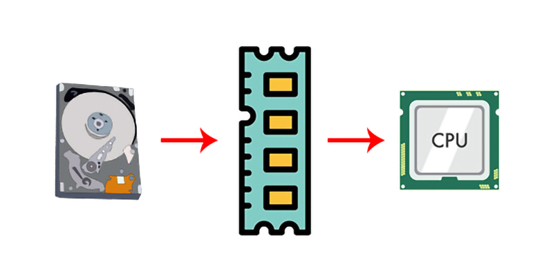
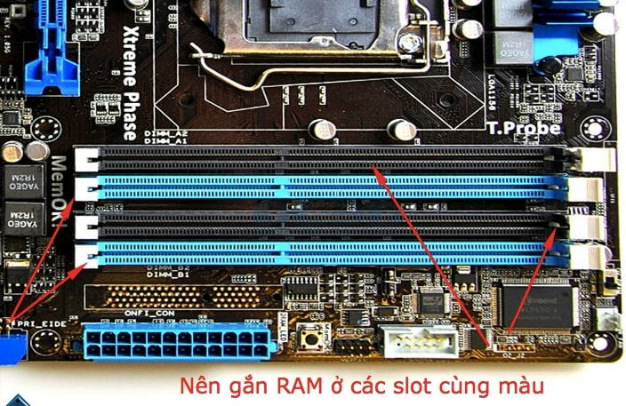
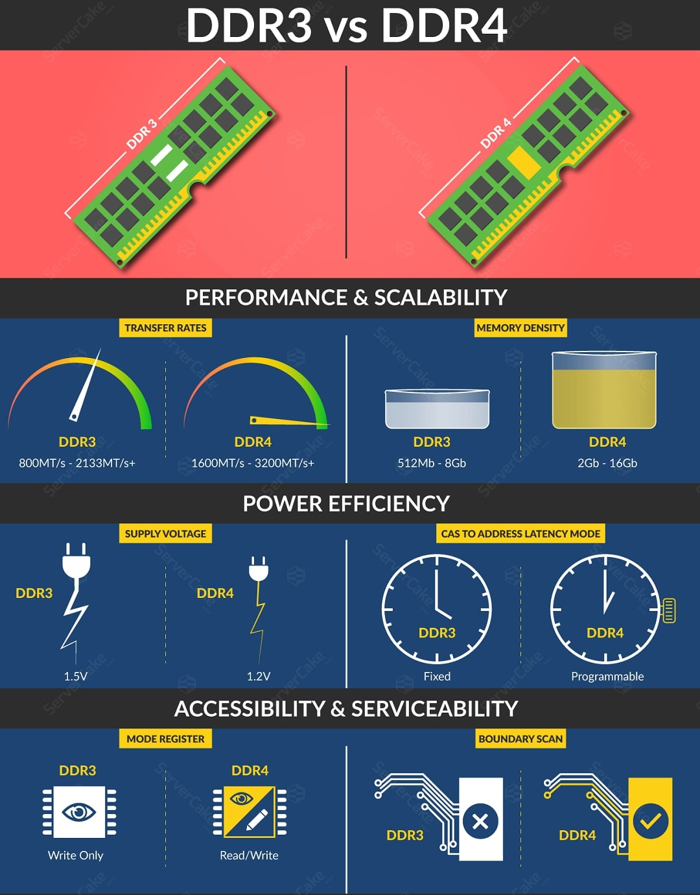
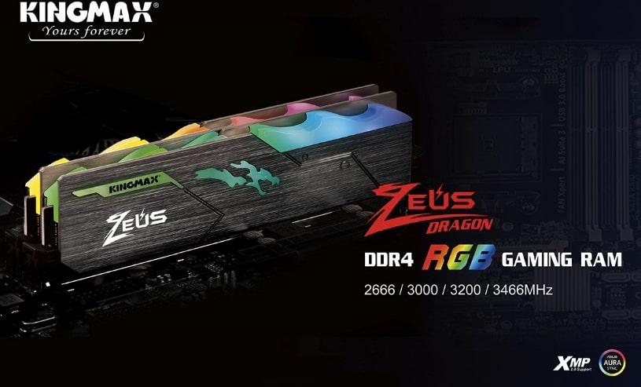
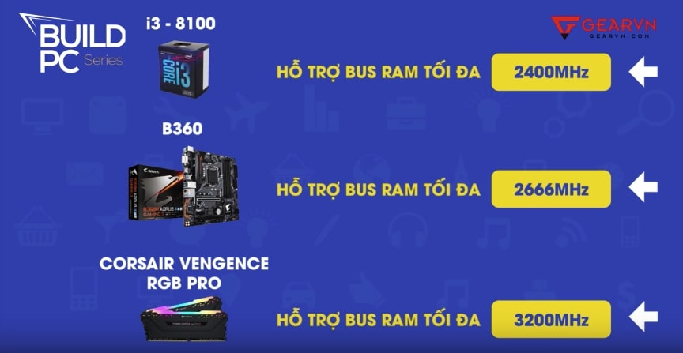

# RAM (Random accressory memory)
`Ram` là bộ nhớ truy xuất ngẫu nhiên. Nói đơn giản thì Ram là bộ nhớ tạm thời của máy tính lưu trữ thông tin hiện hành để CPU có thể truy xuất và xử lý. Ram sẽ nhớ những hoạt động từ khi bật máy cho đến khi tắt máy thôi.
-> Vậy nên mới có trường hợp máy chậm thì khởi động lại (để ram quên đi hết) để máy tính chạy nhanh hơn.

## `RAM khác ROM`
ROM (Read Only Memory) - Bộ nhớ chỉ đọc - là loại bộ nhớ trong đó dữ liệu đã được ghi vào từ trước và chứa các chương trình giúp máy tính "khởi động". Khác với RAM sẽ xóa sạch mọi dữ liệu lưu trữ tạm thời, ROM giữ lại nội dung ngay cả sau khi máy đã tắt; đó chính là lý do máy tính có thể được bật lên ở lần đầu tiên sử dụng. Nếu không có ROM, việc khởi động được hệ thống sẽ là một điều xa xỉ.

Một ví dụ điển hình của ROM trong máy tính chính là BIOS.

## `Cơ chế hoạt động`
Khi chúng ta mở một ứng dụng trên PC, dữ liệu của phần mềm sẽ được truyền từ ổ cứng và lưu trữ tại RAM, lúc này CPU sẽ truy xuất và lấy dữ liệu từ RAM để hiển thị vào đáp ứng lại thao tác của người dùng.

- Tại sao không truyền thẳng từ disk đến CPU? Đơn giản là vì tốc độ của Ram đến CPU là nhanh nhất, rất nhanh so với ổ cứng đến với CPU.

RAM được chia làm 2 loại, SRAM và DRAM. SRAM hay còn gọi là RAM tĩnh (Static RAM) loại RAM này không bị mất nội dung sau khi nạp trừ khi khởi động máy tính, nó được ứng dụng vào lưu trữ dữ liệu khởi động. Khác với SRAM, DRAM được sử dụng để lưu trữ dữ liệu tạm thời khi chạy ứng dụng và có thể bị trả lại vùng nhớ khi đóng ứng dụng hoặc shutdown hoặc turn off điện thoại hoặc máy tính.
## `Dung lượng RAM`
- RAM có kích cỡ từ 2,4,8,16,32,64 gb thường với những PC cá nhân thì RAM tổng 8gb (2 thanh 4gb) là tiêu chuẩn. Tuy vậy, RAM càng nhiều càng tốt.

Nếu máy tính bạn đã có 1 thanh ram thì có thể nâng cấp bằng cách gắn thêm 1 thanh ram nữa (Nên chọn 2 thanh ram giống nhau)

Cách gắn Ram thì thường bạn gắn ở những slot cùng màu sẽ kích hoạt được chế độ Dual Channel (main máy tính phải có hỗ trợ) để tối đa dung lượng của ram.
## `Bus RAM`
bus RAM là tốc độ từ RAM đến CPU, đơn vị MHz, bus RAM càng nhanh -> tốc độ càng nhanh. 

## `Chuẩn RAM DDR3 và DDR4`
- Trong khi RAM DDR truyền hai khối dữ liệu trong một chu kỳ xung nhịp, thì DDR2 có thể truyền được 4 khối dữ liệu trong cùng thời gian, và DDR3 còn mạnh hơn: 8 khối dữ liệu trong một chu kỳ xung nhịp: DDR3 đạt mức 800 – 2133 MT/s

- DDR4 là bản nâng cấp đáng giá từ DDR3 và hiện nay đang được sử dụng khá phổ biến, có thể được coi là chuẩn RAM cần có trên mọi chiếc PC hay laptop ‘gaming'.

DDR4 sử dụng nguồn điện thấp hơn so với DDR3, chỉ khoảng 1.2V. Tuy nhiên tốc độ truyền dữ liệu của nó ở mức đáng kinh ngạc, từ 1600 – 3200 MT/s.

Tốc độ truyền tải RAM DDR (double-rate) 3200MT/s = 3200 MHZ/s
=> <b>`Băng thông = tỉ lệ truyền tải x độ rộng bus 64 bit/8 bit` = 3200 x 64/8= 25600 MB/s</b>

## `Cách đọc chỉ số trên RAM`
Ví dụ: có một thanh ram tên là DDR4 Kingmax 16GB-3000

- Chuẩn Ram: DDR4
- Hãng: Kingmax
- Dung lượng ram: 16GB
- Bus Ram: 3000MHz
### `Tản nhiệt RAM`
Hiện tại trên thị trường có RAM tản nhiệt để tăng tuổi thọ RAM.
## `Cách chọn RAM phù hợp`

- Nếu có CPU có BUS là 2400 MHz, Main hỗ trợ 2666MHz, Và Ram có Bus 3200MHz thì máy tính bạn chỉ hoạt động tối đa là 2400MHz (thấp nhất). Vậy nên bạn nên chọn Ram có BUS phù hợp với CPU và main để tiết kiệm chi phí.

## `Note`
1. Mainboard chỉ hỗ trợ DDR3 vậy có gắn được DDR4 không?

– Không nhé! Mainboard hỗ trợ DDR3 thì không gắn được DDR4. Nó không tương thích, và sẽ không gắn được.

2. 2 thanh ram cùng dung lượng nhưng khác Bus có hỗ trợ Duel Channel không?

– Có! Vẫn hỗ trợ Duel channel nhưng nó chỉ lấy Bus của thanh ram thấp hơn làm tiêu chuẩn.

3. 2 thanh ram khác dung lượng có hỗ trợ dual channel không?

– Cái này thì tùy thuộc vào main. Một số main đời mới có hỗ trợ việc này, nó sẽ lấy dung lượng của thanh ram thấp hơn để chạy Dual channel. Và lấy dung lượng của thanh ram còn lại chạy Singal channel. Vậy nên dù sao thì bạn cũng nên sử dụng 2 thanh ram giống nhau