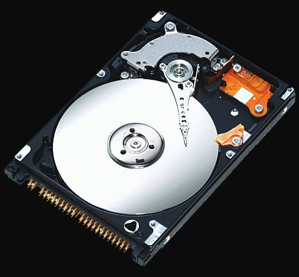
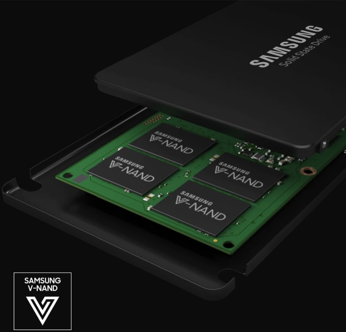
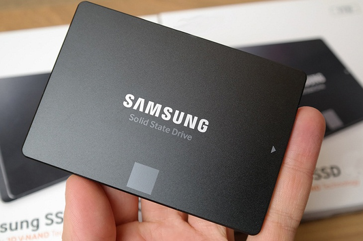
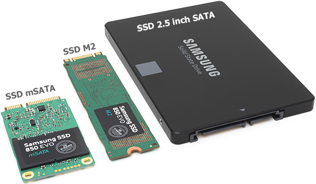
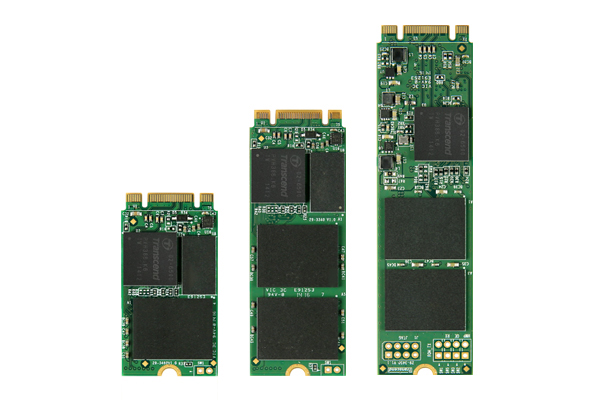
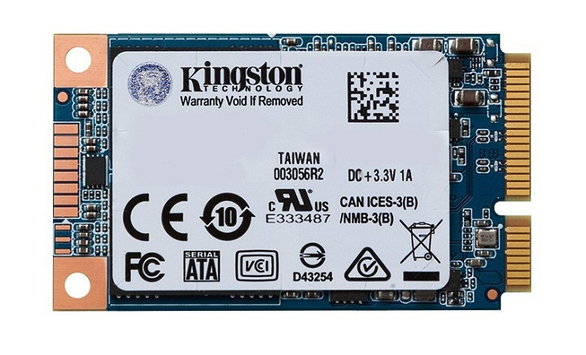
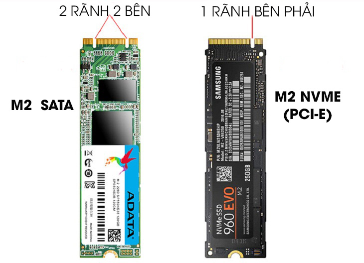
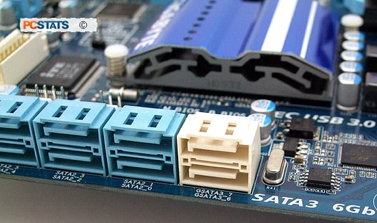

# DISK
Ổ đĩa cứng (đôi khi được viết tắt là ổ cứng, HD hoặc HDD) là loại bộ nhớ "không thay đổi" (non-volatile), có nghĩa là dữ liệu trong ổ cứng sẽ không biến mất khi nguồn điện ngừng cung cấp. Ổ cứng là thiết bị lưu trữ thứ cấp mà trong đó, dữ liệu được ghi bằng đầu từ.

Ổ cứng có tác dụng:
1. Lưu trữ hệ điều hành
2. Lưu trữ tất cả dữ liệu máy tính

# `HDD (Hard disk drive)`

Mỗi cái đĩa ổ cứng thì được tổ chức bên trong vòng tròn đồng tâm -> được gọi là các Track. Track thi thì chia ra thành những đơn vị hợp lý gọi là những sector. Mỗi Track và mỗi số sector thì có một địa chỉ độc nhất và nó dùng để sắp xếp và lưu trữ dữ liệu.

Tốc độ vòng quay của HDD thì thường có tốc độ từ 5400 rpm đến 7200 rpm. Tốc độ càng cao thì ổ cứng có tốc độ đọc càng nhanh.

Thời gian để đĩa quay và kim đọc ghi có thể tìm đúng track và sector được gọi là độ trễ (Latency). Ngoài ra HDD cũng có nhiều thế hệ để đánh giá khả năng xử lý như trước thì có Sata 1, cao hơn có Sata 2 (tốc độ đọc/ghi 200 MB/s), Sata 3 (tốc độ đọc/ghi 6 Gbp/s).
## `Kích thước HDD`
Hiện nay ổ cứng HDD có 2 loại kích thước phổ biến là `3.5 inch` cho máy bàn và `2.5 inch` cho máy tính xách tay
- Ổ 3.5 inch: 
     + 4 inch × 1 inch × 5.75 inch (101.6 mm × 25.4 mm × 146 mm) = 376.77344 cm³
     + Ổ cứng 3.5 inch nhanh nhất có thể đọc dữ liệu với tốc độ hơn 131 MB/giây. 
     + Giá thành thấp, một ổ cứng 2000GB có giá 200 USD.
     + 3.5 inch trung bình tạo ra 21 đến 23 decibel trong bán kính 1m.
- Ổ 2.5 inch:
     + 2.75 inch × 0.25 – 0.75 inch × 3.945 inch (69.85 mm x 7–19 mm x 100 mm) = 48.895– 132.715 cm³
     + Dùng cho laptop
     + Một ổ cứng 2.5 yên tĩnh nhất có thể tạo ra 19 đến 21 decibel ở khoảng cách 1 mét
     + Ổ cứng 2.5 inch không thể cạnh tranh với ổ cứng 3.5 inch về tốc độ hoặc giá cả, nó có tốc độ đọc dữ liệu tối đa là 101MB/giây và có giá 150 USD cho ổ cứng 750GB.

# `SSD (Solid State Drive)`
Là ổ cứng điện tử. Những cái SSD thì đơn giản bạn có thể coi như là những USB lớn, chúng được sử dụng bới công nghệ cơ bản gọi là NAND. Và dữ liệu của bạn sẽ được chứa vào bên trong này.

Có một SSD controller thực hiện nhiều chức năng và theo dõi dữ liệu được đặt ở đâu.
## `Các loại ổ SSD`
1. Ổ cứng SSD 2.5 inch SATA III được sử dụng khá phổ biến hiện nay với tốc độ đọc - ghi dữ liệu giới hạn ở mức 6Gbps tương đương 550MB/s. Với ưu điểm giá thành khá rẻ nên đang được trang bị trên hầu hết các dòng laptop phổ thông.

2. SSD mSATA:

3. SSD M.2 SATA: Tương tự như SSD 2.5 inch SATA III, SSD M.2 SATA vẫn sử dụng chuẩn giao tiếp dữ liệu SATA III nên tốc độ đọc - ghi dữ liệu ở giới hạn ở mức 6Gbps, tương đương 550MB/s.

Tuy nhiên, kích thước của SSD M.2 SATA III lại nhỏ gọn hơn so với SSD 2.5 inch SATA III, hình dáng chỉ tương tự như một thanh RAM máy tính thích hợp cho các dòng máy tính nhỏ gọn, nhẹ.

SSD M2 SATA không phải có 1 chuẩn duy nhất mà có đến 3 chuẩn là 2242, 2260 và 2280. Bề rộng vẫn giữ mặc định là 22 mm, tuy nhiên chiều dài thay đổi lần lượt là 42mm, 60mm, 80mm.

4. SSD M2 PCIe
Ổ cứng SSD M.2 PCIe sử dụng tiêu chuẩn giao tiếp PCL Express với tốc độ đọc ghi lên đến 32 Gb/s (tương đương 4 GB/s), tức cao hơn rất nhiều lần so với SSD M2 SATA chỉ 550 MB/s.

Điểm giống giữa SSD M.2 PCIe và SSD M2 SATA chỉ là khe cắm M2, vì thế SSD M.2 PCIe vẫn có đến 3 chuẩn là 2242, 2260 và 2280. Bề rộng vẫn giữ mặc định là 22 mm, tuy nhiên chiều dài thay đổi lần lượt là 42mm, 60mm, 80mm.

Kích thước phổ biến nhất của ổ cứng SSD M.2 PCIe là rộng 22 mm và dài 80 mm, các loại khác ít được sử dụng và sản xuất hơn.
## `SSD Phổ biến hiện nay`
### `Ổ cứng SSD mSATA`
Dạng truyền thống, tốc độ đọc ghi: 550Mb/s

 
### `SSD M.2 SATA`
Là loại ổ cứng thế hệ mới, hình thức giống thanh RAM máy tính. Có 2 loại chính là M2 SATA và M2 NVMe (PCIe):

SSD M2 SATA: chân cắm của ổ có 2 rãnh 2 bên, kích thước phổ biến là 22×42 và 22x80 mm, và tốc độ chỉ đạt khoảng 550 Mbps/ 550 Mbps (do bị giới hạn bởi băng thông).
M2 NVMe: chân cắm ổ có 1 rãnh bên phải, có kích thước phổ biến là 22x80 mm, và tốc độ đạt khoảng 3.5 Gbps/ 2.5 Gbps.

## `SATA`
SATA (hay S-ATA, Serial ATA) là một chuẩn giao tiếp giữa các thiết bị lưu trữ như ổ cứng SSD, HDD, ổ đĩa quang với máy tính.

SATA có các phiên bản 1.0, 2.0, 3.0,.. chủ yếu hiện nay là SATA 3.0. Xét về tốc tốc độ theo lý thuyết tương ứng lần lượt là 1.5Gb/s, 3Gb/s, 6Gb/s,..Vì thế bạn thường thấy chúng hay có tên khác là:

SATA 1.0: SATA 1.5 Gbps, SATA-150,..
SATA 2.0: SATA 2 3Gbps, SATA-300,..
SATA 3.0: SATA 3 6Gpbs, SATA-600,..

Thường các mẫu mainboard hiện nay sẽ sử dụng SATA3. Tuy vậy các mẫu cũ vẫn dùng SATA 2. Vì vậy trước khi mua ổ cứng phải kiểm tra xem mainboard có hỗ trợ SATA loại nào:

- Combo hoàn hảo nhất cho một máy tính đó chính là SSD dùng để boot máy tính và các chương trình cơ bản + HDD để lưu trữ dữ liệu.