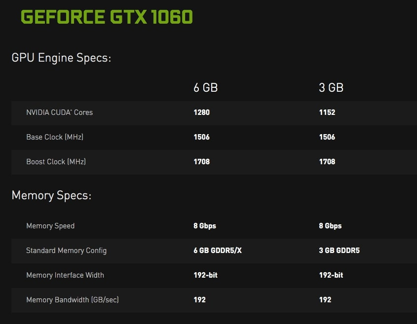

# VGA
VGA (video graphics adapter) hay còn gọi là card màn hình là một phần máy tính giúp xử lý và hiện thị hình ảnh, VGA có nhiều tên gọi như card đồ họa. Công việc của VGA là giúp cho xử lý hình ảnh hiện thị trở nên đẹp hơn.

VGA có lõi là GPU (Graphics Processing Unit) là bộ lõi của VGA, có trách nhiệm chính trong việc xử lý hình ảnh, đồ họa của máy tính. Là thành phần quan trọng nhất trong một cái card màn hình. Có 2 nhà sản xuất GPU lớn nhất hiện này là Nvidia và AMD)
## `Cách VGA hoạt động`

Hình ảnh ở trên màn hình máy tính được làm bởi hàng triệu điểm ảnh được gọi là những Pixel. Ví dụ một màn hình 1920×1080 tức là bạn sẽ có 1920×1080=2.073.600 pixel. Vậy máy tính sẽ làm gì để xử lý hết 2 triệu điểm ảnh đó, để làm được điều đó thì máy tính cần một translator – là một thứ có thể lấy dữ liệu nhị phân của máy tính để biến nó thành hình ảnh mà bạn thấy được. Trừ khi máy tính có thể làm điều đó ở bo mạnh chủ (thường thì CPU xử lý việc này không tốt lắm). Thì Translator đó chính là card đồ họa.

Nếu một máy tính không có card đồ họa thì việc xử lý những hình ảnh phức tạp mà máy tính không thể xử lý nhanh được cũng như việc chơi game sẽ không thể được mượt mà.

Card màn hình hoàn thành nhiệm vụ của mình theo các bước

- Một bo mạch chủ gửi cho năng lượng và dữ liệu
- Một bổ xử lý sẽ quyết định làm gì với từng pixel trên màn hình (bộ xử lý ở đây chính là GPU)
- Bộ nhớ sẽ lưu thông tin về các pixel đó và lưu tạm thời những hình ảnh hoàn thành
- Kết nối tới màn hình để hiện ra hình ảnh cuối cùng.
## `Phân loại`
- Các VGA onboard được NPH tích hợp luôn trên mainboard nhưng hiệu suất không thể nào bằng card rời. Chưa kể các mẫu mainboard tiên tiến hiện nay không còn lắp VGA onboard nữa.
- VGA rời có tính năng giống với card onboard nhưng nó được thiết kế riêng và hoạt đồng hoàn toàn độc lập và chuyên về xử lý hình ảnh, đồ họa. VGA rời được trang bị cả bộ tản nhiệt riêng, một GPU xử lý riêng, nó giúp cho chiếc máy tính hay laptop mạnh mẽ hơn trong việc xử lý đồ họa. 

## `Đọc thông số VGA`

- Base Clock (MHz): Xung cơ bản
- Boost Clock (MHz): Xung tăng cường
=> Đơn giản là xung càng cao thì card càng mạnh thôi
- Số nhân: Nvidia gọi là: Cuda Core (Bản GTX 1060 6G có 1280 nhân trên hình)AMD gọi là: Stream Processors. Nhân của GPU thì có rất nhiều từ vài trăm đến vài nghìn nhân.Số nhân nhiều thì số lượng công việc được xử lý trong một khoảng thời gian được nhanh hơn
- Bộ nhớ chuẩn: Ví dụ: 6GB GDDR5/X hay 3GB GDDR56GB và 3GB là dung lượng bộ nhớ của VGAGDDR5/X hay GDDR5 là chuẩn bộ nhớ của card VGA. Chuẩn bộ nhớ cao cấp hơn thì càng xịn hơn. Và nếu bạn đang phân vân giữa dung lượng cao hơn chuẩn bộ nhớ cao cấp thì chuẩn bộ nhớ cao cấp thường ngon hơn dung lượng bộ nhớ VGA
- Memory interface width: Còn được gọi là bus bộ nhớ. Bus bộ nhớ càng cao thì dữ liệu chuyền trong một chu kì càng lớn.
- Memory bandwidth: Khả năng truyền của bộ nhớ; chỉ số càng cao càng tốt.

## `GPU`
GPU là viết tắt của Graphics Processing Unit là bộ lõi của VGA, có trách nhiệm chính trong việc xử lý hình ảnh, đồ họa của máy tính. Là thành phần quan trọng nhất trong một cái card màn hình. Có 2 nhà sản xuất GPU lớn nhất hiện này là Nvidia và AMD

GPU cũng thường có hình dạng vuông, giống như CPU nằm ở phía bên trong của chiếc card màn hình. GPU được bọc bên ngoài bởi những miếng kim loại. Bảo về bên trong là bộ vi xử lý.

Hiện nay thì GPU còn có vai trò lớn trong cả việc xử lý thông tin cho AI (trí tuệ nhân tạo) và cũng như Deep Learning.

GPU là thành phần cốt lỗi của VGA nên thường được coi là 1 khái niệm.

### `So sánh GPU và CPU`

## `VRAM`
VRAM (Video RAM) là bộ nhớ đặc biệt nằm trong VGA hỗ trợ GPU xử lý hình ảnh.

Vram là một bộ phần khá quan trọng bởi nhờ Vram sẽ cung cấp các thông tin cho GPU để xử lý hình ảnh, cho phép GPU truy cập thông tin một cách nhanh nhất để đưa tới đầu ra là màn hình.

Tại sao có Ram nhưng lại vẫn phải sử dụng Vram? Đơn giản bởi vì Vram nằm gần GPU hơn Ram, giúp cho việc xử lý đồ họa nhanh hơn cũng như xử lý các hoạt động ở cường độ cao.
### `Nhiệm vụ VRAM`
Tác dụng chính và lớn nhất của Vram đó chính là giúp điều chỉnh độ phân giải màn hình, Vram có tác dụng giúp cho việc hiển thị hình ảnh trước và trong thời gian GPU hoạt động, các màn hình hiện thị tốt hơn, đẹp hơn sẽ tiêu thụ một lượng Vram nhiều hơn bởi độ phân giải càng cao thì sẽ có càng nhiều điểm ảnh.
### `Dung lượng VRAM`
Vram có rất nhiều loại dung lượng khác nhau, từ 1Gb – 2Gb, 3Gb – 4Gb, đa số là những loại Vram tầm trung và chỉ có thể xử lý được chỉ với một số cài đặt trung bình hoặc thấp hơn, rất khó khăn trong việc sử dụng các ứng dụng đồ họa hay thiết kế 3D.

Vram từ 8Gb hoặc cao hơn sẽ giúp bạn có thể có những tùy chỉnh trên trung bình và có thể cao hơn và  đem lại những trải nghiệm chơi game tốt hơn hoặc sử dụng các phần mềm đồ họa, thiết kế 3D chuyên nghiệp mượt và ổn định hơn.