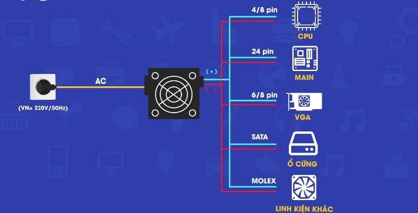
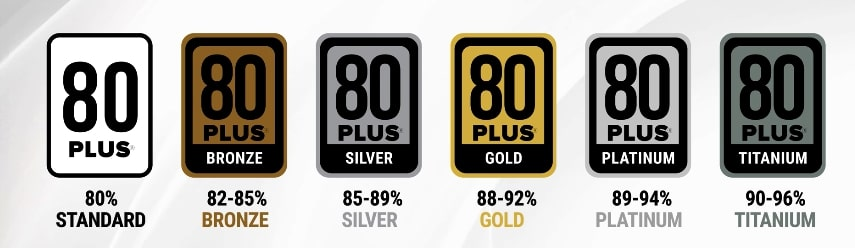
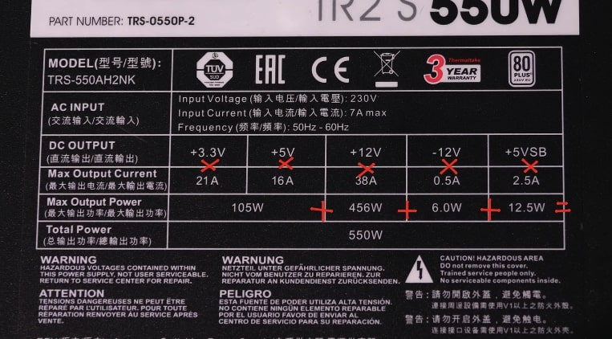
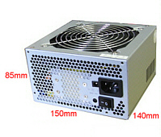
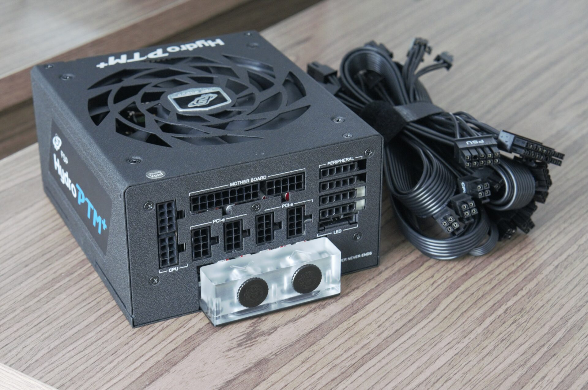
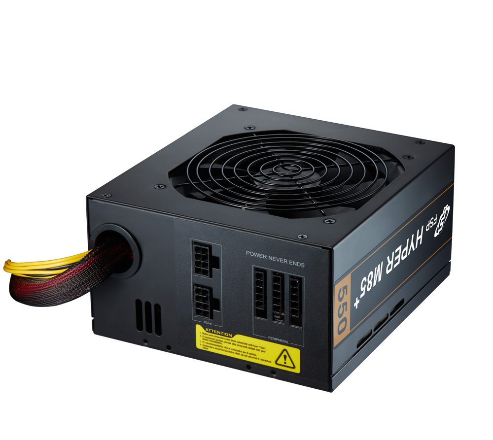
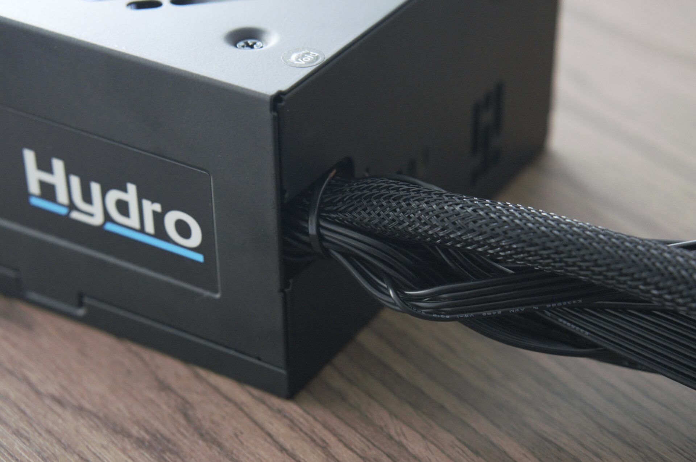

# PSU(Power Supply Unit)
PSU còn được gọi là nguồn máy tính, PSU được viết tắt Power Supply Unit là một phần cứng của máy tính có nhiệm vụ nhận chuyển đổi dòng điện từ AC thành DC cung cấp năng lượng cho các linh kiện khác

CáC bộ phần máy tính như CPU, Main, VGA, ổ cứng hay bàn phím, chuột đều sử dụng nguồn điện DC (điện 1 chiều). Và nguồn máy tính chuyền từ điện AC - Alternating current (điện xoay chiều) từ bên ngoài và chuyển thành điện DC - Direct current theo các đầu Pin.

- VGA và CPU là 2 nguồn tiêu thụ điện năng nhiều nhất
## `Nhà sản xuất`
Một số hãng nguồn tốt và nổi tiếng bạn có thể tham khảo khi mua PSU như: CoolMax, CORSAIR, Ultra, Antec, Gigabyte, Thermaltake và Seasonic
## `Nguyên lý hoạt động PSU`
Khi chuyển đổi từ AC sang DC, không phải cứ 100W thì PSU chuyển được 100W.

Vậy nên có một số nhà xuất đã có tem đã bảo đó chính là chuẩn 80 Plus

# `Công suất nguồn`
Công suất nguồn (đơn vị là: W) là thứ thể hiện sức mạnh của nguồn. Và là phần quan trọng nhất khi đi mua nguồn, bởi vì nguồn phải có công suất phù hợp với thành phần máy tính, phải đủ sức cần nổi tất cả các phần của máy tình. Nếu không muốn máy tính bạn bị tắt đột ngột hoặc bật không lên thì hãy biết những điều sau:

Total Power: Tức là công suất tổng
Continuous Power: Công suất ổn định
Peak Power: Tức là công suất đỉnh
Nếu bạn đi mua nguồn mà có số in trên nguồn là Total Power hay Continuos Power thì bạn nên mua, còn nếu là Peakpower thì cần phải cân nhắc kĩ. Bởi Peak Power là công suất cao nhất mà nguồn đó có thể đạt được trong vài mili giây thôi.

Để chọn được đúng công suất CPU đó là Total Power hay Continuous Power thì bạn cứ lên trang web của hãng xem. Họ sẽ ghi đầy đủ trên trang web hay sẽ ghi đầy đủ trên vỏ hộp.

Tức bạn sẽ có công thức tính công suất:

`P=UxI`

Trong đó:

P là công suất (W)
U là hiệu điện thế (V)
I là cường độ dòng điện (A)
Và ta cứ nhân U với I sau đó ra được công suất, cộng hết các công suất với nhau ta sẽ được công suất tổng. Nếu công suất này lớn hơn hoặc bằng với công suất ghi trên hộp thì đó chính total power hoặc Continuous Power. Còn nếu thấp hơn rất nhiều thì đó chính là Peak Power.
## `Kích thước`

Là chuẩn PS2 được dùng phổ biến hiện nay. Đối với những PSU có công suât lơn hơn thì có kích thước to hơn 1 chút. VD:
Nguồn máy tính Corsair RM750 80 Plus GOLD có kích thước: 150mm x 86mm x 160mm
## `Các loại dây nguồn`
- Full module: Những bộ nguồn Full Modular sẽ cho phép tháo toàn bộ dây dẫn ra khỏi bộ nguồn và không có bất kỳ dây cáp nào bị hàn cứng với bộ phận bên trong.

- Semi Modular: Có một số sợi cáp không thể tháo rời kết hợp với một số cáp có thể tháo rời. Những sợ không thể tháo rời thường là sợi 24 pin cấp nguồn cho mainboard, còn sợi 6 pin cho các loại card cắm khe PCIe và sợi 4 pin cấp nguồn CPU thì tùy hãng.

- Nonmodule: Những bộ nguồn Non Modular thì sẽ không cho phép tháo dây cáp ra mà sẽ hàn cứng tất cả các loại dây vào bộ nguồn luôn.

So sánh:

## `Lưu ý khi mua PSU`
- Bạn phải chọn nguồn đủ hoặc dư, nguồn không cung cấp đủ có thể khiến hỏng linh kiện gaming gear.
- Không nên mua nguồn in Peak power.
- Nên chọn những nguồn có dán tem chuẩn 80 plus, vì những nguồn này đã được test và nó như một con team đánh giá chất lượng vậy.

## `Tư vấn mua nguồn`
- Hoàn toàn có thể chọn PSU có công suất lớn để tiện nâng cấp về sau mà vẫn không sợ tốn quá nhiều điện.
- Để mua nguồn hợp với máy tính thì bạn dùng công thức sau:
`TDP(CPU)+TDP(VGA)+200w`

- CPU 4/8 chấu: Đây là cổng kết nối cung cấp điện năng cho CPU của bạn. Các CPU hiện đại sử dụng nhiều điện năng hơn cấu hình mà bo mạch chủ 24 chấu có thể cung cấp. Vì vậy, người ta thườn sử dụng thêm dây cáp 4/8 chấu. Dây cáp của CPU thường được cắm vào cạnh trên cùng bên trái của bo mạch chủ, gần I/O trên cách bố trí tiêu chuẩn. Tuy nhiên, điều này còn tùy vào nhà sản xuất.
- 6/8 chấu (PCIe*/GPU): Một số GPU sử dụng đủ điện năng từ khe PCIe*, trong khi các loại khác đòi hỏi phải có cáp điện riêng để vận hành đúng cách. Đa phần các PSU giải quyết sự khác biệt bắt buộc này bằng cách cung cấp các dây cáp có thể kết hợp theo nhiều cách khác nhau, một số trong đó bao gồm cổng nối 6 chấu, 8 chấu, 6+6 chấu, 8+6 chấu, 8+8 chấu và thậm chí là 8+8+8 chấu. Các PSU thường hỗ trợ nhiều cổng kết nối trên cùng một dây cáp để tránh phải sử dụng thêm dây. Với đại đa số người dùng, loại dây cáp tích hợp này cũng hoạt động giống như sử dụng nhiều dây cáp. Trước khi mua, hãy kiểm tra kỹ bộ cấp nguồn để đảm bảo có các kết nối mà GPU cần.