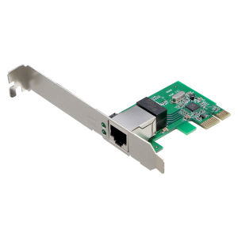

# `CARD mạng`
`Card mạng (network card)`, hay card giao tiếp mạng (Network Interface Card), là một bản mạch cung cấp khả năng truyền thông mạng cho một máy tính.

## `Chức năng`
Chức năng cơ bản của card mạng cần nhắc đến đầu tiên chính là chức năng truyền dữ liệu qua lại giữa các máy tính, đồng thời kiểm soát thống kê thông tin dữ liệu từ cấp tới máy tính. Có nghĩa là các thông tin mà bạn muốn đưa lên mạng hay các thông tin bạn tìm từ internet về thì các dữ liệu đó sẽ được chuyển đổi từ dạng byte và bit sang loại tín hiệu điện. Và tín hiệu này sẽ truyền qua dây cáp đến máy tính của bạn khi muốn nhận dữ liệu hoặc ngược lại khi bạn muốn truyền dữ liệu.

Đặc điểm cơ bản của một card mạng chỉ là nó sẽ có một địa chỉ MAC.` Đây là địa chỉ duy nhất của Card mạng không trùng khớp với bất cứ card mạng nào` (Địa chỉ này gồm 6 byte (48 bit) trong đó thì 3 byte là mã số của chính nhà sản xuất ra card mạng và 3 byte là số seri của các card mạng do hãng sản xuất) Nhờ vào đó đó nó sẽ được phân biệt với nhau ở trên mạng internet thì mới có thể truyền đi hay cung cấp dữ liệu về chính xác nhất.
## `Hoạt động`
- Nhiệm vụ của card mạng là giúp chuyển đổi các dữ liệu từ máy tính qua đường truyền tín hiệu đến các phương tiện khác hoặc ngược lại. (Không chỉ thực hiện đơn lẻ một bên mà cùng lúc song song nhiều dữ liệu qua lại một lúc đều được).

- Các thông tin sẽ được chuyển đi hay tải về nhờ dây dẫn thông qua card mạng của máy.

- Dễ dàng gửi và nhận thông tin một cách chính xác, có nghĩa là mọi nguồn dữ liệu ở mạng internet muốn vào máy tính phải thông qua card mạng và ngược lại nếu dữ liệu muốn truyền đi cũng phải thông qua card mạng để ra ngoài.
## `MAC`
Địa chỉ MAC được cung cấp từ IEEE (Institute of Electrical and Electronics Engineers) và các nhà sản xuất card mạng. Họ sẽ cố định địa chỉ MAC cho card mạng.

Chúng được phân chia như sau: Địa chỉ MAC gồm 6 byte, trong đó 3 byte sẽ là mã số nhà sản xuất và 3 byte sẽ là số seri của các card mạng do hãng đó sản xuất, chính vì vậy các địa chỉ MAC của card không thể giống nhau, nên đường truyền giữ liệu đi vào ra hay đều chính xác một cách tuyệt đối.

`Card mạng được cắm vào các khe cắm như PCI hay qua cổng USB đều được và card mạng giao tiếp với cáp mạng bằng các chuẩn AUI, BNC, UTP…`
