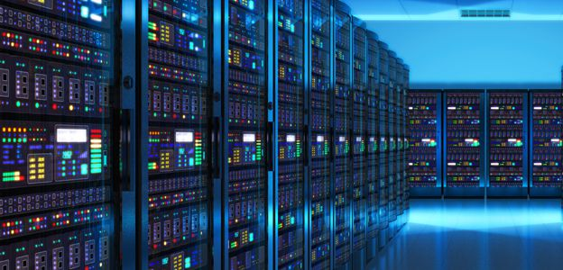
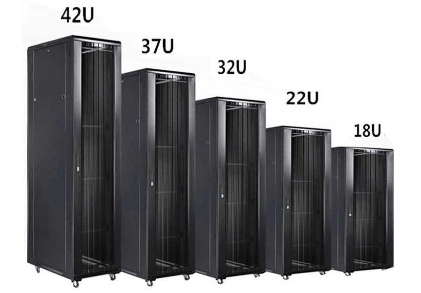

# `Data Center`
Data center là khu vực chuyên biệt chứa server hay phòng máy tính. Là nơi đặt và vận hành các thành phần liên quan (hệ thống truyền thông, hệ thống dữ liệu)

## `Những ai cần dùng data center?`
- Đối tượng 1: có nhu cầu thuê một, hoặc nhiều máy chủ riêng hoặc chỗ đặt máy chủ, thích hợp cho các doanh nghiệp vừa và nhỏ.
- Đối tượng 2: có nhu cầu thuê tủ rack hoặc không gian, thuê theo diện tích mặt sàn tính bằng (m2) và quây khu riêng đặt nhiều tủ rack, thích hợp dành cho các doanh nghiệp lớn.
## `Thành phần datacenter`
- `White space`: datacenter được xếp vào những cơ sở tiêu tốn nhiều năng lượng nhất thế giới, phải truy cập 24/24. Phải đảm bảo không gian sạch, mát mẻ, đạt chuẩn nhiệt độ, độ ẩm.
- `Cơ sở hạ tầng`: Mức độ sẵn sàng chuẩn dao động từ 99,671%(tier 3) đến 99,995%(tier 4). Một số thiết bị hỗ trợ cơ sở hạ tầng như:

     + Nguồn điện liên tục (UPS, Uninterruptible Power Sources): ngân hàng năng lượng, máy phát điện và nguồn điện dự phòng.
     + Kiểm soát môi trường (Environmental Control): máy điều hòa không khí phòng máy (CRAC), hệ thống sưởi, thông gió, điều hòa không khí (HVAC), hệ thống ống xả.
     + Hệ thống an ninh vật lý (Physical Security Systems): hệ thống giám sát sinh trắc học và video.

- `Thiết bị IT`: servers, phần cứng lưu trữ, cáp và racks, ngoài ra còn phải có firewall (thường là firewall cứng) đảm bảo tính bảo mật.
- `Staff - nhân viên điều hành`: đảm bảo datacenter vận hành 24/24.

## `Tại sao cần dùng datacenter`
- Lưu trữ chuyên nghiệp, an toàn.
- Tiết kiệm chi phí lưu trữ, quản lý: thống nhất trong việc lưu trữ.
     + Cá nhân: Khách hàng cá nhân thuê Data center vừa để làm trung tâm lưu trữ chính, vừa làm trung tâm sao lưu, khôi phục sau thảm họa đều được, điều này giúp cho hệ thống cơ sở dữ liệu của bạn luôn được đảm bảo liên tục, liền mạch trong vận hành kinh doanh.
     + Doanh nghiệp, tổ chức: Trung tâm dữ liệu cực kì quan trọng trong các tổ chức lớn, các tổ chức cần lưu trữ hệ thống thông tin quản lý như các Bộ, Ban, Ngành, Các tổ chức, Doanh nghiệp hoạt động trong mảng tài chính ngân hàng, chứng khoán, tuyển dụng nhân sự,… Sự bảo mật thông tin và ổn định truy cập được đảm bảo ở mức độ cao.  VD: Data center giúp các công ty chuyên tuyển dụng nhân sự lưu trữ thông tin nhà tuyển dụng, thông tin ứng viên,…

## `Rack`
Tủ mạng hay còn gọi là tủ rack là một phần không thể thiếu trong các Datacenter. tập trung các thiết bị như Router, Switch, Thiết bị cân bằng tải, Gateway, thiết bị tường lửa firewall, bộ lưu điện, hộp phối quang ODF, Patch Panel,... giúp giảm thiểu các tác động từ môi trường bên ngoài, tối ưu về không gian sử dụng và dễ dàng quản lý.

Các kích cỡ tủ rack:

- Đơn vị U : cho biết có bao nhiêu thiết bị có thể được lắp vào tủ. `1U bằng 1.75 inch`, khoảng 44.45mm
- Độ rộng tủ : cho biết ta có bao nhiêu không gian ở các bên của tủ. `Độ rộng tiêu chuẩn là 19inch = 48,26cm`
- Độ sâu : cho biết tủ có thể được lắp các thiết bị có độ dài thế nào - Tuy nhiên chúng ta cần biết kích thước lắp đặt. `Các độ sâu phổ biến: 600, 800, 1000 mm`
- Tải trọng : cho biết tổng khối lượng thiết bị có thể được đặt vào tủ.