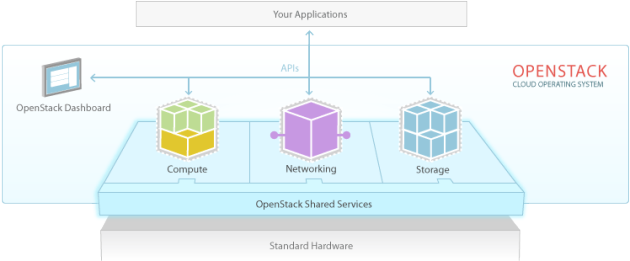

# `Openstack`
## `Ảo hóa (Virtualization)`
 Ảo hóa là kỹ thuật tạo ra phần cứng, thiết bị  mạng, thiết bị lưu trữ,… ảo – không có thật (cũng có thể là giả lập hoặc mô phỏng).
 ### `Lợi ích ảo hóa`
- `Tiết kiệm`: Kỹ thuật ảo hóa giúp tiết kiệm tiền bạc và tận dụng được tài nguyên phần cứng. Ví dụ: khi cần một máy tính chạy hệ điều hành, thay vì mua, chúng ta có thể cài đặt và tạo ra các máy ảo trên máy vật lý của mình.
- `Linh hoạt`: Với các phần mềm để tạo ra các máy ảo, bạn có thể tạo, xóa, hủy các máy ảo này một cách nhanh chóng và thuận tiện (tùy các nền tảng khác nhau và kỹ năng sử dụng của người dùng khác nhau).
- `Nhanh chóng`: Đối với các môi trường thử nghiệm và phòng thí nghiệm, kỹ thuật ảo hóa giúp sao lưu và khôi phục hệ thống, khôi phục máy ảo nhanh chóng và thuận tiện.  
## `Cloud computing`
là mô hình điện toán cho phép truy cập qua mạng để lựa chọn và sử dụng tài nguyên tính toán (Ví dụ: mạng, máy chủ, lưu trữ, ứng dụng và dịch vụ) theo nhu cầu một cách thuận tiện và nhanh chóng; đồng thời cho phép kết thúc sử dụng dịch vụ, giải phóng tài nguyên dễ dàng, giảm thiểu các giao tiếp với nhà cung cấp).

Hiểu một cách đơn giản thì Điện toán đám mây là bước kế tiếp của Ảo hóa. Ảo hóa phần cứng, ảo hóa ứng dụng là thành phần quản lý và tổ chức, vận hành các hệ thống ảo hóa trước đó.

Để hiểu rõ thì chúng ta cần nắm được quy tắc 5-4-3 trong Cloud Computing: 5 đặc tính, 4 mô hình dịch vụ và 3 mô hình triển khai.
### `5 đặc điểm cloud computing`
- Khả năng thu hồi và cấp phát tài nguyên (Rapid elasticity). 
- Truy nhập qua các chuẩn mạng (Broad network access).
- Dịch vụ sử dụng đo đếm được (Measured service), tức là chi trả theo mức độ sử dụng, dùng bao nhiêu trả bấy nhiêu (pay as you go). 
- Khả năng tự phục vụ (On-demand self-service). 
- Chia sẻ tài nguyên (Resource pooling).
### `4 mô hình dịch vụ`
- Public Cloud: Đám mây công cộng (là các dịch vụ trên nền tảng Cloud Computing để cho các cá nhân và tổ chức thuê, họ dùng chung tài nguyên). 
- Private Cloud: Đám mây riêng (dùng trong một doanh nghiệp và không chia sẻ với người dùng ngoài doanh nghiệp đó) 
- Community Cloud: Đám mây cộng đồng (là các dịch vụ trên nền tảng Cloud computing do các công ty cùng hợp tác xây dựng và cung cấp các dịch vụ cho cộng đồng). 
- Hybrid Cloud: Là mô hình kết hợp (lai) giữa các mô hình Public Cloud và Private Cloud.
### `3 mô hình triển khai`
- Hạ tầng như một dịch vụ (Infrastructure as a Service) 
- Nền tảng như một dịch vụ (Platform as a Service) 
- Phần mềm như một dịch vụ (Software as a Service)
## `Openstack là gì`
Là một phần mềm mã nguồn mở, dùng để triển khai Cloud Computing, bao gồm private cloud và public cloud (Open source software for building private and public clouds).

OpenStack là một phần mềm mã nguồn mở, dùng để triển khai Cloud Computing, bao gồm private cloud và public cloud (nhiều tài liệu giới thiệu là Cloud Operating System). Đúng như với thông tin từ trang chủ http://openstack.org: Open source software for building private and public clouds
- Phía dưới là phần cứng máy chủ đã được ảo hóa để chia sẻ cho ứng dụng, người dùng.
- Trên cùng là các ứng dụng của bạn, tức là các phần mềm mà bạn sử dụng. 
- Và OpenStack là phần ở giữa 2 phần trên, trong OpenStack có các thành phần, module khác nhau nhưng trong hình có minh họa các thành phần cơ bản như Dashboard, Compute, Networking, API, Storage,…

## `Thông tin Openstack`
 Có 3 nhóm chính tham gia: Nhóm điều hành, nhóm phát triển và nhóm người dùng.

- OpenStack hoạt động theo hướng mở: Công khai lộ trình phát triển, công khai mã nguồn,...

- Tháng 10/2010 Rackspace và NASA công bố phiên bản đầu tiên của OpenStack, có tên là OpenStack Austin, với 2 thành phần chính (Project): Compute (tên mã là Nova) và Object Storage (tên mã là Swift).

- Các phiên bản OpenStack có chu kỳ 6 tháng. Tức là 6 tháng một lần sẽ công bố phiên bản mới với các tính năng bổ sung. 

- Tính đến nay có 13 phiên bản của OpenStack bao gồm: Austin, Bexar, Cactus, Diablo, Essex, Folsom, Grizzly, Havana, Icehouse, Juno, Kilo, Liberty, Mitaka. Tên các phiên bản được bắt đầu theo thứ tự A, B, C, D… trong bảng chữ cái. 