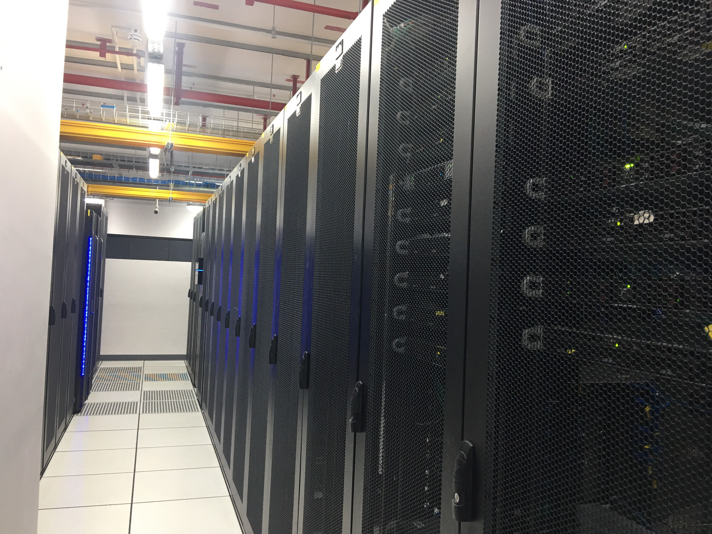
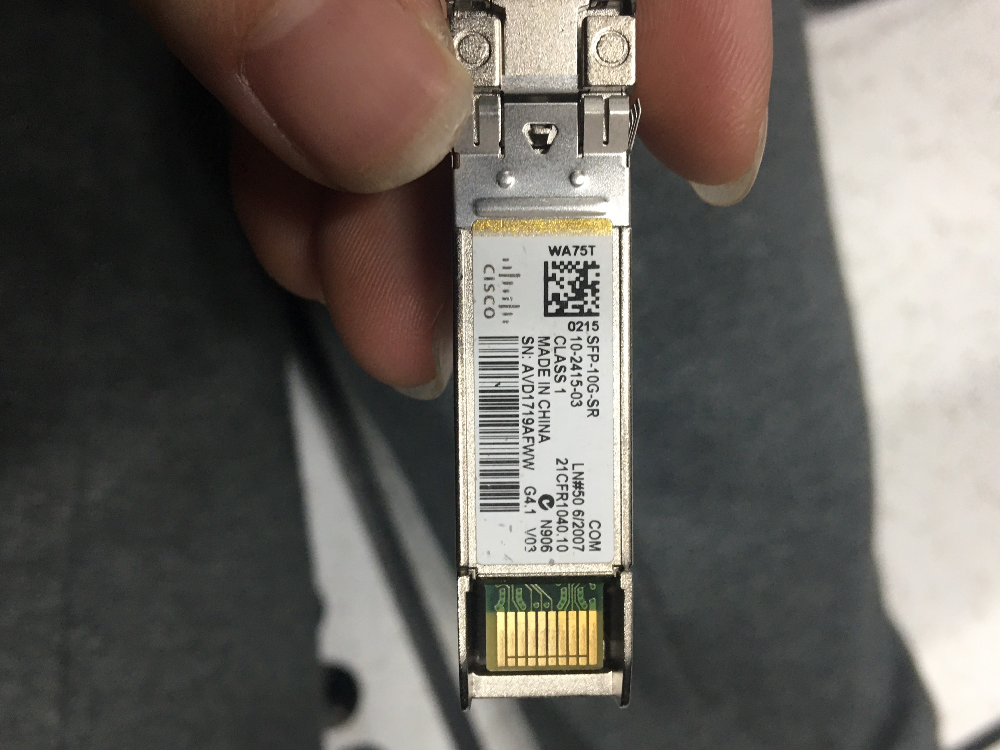
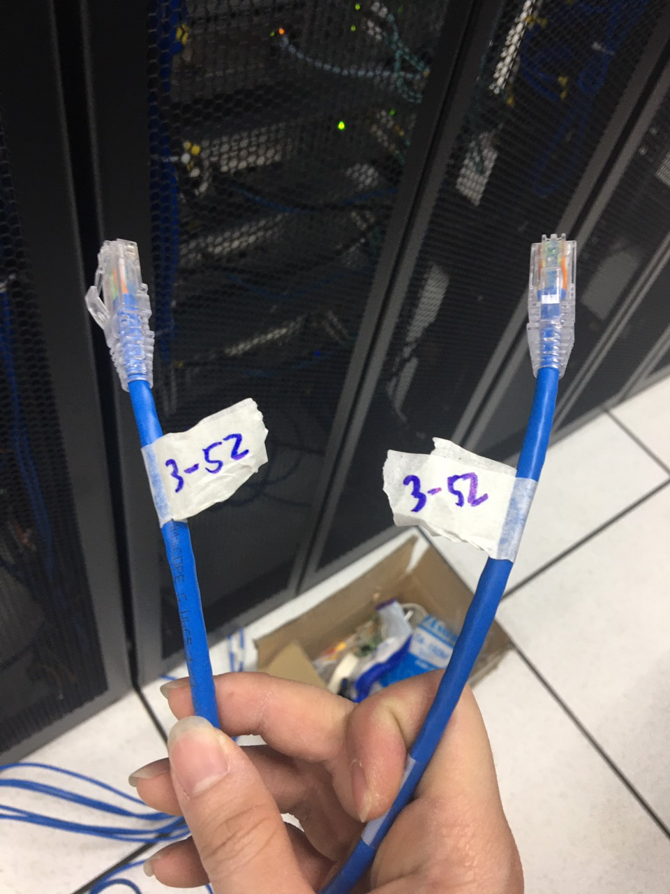
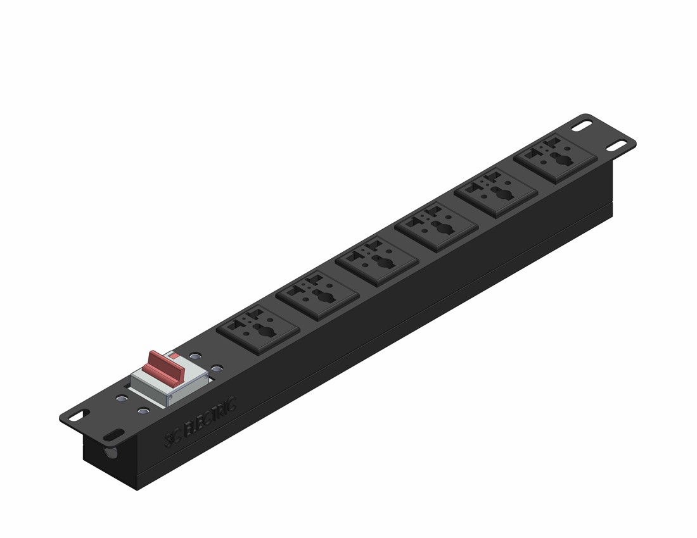

<h1 style="color:orange">Quy trình lắp đặt server</h1>
<h2 style="color:orange">1.Quy trình ra vào datacenter</h2>
Địa chỉ FPT Datacenter: 2 Phạm Văn Bạch, Dịch Vọng, Cầu Giấy, Hà Nội.

Thủ tục vào tòa nhà:
1. Những nhân viên không thuộc tòa nhà đều phải đổi CMT/CMND ở lễ tân để lấy thẻ ra vào tòa nhà. Trước khi đổi thẻ phải mail trước 24h để thông báo những người vào tòa nhà.
2. Chỉ nhân viên datacenter mới có thể tự do ra/vào datacenter ----> Lên tầng 2 đổi thẻ ra/vào tòa nhà lấy thẻ ra/vào datacenter.
3. Hình ảnh bên trong FPT datacenter:

 
Sơ đồ datacenter:
 
4. Khi rời khỏi datacenter --> đổi lại thẻ ra/vào tòa nhà --> rời khỏi tòa nhà --> đổi lại CMND. 

Datacenter có thể cho các công ty ngoài thuê tủ rack để đặt server của họ. 
<h2 style="color:orange">2. Cấu trúc datacenter</h2>

1. Những đường ống màu vàng nối phía trên tủ rack thường được gọi là máng để đi dây mạng:

2. Nguồn: datacenter yêu cầu luôn luôn hoạt động và làm mát. Chính vì vậy hệ thống điện của datacenter cũng cần phải đặc biệt có công suất cao và độ ổn định. Nhiệt độ trung bình trong datacenter là 16*C. Hình ảnh tủ điện datacenter:
 
Bên trong tủ điện: 
 
Đường dây được chạy dưới sàn datacenter, đồng thời cũng là những đường thông gió mát từ điều hòa tổng của datacenter: 
 
Các đường dây được nối trực tiếp đến tủ rack từ dưới sàn.
3. Tủ rack
- Sử dụng tủ có độ cao 47U
- độ sâu 1000 mm
<h2 style="color:orange">3. Server của phòng CAS (FTI)</h2>
<h3 style="color:orange">3.1. Chuẩn bị</h3>

1. CAS dự kiến sẽ cần 2 tủ rack (L12 VÀ L13) xây dựng server theo sơ đồ:

2. Các thiết bị được CAS đề xuất để hoàn thành việc lắp đặt.

 
3. Tủ rack
- Sử dụng tủ có độ cao 47U
- độ sâu 1000 mm
- Sử dụng 2 loại server 1U và 2U.
<h3 style="color:orange">3.2. Sơ đồ 1 máy chủ</h3>
VD: DELL POWEREDGE R730XD

 
Những thành phần trong 1 con server:

1. CPU: R730 POWEREDGE  của DELL sử dụng 2 CPU\
2. Khe cắm RAM: tiêu chuẩn DIMM (DDR4). Hỗ trợ 24 khe cắm RAM tối đa 32Gb.
3. Nơi cắm ổ cứng: R730 DEL hỗ trợ 24 khe cắm DISK 2,5 inch hoặc 12 ổ cỡ 3.5 inch. Như hình là 24 khe DISK 2,5 inch:

2 ổ đầu là ổ SSD 480Gb dùng cho OS 
 
Còn lại 22 ổ cho DISK SSD 2Tb:
 
4. Khe cắm PSU (nguồn): hỗ trợ 2 khe cắm cho PSU 750W (2 nguồn)
 
5. RAID controller: card hỗ trợ RAID (gần như server nào cũng được tích hợp sẵn)
6. Tích hợp sẵn card mạng 1Gb 4 cổng chuẩn RJ45

7. Các khe tùy chọn có thể cắm thêm card mạng (dây đồng hoặc dây quang 1gb hoặc 10gb). Hình ảnh VD card mạng 10gb:
 
 
 
Vùng khoanh đỏ là chỗ cắm các module 10gb
8. IDRAC: hỗ trợ chuẩn RJ45. Có tác dụng để điều khiên server từ xa.
9. chip ILO: kết nối với cổng IDRAC giúp cho có thể điều khiển server từ xa.
<h3 style="color:orange">3.3. Các module mạng</h3>

 
 
 
Có thể hiểu như là cổng trung gian giữa dây quang và card mạng
So sánh module quang 1gb và 10gb:
- module 1gb: Module quang 1G là thiết bị có chức năng hỗ trợ khả năng giám sát quang kỹ thuật số DOM. Cisco SFP 1Gb hỗ trợ đàm phán tự động trên đường truyền tốc độ 10/100/1000 gồm cả khả năng tự động MDI/MDIX. Thiết bị này có thể hoạt động trên các liên kết sợi đơn mode và đa mode, tương thích với các tiêu chuẩn IEEE802.3Z SX và LX. 
Loại module quang 1 Gb có tốc độ đạt 1Gb và sử dụng ở nhiều chuẩn cáp quang khác nhau như Single hoặc multimode, chúng cũng được ứng dụng phổ biến và rộng rãi trong phần lớn hệ thống các thiết bị hiện nay.
- Module 10gb: 
.Thiết bị đầu vào / đầu ra có thể tráo đổi cắm vào cổng Ethernet SFP + của bộ chuyển mạch Cisco (không cần tắt nguồn nếu cài đặt hoặc thay thế) 
.Khả năng giám sát quang kỹ thuật số cho khả năng chẩn đoán mạnh mẽ 
.Khả năng tương tác quang học với các giao diện XFP 10GBASE XENPAK, 10GBASE X2 và 10GBASE trên cùng một liên kết 
.Tính năng nhận dạng chất lượng (ID) của Cisco cho phép nền tảng của Cisco xác định xem mô-đun có được chứng nhận và kiểm tra bởi Cisco không.
<h3 style="color:orange">3.4. Switch</h3>
Sử dụng Switch CISCO NEXUS 3064-X:

 
1. Các cổng mạng hỗ trợ module quang.
 
Sử dụng nguồn được tích hợp sẵn trên switch 400 W. Phía trên là đèn tín hiệu của switch (FAIL >< OK)
<h3 style="color:orange">3.5. Cách đi dây nguồn</h3>
Mỗi cạnh bên trong tủ rack sẽ có các chỗ cắm điện. Tuy ở trong cùng 1 tủ nhưng những ổ cắm này lại thuộc 2 nguồn điện khác nhau (để tránh sự cố xảy ra do 1 nguồn điện sập)

------> Chính vì vậy, phải đi dây nguồn server hoặc switch theo nguyên tắc đối xứng.
- Nếu như server chỉ có 1 nguồn: dây nguồn server ở trên cắm ổ bên phải, dây nguồn server dưới cắm ổ trái hoặc ngược lại.
-  Nếu như server có 2 nguồn: 1 dây nguồn cắm ổ phải, 1 dây nguồn cắm ổ trái.
 
<h3 style="color:orange">3.6. Đánh tag cho dây</h3>

 
Trong hệ thống tủ rack có rất nhiều dây (dây nguồn, dây mạng, ...) đòi hòi việc đánh tag cho 2 đầu dây
------> phân biệt dây nào cắm đầu nào và khi mà rút dây có thể cắm lại dễ dàng.
 
<h3 style="color:orange">3.7. PDU</h3>
Ổ cắm rack (PDU) là một thiết bị phân phối năng lượng điện được thiết kế để phù hợp với một server rack ngang hoặc thẳng đứng.

 
Một PDU được lắp trên giá gắn trực tiếp với một giá đỡ để nó có thể kiểm soát và giám sát điện năng đến các máy chủ cụ thể, các thiết bị chuyển mạch và trung tâm dữ liệu khác, đồng thời hỗ trợ trong việc cân bằng tải điện.
 
1 số PDU tiên tiến có chức năng theo dõi từ xa.