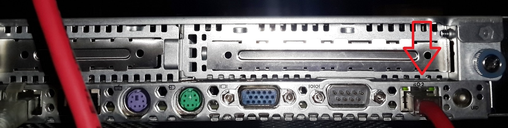
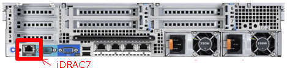

<h1 style="color:orange">In-band và Out-of-band</h1>
<h2 style="color:orange">1. In-band management</h2>
In-band management là hoạt động quản lý thiết bị như máy chủ thông qua các giao thức hỗ trợ như Telnet, VNC, RDP hoặc SSH trên hệ điều hành đã được cài đặt và hoạt động.

Với in-band bạn sẽ đăng nhập vào Terminal/Console/RDP của OS và quản lý các thông tin, cấu hình hệ thống, thiết bị phần cứng máy chủ thông qua các hình thức này. 
In-band phụ thuộc vào đường truyền đến máy chủ remote. 
Chỉ có thể thực hiện in-band khi máy chủ đã bật OS (hoạt động). 
<h3 style="color:orange">1.1. Ưu điểm</h3>
– Không có yêu cầu chi phí cao.
– Không yêu cầu phần cứng máy chủ phải có thêm 1 cổng kết nối riêng.
– Có thể tuỳ biến các chương trình hỗ trợ in-band.
<h3 style="color:orange">1.2. Nhược điểm</h3>
– Thường khó để nâng cấp firmware (chương trình cấp thấp điều khiển thiết bị điện tử) của phần cứng máy chủ.
– Không thể tự thực hiện cài đặt lại OS từ xa thông qua RemoteConsole KVMoverIP.
– Không dễ để xử lý các vấn đề liên quan đến phần cứng nếu OS không boot lên được nhằm xác định vấn đề.
– Phụ thuộc đường truyền mạng.
<h2 style="color:orange">2. Out-of-band management</h2>
Là giải pháp truy cập quản lý thiết bị máy chủ bằng cách kết nối đường truyền vật lý đến một cổng (port) quản lý riêng được thiết kế đặc biệt trên từng thiết bị riêng biệt.

Ở cổng quản lý thiết bị phần cứng riêng OOB của mỗi hãng thiết bị đều tích hợp chương trình hoặc nền tảng, giúp cho chúng ta truy cập thông qua Website HTTP hoặc Terminal Console kết nối đến để thực hiện quản lý phần cứng thiết bị.

Cổng quản lý out-of-band đó có thể sử dụng ip public (cần đảm bảo các ACL truy cập an toàn) hoặc sử dụng trong hệ thống mạng nội bộ với 1 thiết kế VLAN riêng rồi phân chia từng IP Private riêng ứng với từng cổng quản lý oob của từng thiết bị.

`1 số ví dụ về out-of-band:`
 
Cổng ILO của server HP.

 
Cổng IDRAC của server DELL.
<h3 style="color:orange">2.1. Ưu điểm</h3>

- Không cần phải chạy lên DC mỗi khi thiết bị máy chủ có vấn đề bị treo,…
- Có thể xem màn hình remote console OS đang chạy như KVM over IP.
- Có thể xem thông tin phần cứng hệ thống, tiến hành reboot, khởi động server mà không cần phải thực hiện trực tiếp bằng tay.
- Cung cấp chức năng quản lý người dùng truy cập vào cổng OOBM.
- Cài OS mà không cần bật server (chỉ cần cắm điện)
<h3 style="color:orange">2.2. Lưu ý</h3>

- Cần đảm bảo nguồn cho server, để có thể chạy cổng OOB ngay cả khi server đã tắt OS.
- Đảm bảo đường link kết nối đến cổng OOBM của thiết bị luôn luôn ổn định.