<h1 style="color:orange">Sử dụng băng từ như đĩa cứng - tape drive as hard drive</h1>
Theo truyền thống, các hệ thống lưu trữ dùng băng từ được dùng chủ yếu cho mục đích sao lưu dự phòng (backup). Việc sao lưu dự phòng và phục hồi các tập tin chứa trong băng từ phải dựa vào các phần mềm chuyên dụng do cấu trúc lưu trữ hệ thống file trên tape drive không giống cách lưu trữ và truy xuất file thường được dùng trên hê thống hard drive trên máy tính. Hạn chế này là cản trở lớn nhất đến việc dùng hệ thống băng từ như hệ thống lưu trữ dùng ổ đĩa thông dụng trong các hệ thống lưu trữ thông tin.

Trước đây, người ta không quan tâm đến vấn đề này do bản chất việc truy xuất file lưu trên băng từ là tuần tự và tốc độ của hệ thống băng từ còn thấp. Tuy nhiên, do tốc độ và dung lượng của hệ thống băng từ ngày càng cao, giá thành của băng từ ngày càng giảm nên bắt đầu từ thế hệ LTO 5, các nhà sản xuất đã bổ sung thêm khả năng dùng băng từ như đĩa cứng vào các thiết bị lưu trữ theo chuẩn LTO

Để làm được điều này người ta đã thống nhất triển khai và bổ sung thêm định dạng Linear Tape File System (LTFS) vào cả phần cứng và phần mềm. Người dùng có thể tích hợp tính năng nhận diện định dang mới này trên các hệ điều hành thông dụng như Windows, Mac, Linux bằng cách cài đặt thêm driver từ các hãng sản xuất băng từ như HP, IBM, Imation, Quantum...
Với việc bổ sung định dạng LTFS, người dùng có thể trao đổi, truy xuất thông tin đã lưu trên bằng từ giữa các máy có  các nền tảng hệ điều hành khác nhau như Windows, Linux, Mac… Các thao tác quản lý, xem, truy xuất, thêm, xóa file, folder trên băng từ tương tự như với các đĩa cứng truyền thống.

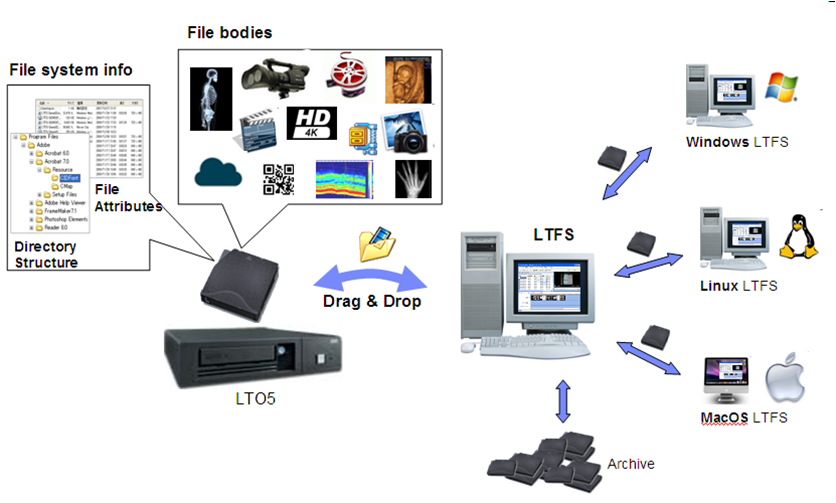 
Khả năng kéo thả các file, folder trên băng từ và giữa đĩa cứng và băng từ lưu theo định dạng LTFS cũng được hổ trợ. Cũng như ổ cứng, thông tin trên băng từ cũng có thể được chia sẽ qua mạng cục bộ.

Tương tự với ổ đĩa mạng (disk-based NAS Server), các ổ băng từ mạng (tape-based NAS server) cũng được nhiều nhà sản xuất tung ra thị trường như IBM, Quantum, HP…

Với các ưu điểm vượt trội như thời gian lưu trữ rất lâu (30 ~ 50 năm), cơ động hơn đĩa cứng trên phương diện chống sốc, độ bền (đĩa cứng có thể hỏng bất kỳ lức nào), giá thành thấp hơn đĩa cứng nhiều lần, băng từ với định dạng mới LTFS cung cấp thêm một giải pháp mới, tối ưu cho một số nghành cần lưu trữ file với dung lượng rất lớn, thời gian lưu trữ nhiều năm và với một giá thành rất hợp lý.
<h2 style="color:orange">1. Những chuẩn công nghệ băng từ</h2>
Cho tới nay, phương tiện sao lưu dự trữ (backup) thịnh hành nhất vẫn là băng từ. Phương thức áp dụng băng từ là đáng tin cậy, an toàn, dễ áp dụng and có kinh phí tương đối thấp.Để tăng dung tích lưu trữ and vận tốc chuyển dữ liệu, người ta thường sử dụng những kỹ thuật nén dữ liệu. Tỷ lệ nén dữ liệu thường đc sử dụng thường là giữa 2:1 and 4:1.
<h3 style="color:orange">1.1. DFS/DAT TAPES</h3>

DAT Tapes là công nghệ tầm thấp thường dùng cho các doanh nghiệp nhỏ với độ tin cậy và chi phí thấp.
- DAT - Digital Audio Tape: một chuẩn định dạng âm thanh trên băng có độ rộng 3.81mm.
- DDS – Digital Data Storage (cũng được gọi là băng 4mm) được phát triển dựa trên chuẩn DAT nhưng dành là định dạng cho dữ liệu máy tính. Tuy vậy, nhiều người vẫn tiếp tục gọi ổ DDS là “ổ DAT” và kiểu gọi này vẫn phổ biến cho tới nay.
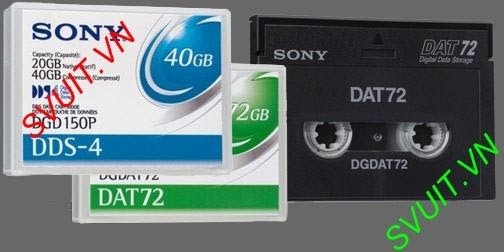 
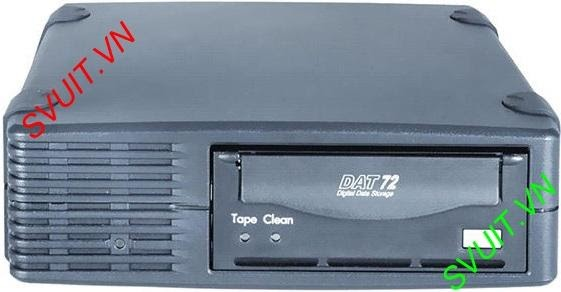 
<h3 style="color:orange">1.2. DLT/SDLT Tapes</h3>
Các sản phẩm DLT đầu tiên được giới thiệu vào năm 1985 bởi DEC và ngày càng trở nên phổ biến. Công nghệ SDLT được Quantum tập trung phát triển trong nổ lực để cung cấp một dòng sản phẩm hiệu suất cao hơn. Cả hai lọai được biết tới như những dòng sản phẩm cao cấp, tốc độ cao và đắt tiền. DLT1 và DLT vs80 cũng được giới thiệu để đáp ứng đòi hỏi của những người dùng cần một công nghệ cho tốc độ cao, dung lượng lớn nhưng có giá thành chấp nhận được.

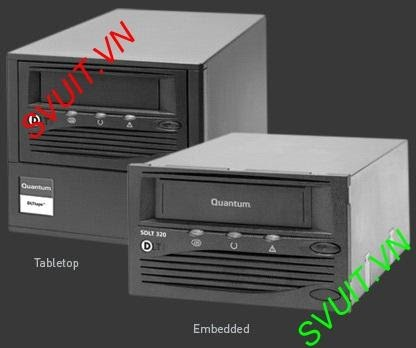 
<h3 style="color:orange">1.3. AIT Tapes</h3>
So sánh với DLT và SDLT thì AIT cho tốc độ cao hơn nhưng có giá thành thấp hơn tính trên 1MB dữ liệu.
AIT dùng bộ điều khiển đĩa Fast-Wide SCSI cho phép tốc độ đạt đến 86GB/giờ nếu áp dụng tỷ lệ nén 2:1.
Các ổ AIT 35GB, 50GB, 100GB có tốc độ tải dữ liệu tương ứng là 3MB/s, 6MB/s, 12MB/s.
Áp dụng tỷ lệ nén 2:1 trên các ổ này, chúng ta có thể nâng dung lượng của chúng lên tới 70GB, 100GB, 200GB với tốc độ chuyển dữ liệu tương ứng là 6MB/s, 12MB/s, 24MB/s.

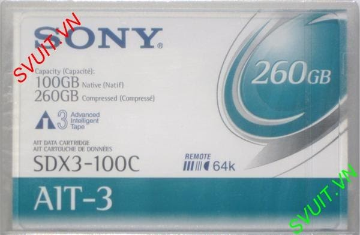 
<h3 style="color:orange">1.4. Ultrium/LTO</h3>
HP, IBM và Seagate đã quyết định phát triển một định dạng mới có các đặc tính kỹ thuật vượt trội so với các định dạng băng từ đã phổ biến như DAT, SDLT...

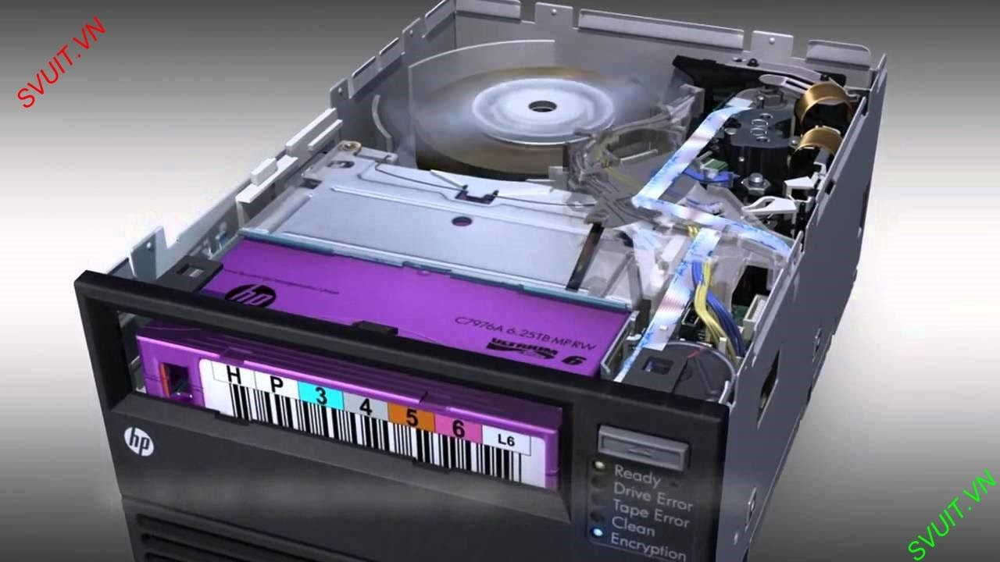 
So sánh tốc độ giữa các công nghệ Tape Drive.
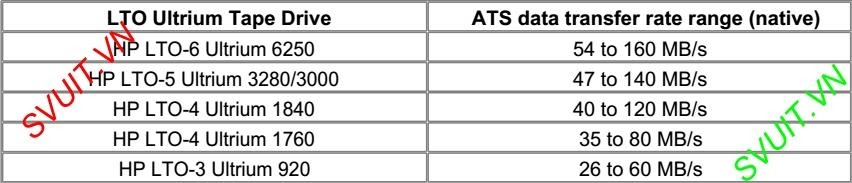 
Hiện tại người ta cũng đang nghiên cứu để phát triển các thế hệ tiếp theo của LTO Ultrium nhằm cải tiến dung lượng lưu trữ và tốc độ truyền dữ liệu.

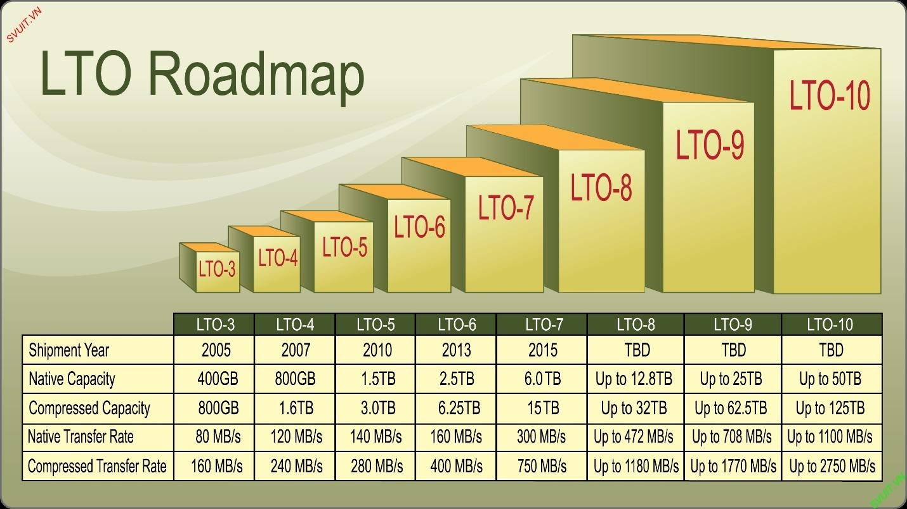 
<h2 style="color:orange">2. Công nghệ đầu đọc - Tape drive</h2>
<h3 style="color:orange">2.1. DAT drives</h3>
Là công nghệ tầm thấp thường dùng cho các doanh nghiệp nhỏ với độ tin cậy và chi phí thấp.

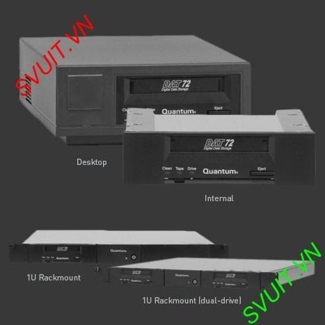 
Những nhược điểm của DAT
- Đối với các hệ thống sao lưu dự phòng nhỏ thường sử dụng các đầu đọc băng từ (tape drive) chỉ bao có 1 đầu đọc và chỉ chứa cùng lúc được 1 băng từ. Điều này gây ra nhiều hạn chế cho hệ thống backup cho các doanh nghiệp.
- Hạn chế về dung lượng của công nghệ băng từ. Hiện nay, dung lượng tối đa của tape drive chỉ là 6.25TB / băng từ. Các chương trình Backup có thể ghi tràn sang băng từ khác khi dung lượng cần sao lưu lớn hơn dung lượng băng từ.
- Tuy nhiên, do các thao tác sao lưu thường thực hiện vào ban đêm và do đó không có ai thực hiện việc thay đổi băng từ khi cần.
- Bên cạnh đó, tốc độ tối đa của các ổ băng từ là 1.45TB / giờ cũng không đáp ứng nhu cầu nhanh chóng sao lưu hoặc phục hồi dữ liệu khi cần

Để khắc phục hạn chế trên, người ta đã dùng giải pháp kết hợp nhiều đầu đọc cùng với cơ chế chứa nhiều băng từ trong cùng một hệ thống MSL Libraries.
- Tape Autoloader: Loại thiết bị có 1 đầu đọc và chứa cùng lúc ít hơn 12 băng từ thường được gọi là Tape Autoloader
- Tape Libraries: Các hệ thống backup bằng băng từ cao cấp và mạnh hơn thường được gọi là tape library. Trên thực tế các loại tape library có thể hổ trợ tới 42 đầu đọc và có thể chứa cùng lúc 560 tape cartridge.
<h3 style="color:orange">2.2. Tape autoloader</h3>
Tape Autoloader: là thiết bị có 1 đầu đọc băng từ và chứa cùng lúc ít hơn 12 băng từ.

Được thiết kết theo kiểu nạp băng tape tự động (cho các băng tape trắng vào khe ổ tape sau đó băng nào đầy được tự động thay băng mới vào để backup tiếp dữ liệu).

Các ưu điểm:
Ngăn chặn việc thay băng tape bằng tay mất thời gian và bị động, phải có người theo dõi khi băng tape đầy để thay băng mới
Có dữ liệu nhiều hơn băng tape
Hiệu suất cao, hiệu quả cao
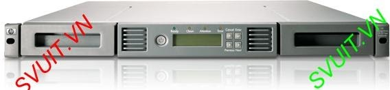 
<h3 style="color:orange">2.3. Tape libraries</h3>
Tape Library: Là thiết bị có nhiều hơn 1 đầu đọc và chứa cùng lúc nhiều băng từ.

Là dạng backup tự động, với dung lượng lớn (nguồn dữ liệu ở nhiều nơi), thời gian nhanh, hiệu suất cao. MSL là giải pháp hoàn hảo, quản trị đơn giản, để dàng thao tác, vừa khít với nhiều môi trường của khách hàng, làm việc trên LAN, SAN, được trang bị những công cụ thông minh.

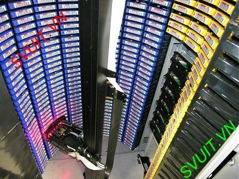 
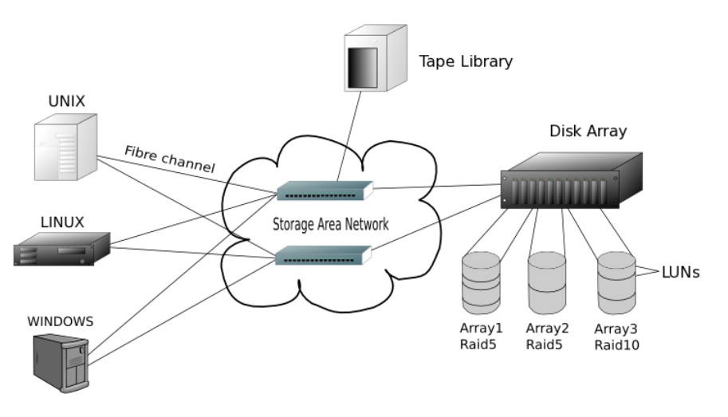 
<h2 style="color:orange">3. So sánh backup dữ liệu bằng disk và tape</h2>
Đối với tape:

- Giá thành tape rẻ
- Lưu trử được lâu
- Khả năng phục hồi cao
- Tốc độ thấp hơn
- Truy nhập tuần tự

Đối với disk:

- Giá thành cao
- Hiệu năng cao
- Restore nhanh chóng.
- Backup đồng thời với khả năng đa nhiệm: backup nhiều luồng khác nhau nên rút ngắn thời gian sao lưu dữ liệu.
- An toàn dữ liệu cao với RAID công nghệ mới RAID 5, RAID 6 giúp dữ liệu vẫn an toàn khi có sự hư hỏng cho phép của 1 trong các HDD, cơ chế mã hóa dữ liệu giúp hạn chế những truy cập trái phép.
- Hỗ trợ đa nền tảng nhiều hãng Window, Linux, Mac
- Backup nhiều kiểu
    + Backup theo từng block iSCSI,
    + Backup đến HDD gắn ngoài,
    + Backup đến Server khác…

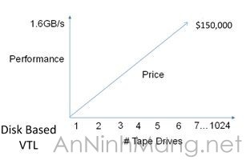 
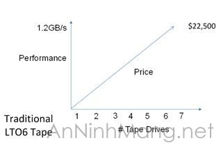 
Viettel vẫn sử dụng backup bằng tape nhưng đang bỏ dần.